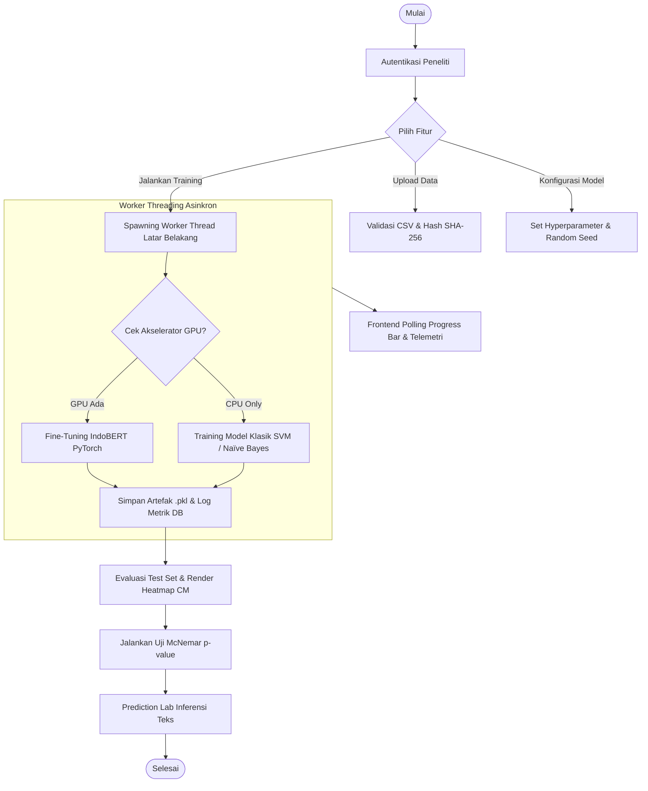

# BAB III
# ANALISIS DAN PERANCANGAN SISTEM

## 3.1. Lokasi, Waktu, dan Lingkungan Penelitian

Pelaksanaan penelitian ini memerlukan perencanaan jadwal kegiatan yang terstruktur serta penetapan spesifikasi lingkungan komputasi yang memadai guna memastikan seluruh tahapan eksperimen dan pengembangan sistem web dapat berjalan optimal.

### 3.1.1. Lokasi dan Waktu Penelitian
Penelitian ini direncanakan dan akan dilaksanakan secara luring dan daring di lingkungan Program Studi Sistem Informasi, Fakultas Ilmu Komputer dan Teknologi Informasi, Universitas Muhammadiyah Sumatera Utara (UMSU), Jalan Kapten Mukhtar Basri No. 3 Medan. Rangkaian kegiatan penelitian direncanakan akan berlangsung selama kurun waktu enam bulan, terhitung sejak bulan Maret 2026 sampai dengan bulan Agustus 2026. Alokasi rincian waktu pelaksanaan setiap tahapan penelitian disajikan pada Tabel 3.1.

**Tabel 3.1. Jadwal Pelaksanaan Penelitian Skripsi**

| No | Tahapan Kegiatan Penelitian | Mar | Apr | Mei | Jun | Jul | Agu |
| :---: | :--- | :---: | :---: | :---: | :---: | :---: | :---: |
| 1 | Studi Literatur dan Identifikasi Kesenjangan Riset | X | | | | | |
| 2 | Pengumpulan dan Pra-Pengolahan Dataset SmSA | | X | | | | |
| 3 | Perancangan Arsitektur Sistem dan Basis Data WAL | | X | X | | | |
| 4 | Eksperimen Pemodelan dan Penalaan Hiperparameter | | | X | X | | |
| 5 | Pengembangan Platform Web App Ummu NLP Lab | | | | X | X | |
| 6 | Pengujian Validasi Metrik dan Uji McNemar | | | | | X | X |
| 7 | Penyusunan Laporan Naskah Skripsi Final | | | | | | X |

*Sumber: Rancangan jadwal kerja penelitian (2026)*

Berdasarkan jadwal pada Tabel 3.1, setiap tahapan penelitian memiliki target luaran yang jelas dan saling berkesinambungan. Keberhasilan pelaksanaan jadwal tersebut didukung oleh ketersediaan perangkat keras dan perangkat lunak yang sesuai dengan kebutuhan pemrosesan data skala besar.

### 3.1.2. Lingkungan Penelitian (Hardware dan Software)
Eksperimen pemodelan pembelajaran mesin dan pelatihan mendalam (*deep learning*) memerlukan dukungan komputasi berperforma tinggi, khususnya untuk proses *fine-tuning* arsitektur Transformer. Rincian spesifikasi perangkat keras komputasi yang akan digunakan dalam penelitian ini dirangkum pada Tabel 3.2.

**Tabel 3.2. Spesifikasi Perangkat Keras Komputasi Penelitian**

| Komponen Perangkat Keras | Spesifikasi Lingkungan Cloud VM | Spesifikasi Komputer Lokal Pengembang |
| :--- | :--- | :--- |
| **Processor (CPU)** | Intel Xeon 4 vCPU @ 2.20 GHz | Intel Core i7-11800H 8-Core @ 2.30 GHz |
| **Akselerator Grafis (GPU)** | NVIDIA Tesla T4 / L4 (16 GB VRAM) | NVIDIA GeForce RTX 3050 Ti (4 GB VRAM) |
| **Memori Utama (RAM)** | 32 GB DDR4 | 16 GB DDR4 Dual Channel |
| **Media Penyimpanan** | 100 GB NVMe Solid State Drive (SSD) | 512 GB NVMe M.2 SSD |

*Sumber: Konfigurasi lingkungan eksperimen laboratorium (2026)*

Penggunaan GPU dengan kapasitas memori minimal 16 GB pada lingkungan *Cloud VM* sebagaimana tertera pada Tabel 3.2 sangat krusial guna menampung tensor model IndoBERT selama proses propagasi maju dan mundur (*backpropagation*). Di samping perangkat keras, lingkungan pengembangan perangkat lunak didukung oleh ekosistem pustaka Python modern yang dirangkum pada Tabel 3.3.

**Tabel 3.3. Daftar Pustaka (*Library*) Pemrograman Python**

| Pustaka / Library | Versi Rilis | Fungsi Utama dalam Sistem |
| :--- | :---: | :--- |
| **Python** | 3.10+ | Bahasa pemrograman inti ekosistem riset |
| **Flask** | 3.0.3 | Kerangka kerja web mikro untuk penyediaan antarmuka |
| **PyTorch** | 2.2.2 | Pustaka deep learning komputasi tensor dan GPU |
| **Transformers (Hugging Face)** | 4.40.2 | Arsitektur IndoBERT dan tokenizer WordPiece |
| **Scikit-Learn** | 1.4.2 | Model Naïve Bayes, SVM, TF-IDF, dan metrik evaluasi |
| **Pandas & NumPy** | 2.2.2 / 1.26.4 | Manipulasi struktur data matriks dan dataset tabular |
| **SciPy** | 1.13.0 | Komputasi fungsi distribusi binomial Uji McNemar |
| **Psutil & Pynvml** | 5.9.8 / 11.5.0 | Telemetri pemantauan utilisasi CPU, RAM, dan GPU |

*Sumber: Konfigurasi dependensi lingkungan Python (2026)*

Kombinasi pustaka yang tercantum pada Tabel 3.3 akan diintegrasikan dengan teknologi antarmuka web modern guna menyajikan platform penelitian yang interaktif dan responsif, sebagaimana dijabarkan pada Tabel 3.4.

**Tabel 3.4. Spesifikasi Lingkungan Pengembangan Aplikasi Web**

| Dimensi Lingkungan | Komponen Teknologi yang Diterapkan |
| :--- | :--- |
| **Front-End Styling** | HTML5, CSS3 Kustom (Tema Rose-Pink Glassmorphism) |
| **Interaktivitas UI** | Vanilla JavaScript ES6+ (Asynchronous Fetch API) |
| **Visualisasi Grafik** | ApexCharts.js 3.45.0 (Heatmap & Diagram Batang) |
| **Basis Data Relasional** | SQLite 3 dengan Mode Write-Ahead Logging (WAL) |
| **Manajemen Asinkron** | Python Native `threading.Thread` dan `threading.Event` |

*Sumber: Arsitektur tumpukan teknologi web platform (2026)*

Ketersediaan lingkungan perangkat keras dan perangkat lunak yang terstandarisasi ini menjadi fondasi utama dalam melaksanakan kerangka analisis sistem dan pemodelan kuantitatif.

---

## 3.2. Analisis Sistem dan Pemodelan Kuantitatif

Analisis sistem dilakukan guna merancang kerangka alur penelitian, strategi pra-pengolahan data, formulasi matematis algoritma klasifikasi, serta metodologi pengujian signifikansi statistik yang akan diterapkan.

### 3.2.1. Kerangka Konsep dan Alur Penelitian
Penelitian ini dirancang secara metodologis melalui sebelas tahapan alur kerja yang akan dilaksanakan secara terstruktur guna menjamin validitas dan reprodusibilitas hasil riset. Seluruh tahapan alur penelitian diilustrasikan secara runtut pada Gambar 3.1.

**Gambar 3.1. Diagram Alur Pipeline Penelitian Analisis Komparatif (11 Tahap)**

Sebagaimana diilustrasikan pada Gambar 3.1, alur penelitian akan diawali dari pengumpulan data mentah SmSA, pemisahan dataset terisolasi, penerapan jalur *preprocessing* terpisah, pelatihan model komparatif, hingga validasi inferensial Uji McNemar dan integrasi ke dalam sistem web. Rincian tahapan pra-pengolahan data dijelaskan pada sub-bab berikutnya.

### 3.2.2. Analisis Data dan Dual Preprocessing Pipeline
Karakteristik arsitektur model klasifikasi menuntut penerapan strategi prapemrosesan teks yang berbeda agar potensi performa masing-masing model dapat dioptimalkan secara maksimal:

1. Jalur Preprocessing Klasik (TF-IDF), akan diterapkan khusus untuk model Naïve Bayes dan SVM yang mencakup *case folding*, pembersihan karakter non-alfanumerik, normalisasi kata *slang* menggunakan kamus terintegrasi, pembuangan *stopwords* selektif (mempertahankan kata negasi), serta ekstraksi pembobotan TF-IDF unigram-bigram ($min\_df=5$).
2. Jalur Preprocessing IndoBERT, akan diterapkan khusus untuk arsitektur Transformer dengan mempertahankan *stopwords* dan struktur kalimat asli guna diproses secara kontekstual oleh tokenizer WordPiece melalui penambahan token khusus `[CLS]` dan `[SEP]` serta representasi *Attention Mask*.

Penerapan dua jalur prapemrosesan yang berbeda ini menjamin bahwa representasi fitur yang diterima oleh model pembelajaran mesin klasik maupun model *Transformer* telah sesuai dengan prinsip teoretis arsitektur masing-masing.

### 3.2.3. Formulasi Matematis Model Klasifikasi
Proses klasifikasi teks pada penelitian ini akan dimodelkan menggunakan tiga landasan matematis yang mewakili paradigma berbeda:

1. **Multinomial Naïve Bayes (NB)**  
   Klasifikasi probabilistik Naïve Bayes bekerja berdasarkan Teorema Bayes dengan asumsi independensi fitur bersyarat:
   \[P(c \mid \mathbf{x}) = \frac{P(c) \prod_{i=1}^{n} P(x_i \mid c)}{P(\mathbf{x})}\]
   Di mana estimasi probabilitas kemunculan fitur kata $x_i$ pada kelas $c$ dihitung menggunakan pemulusan Laplace (*Laplace Smoothing*) parameter $\alpha$:
   \[\hat{P}(x_i \mid c) = \frac{N_{ci} + \alpha}{N_c + \alpha \cdot |V|}\]

2. **Support Vector Machine (SVM)**  
   Model SVM mencari bidang pemisah (*hyperplane*) optimal ber-margin terbesar pada ruang vektor TF-IDF berdimensi tinggi:
   \[f(\mathbf{x}) = \mathbf{w}^T \mathbf{x} + b\]
   Optimasi pembentukan *hyperplane* diformulasikan melalui minimisasi fungsi objektif *soft-margin*:
   \[\min_{\mathbf{w}, b, \xi} \frac{1}{2} \|\mathbf{w}\|^2 + C \sum_{i=1}^{m} \xi_i \quad \text{s.t.} \quad y_i(\mathbf{w}^T \mathbf{x}_i + b) \ge 1 - \xi_i, \quad \xi_i \ge 0\]

3. **IndoBERT (Transformer Deep Learning)**  
   Representasi kontekstual IndoBERT dibentuk melalui mekanisme *Scaled Dot-Product Attention* multi-kepala (*Multi-Head Self-Attention*):
   \[\text{Attention}(Q, K, V) = \text{softmax}\left(\frac{QK^T}{\sqrt{d_k}}\right)V\]
   Vektor keluaran representasi token khusus `[CLS]` kemudian diproyeksikan ke lapisan klasifikasi linear dengan fungsi aktivasi *Softmax*:
   \[\hat{\mathbf{y}} = \text{softmax}(W_c \cdot \mathbf{h}_{\text{[CLS]}} + \mathbf{b}_c)\]

### 3.2.4. Formulasi Uji Signifikansi Statistik McNemar
Pengujian signifikansi perbedaan kinerja prediktif antara dua model klasifikasi berpasangan ($Model_A$ dan $Model_B$) akan dievaluasi menggunakan matriks kontingensi $2 \times 2$ sebagaimana dirangkum pada Tabel 3.5.

**Tabel 3.5. Format Matriks Kontingensi 2x2 Uji McNemar**

| Kondisi Prediksi Model | $Model_B$ Benar | $Model_B$ Salah | Total Baris |
| :--- | :---: | :---: | :---: |
| **$Model_A$ Benar** | Sel $a$ (Keduanya Benar) | Sel $b$ ($Model_A$ Benar, $Model_B$ Salah) | $a + b$ |
| **$Model_A$ Salah** | Sel $c$ ($Model_A$ Salah, $Model_B$ Benar) | Sel $d$ (Keduanya Salah) | $c + d$ |
| **Total Kolom** | $a + c$ | $b + d$ | $N = 500$ |

*Sumber: Konsep matriks kontingensi Uji McNemar (Dietterich, 1998)*

Berdasarkan Tabel 3.5, sel tidak sepakat (*discordant pairs*) yaitu sel $b$ dan sel $c$ menjadi fokus utama uji statistik. Apabila jumlah diskordansi kecil ($b + c < 25$), nilai signifikansi (*p-value*) dihitung secara eksak berbasis distribusi binomial:
\[p = 2 \sum_{i=b}^{b+c} \binom{b+c}{i} (0{,}5)^{b+c}\]
Sedangkan untuk jumlah diskordansi besar, digunakan statistik uji Chi-Square dengan koreksi kontinuitas Edwards:
\[\chi^2 = \frac{(|b - c| - 1)^2}{b + c}\]
Hipotesis nol ($H_0$) ditolak jika nilai $p < 0{,}05$, yang menandakan bahwa perbedaan performa kedua model terbukti signifikan secara statistik.

---

## 3.3. Perancangan Struktur Data dan Basis Data

Penyimpanan data eksperimen, konfigurasi model, riwayat pengujian, dan profil pengguna dirancang menggunakan basis data relasional SQLite berarsitektur *Write-Ahead Logging* (WAL) guna menjamin integritas transaksi konkuren.

### 3.3.1. Entity-Relationship Diagram (ERD) Sistem
Relasi antar-entitas data dalam sistem *Ummu NLP Lab* dimodelkan melalui diagram relasional entitas sebagaimana ditampilkan pada Gambar 3.2.

**Gambar 3.2. Entity-Relationship Diagram (ERD) Basis Data SQLite WAL**

Diagram relasional pada Gambar 3.2 menunjukkan keterhubungan kardinalitas antar-tabel. Entitas `users` memiliki relasi *one-to-many* dengan `datasets` dan `experiments`, sementara tabel `experiments` menjadi induk bagi riwayat pengujian pada tabel `mcnemar_tests` dan `prediction_logs`.

### 3.3.2. Spesifikasi Kamus Data dan Tabel Basis Data SQLite WAL
Struktur atribut, tipe data, serta batasan (*constraints*) dari keseluruhan tabel basis data dirangkum pada Tabel 3.6.

**Tabel 3.6. Spesifikasi Kamus Data dan Tabel Basis Data SQLite WAL**

| Nama Tabel | Atribut / Kolom Utama | Tipe Data & Constraint | Deskripsi Fungsi Penyimpanan |
| :--- | :--- | :--- | :--- |
| **`users`** | `id`, `email`, `password_hash`, `name`, `avatar` | INT (PK), VARCHAR, TEXT | Data kredensial dan profil peneliti terotentikasi |
| **`datasets`** | `id`, `filename`, `row_count`, `sha256_hash`, `class_distribution` | INT (PK), VARCHAR, JSON | Metadata berkas dataset, jumlah baris, dan hash integritas |
| **`experiments`** | `id`, `model_type`, `accuracy`, `macro_f1`, `params`, `train_time`, `status` | INT (PK), VARCHAR, FLOAT, JSON, TEXT | Rekam jejak eksperimen latih, hiperparameter, dan metrik |
| **`mcnemar_tests`** | `id`, `model_a_id`, `model_b_id`, `p_value`, `contingency_matrix` | INT (PK), INT (FK), FLOAT, JSON | Hasil komputasi matriks kontingensi dan signifikansi p-value |
| **`prediction_logs`**| `id`, `experiment_id`, `input_text`, `predicted_label`, `confidence` | INT (PK), INT (FK), TEXT, FLOAT | Log riwayat inferensi teks tunggal dan batch Prediction Lab |

*Sumber: Kamus data perancangan basis data sistem (2026)*

Spesifikasi kamus data pada Tabel 3.6 menjamin efisiensi pengaksesan data dan integritas referensial antar entitas selama sistem beroperasi.

---

## 3.4. Perancangan Algoritma dan Pemodelan Sistem

Perancangan logika aplikasi mencakup pemodelan titik akhir antarmuka program aplikasi (*API Endpoints*) serta alur eksekusi asinkron latar belakang.

### 3.4.1. Arsitektur REST API Endpoints
Komunikasi data antara antarmuka pengguna berbasis JavaScript dengan backend Flask akan dibangun melalui protokol HTTP RESTful sebagaimana dirangkum pada Tabel 3.7.

**Tabel 3.7. Spesifikasi REST API Endpoints Platform Ummu NLP Lab**

| HTTP Method | Jalur Endpoint API | Format Data Payload | Fungsi Utama Layanan |
| :--- | :--- | :---: | :--- |
| **POST** | `/api/login` & `/api/register` | JSON | Autentikasi dan pendaftaran peneliti |
| **POST** | `/api/upload-dataset` | Multipart Form | Unggah CSV dan validasi hash SHA-256 |
| **POST** | `/api/train` | JSON | Memulai pekerjaan pelatihan asinkron |
| **GET** | `/api/train/status/<task_id>` | URL Param | Polling kemajuan progress bar dan log |
| **POST** | `/api/train/abort/<task_id>` | URL Param | Pembatalan aman thread pelatihan |
| **GET** | `/api/leaderboard` | JSON | Mengambil daftar model terurut performa |
| **POST** | `/api/mcnemar` | JSON | Kalkulasi Uji McNemar berpasangan |
| **POST** | `/api/predict` & `/api/predict-batch`| JSON / Form Data | Layanan inferensi teks mandiri |
| **GET** | `/api/system-resources` | JSON | Telemetri real-time CPU, RAM, GPU |

*Sumber: Spesifikasi API endpoints antarmuka sistem (2026)*

Daftar endpoint pada Tabel 3.7 melayani seluruh transaksi data secara terisolasi dan aman. Alur eksekusi pekerjaan komputasi berat dikelola secara asinkron menggunakan alur kerja diagram alir sistem.

### 3.4.2. Flowchart Sistem dan Task Manager Asinkron
Guna mencegah terjadinya kondisi pemblokiran (*blocking request*) pada server saat model sedang dilatih, sistem dirancang untuk mengimplementasikan *multithreading* asinkron. Alur logika eksekusi sistem ditampilkan pada Gambar 3.3.

**Gambar 3.3. Flowchart Eksekusi Sistem dan Task Manager Asinkron**

Berdasarkan diagram alir pada Gambar 3.3, saat pengguna memulai eksperimen, server membuat *thread* latar belakang terpisah yang membebaskan antarmuka pengguna untuk tetap responsif. Status pelatihan dipantau secara berkala oleh *frontend* melalui *polling* berkala ke endpoint status.

---

## 3.5. Perancangan Antarmuka Sistem (*Design System dan Mockup*)

Perancangan antarmuka pengguna difokuskan pada penyediaan pengalaman visual yang modern, intuitif, dan ergonomis bagi peneliti melalui konsep *Rose-Pink Glassmorphism*:

**A. Elemen Utama Prinsip Desain Antarmuka:**
1. Komposisi palet warna memadukan warna mawar pastel (`#FFF0F5`), merah muda mawar (`#E91E63`), kartu transparan semi-kaca (*glassmorphism*), dan teks abu gelap (`#2D3748`).
2. Tipografi antarmuka menggunakan rumpun huruf Inter dan System UI Font Family untuk keterbacaan data yang jernih dan modern.
3. Struktur tata letak menerapkan bilah navigasi (*sidebar*) tetap di sisi kiri, panel profil di bagian atas, dan area konten adaptif berbasis grid responsif.

**B. Rincian Tiga Belas Rancangan Antarmuka Sistem:**
1. Rancangan layar login berfokus pada kartu masuk terpusat dengan efek *blur* latar belakang dan validasi kredensial pengguna.
2. Rancangan dashboard utama menyajikan ringkasan eksekutif riset berupa empat kartu statistik dan diagram lingkaran distribusi kelas.
3. Rancangan modul unggah dataset menyediakan area seret-dan-lepas berkas CSV serta tabel pratinjau data dinamis.
4. Rancangan formulir parameter eksperimen memfasilitasi pemilihan rasio data, penguncian *random seed*, dan konfigurasi hiperparameter.
5. Rancangan pemantau pelatihan asinkron menyajikan *progress bar* melingkar, terminal log waktu nyata, dan tombol pembatalan proses latih.
6. Rancangan laporan evaluasi performa menampilkan tabel metrik per kelas serta visualisasi *heatmap Confusion Matrix*.
7. Rancangan papan peringkat menyajikan tabel performa terurut serta grafik batang komparatif antar-model.
8. Rancangan modul Uji McNemar memfasilitasi komparasi berpasangan otomatis dengan kalkulasi matriks kontingensi dan nilai *p-value*.
9. Rancangan laboratorium prediksi menyediakan form inferensi teks tunggal dan batch CSV dengan visualisasi probabilitas kelas.
10. Rancangan pemantau resource server menampilkan indikator utilitas CPU, RAM, Disk, dan memori VRAM GPU secara *real-time*.
11. Rancangan pengelolaan profil memfasilitasi pembaruan informasi identitas peneliti dan pengunggahan avatar.
12. Rancangan simulasi preprocessing klasik memperlihatkan tahapan transformasi teks mentah secara bertahap.
13. Rancangan laboratorium tokenisasi BERT memvisualisasikan pemecahan token WordPiece dan representasi *Attention Mask*.

---

## 3.6. Perancangan Pengujian Sistem (*Test Plan*)

Pengujian sistem dirancang secara menyeluruh guna memvalidasi performa model komputasi dan memastikan seluruh modul fungsional pada platform perangkat lunak *Ummu NLP Lab* beroperasi sesuai spesifikasi teknis. Rencana skenario pengujian komprehensif dirangkum pada Tabel 3.8.

**Tabel 3.8. Matriks Perancangan Pengujian Sistem dan Skenario Validasi**

| No | Kategori Pengujian | Modul / Komponen Diuji | Skenario Pengujian | Masukan Data (*Input*) | Target Luaran (*Expected Output*) | Tolok Ukur Keberhasilan |
| :---: | :--- | :--- | :--- | :--- | :--- | :--- |
| 1 | Pengujian Kinerja Komparatif | Engine ML (NB, SVM) & BERT PyTorch | Evaluasi performa prediksi model pada dataset uji independen | 500 sampel data uji SmSA (representasi TF-IDF & WordPiece) | Nilai metrik *Accuracy*, *Precision*, *Recall*, *Weighted F1*, *Macro F1* | Leaderboard komparatif terbentuk lengkap dan terurut presisi |
| 2 | Pengujian Kelas Minoritas | Modul Evaluasi & Confusion Matrix | Evaluasi sensitivitas deteksi khusus pada kelas minoritas netral | 88 sampel aktual kelas netral pada data uji SmSA | Nilai *Recall* dan *F1-Score* khusus kelas sentimen netral | Terukurnya tingkat ketahanan model terhadap ketidakseimbangan kelas |
| 3 | Pengujian Statistik Inferensial | Modul Uji McNemar (Exact Binomial) | Komparasi berpasangan antar ketiga paradigma model klasifikasi | Pasangan vektor prediksi diskordansi (sel $b$ dan sel $c$) | Matriks kontingensi $2 \times 2$, nilai $p$-value, keputusan $H_0$ | Penentuan signifikansi keunggulan model pada taraf $\alpha = 0{,}05$ |
| 4 | Pengujian Eksekusi Asinkron | Backend Threading & Task Manager | Menjalankan pelatihan IndoBERT bersamaan dengan navigasi UI | Pemicu *Start Training* via endpoint `/api/train` | Thread latar belakang aktif, UI tetap responsif tanpa freeze | Progress bar ter-update berkala via polling `/api/train/status` |
| 5 | Pengujian Integritas & Replikasi | Modul Dataset & Task Controller | Menguji validasi checksum SHA-256 dan pembatalan latih (*abort*) | Berkas CSV dataset dan request `/api/train/abort/<task_id>` | Hash SHA-256 terverifikasi di DB; thread berhenti aman | Integritas data terjaga dan resource hardware dibebaskan aman |
| 6 | Pengujian Inferensi Mandiri | Modul Prediction Lab (Single & Batch) | Melayani inferensi ulasan teks tunggal dan batch berkas CSV | Kalimat opini masukan dan berkas CSV ulasan konsumen | Label prediksi sentimen, bar probabilitas, dan tabel batch CSV | Inferensi selesai instan (< 20 ms) tanpa error *Out-of-Memory* |
| 7 | Pengujian Telemetri Server | Modul System Resources (Psutil/Pynvml) | Pemantauan beban CPU, RAM, Disk, dan VRAM GPU waktu nyata | Polling periodik ke REST API `/api/system-resources` | Data telemetri persentase CPU, RAM, VRAM GPU yang akurat | Indikator server ter-render dinamis pada antarmuka web |

*Sumber: Rancangan matriks pengujian sistem laboratorium (2026)*

Berdasarkan matriks skenario pada Tabel 3.8, pengujian dirancang mencakup dua dimensi utama, yaitu pengujian performa model komputasi dan pengujian fungsionalitas aplikasi web.

### 3.6.1. Skenario Pengujian Performa Model
1. Pengujian akurasi dan *Macro F1-Score* akan dilaksanakan guna mengukur kapasitas klasifikasi ketiga model pada 500 sampel data uji SmSA yang terisolasi.
2. Pengujian ketahanan kelas minoritas akan dilaksanakan dengan mengukur nilai *Recall* dan *F1-Score* khusus pada kelas sentimen netral.
3. Pengujian signifikansi inferensial akan dilaksanakan melalui komparasi berpasangan *McNemar Test* pada taraf signifikansi $\alpha = 0{,}05$.

### 3.6.2. Skenario Pengujian Fungsionalitas Platform Web
1. Pengujian *asynchronous non-blocking* akan dilaksanakan guna memastikan responsivitas antarmuka browser saat proses latih latar belakang sedang dieksekusi.
2. Pengujian integritas data dan replikabilitas akan dilaksanakan guna memastikan validitas kalkulasi hash SHA-256 dan keamanan pembatalan proses latih.
3. Pengujian inferensi mandiri akan dilaksanakan guna memastikan modul *Prediction Lab* mampu melayani prediksi teks secara instan tanpa risiko kegagalan alokasi memori.

Rancangan pengujian yang komprehensif ini memastikan bahwa seluruh komponen sistem yang dirancang pada Bab III akan dapat dievaluasi secara terukur dan dilaporkan hasilnya secara transparan pada Bab IV.
