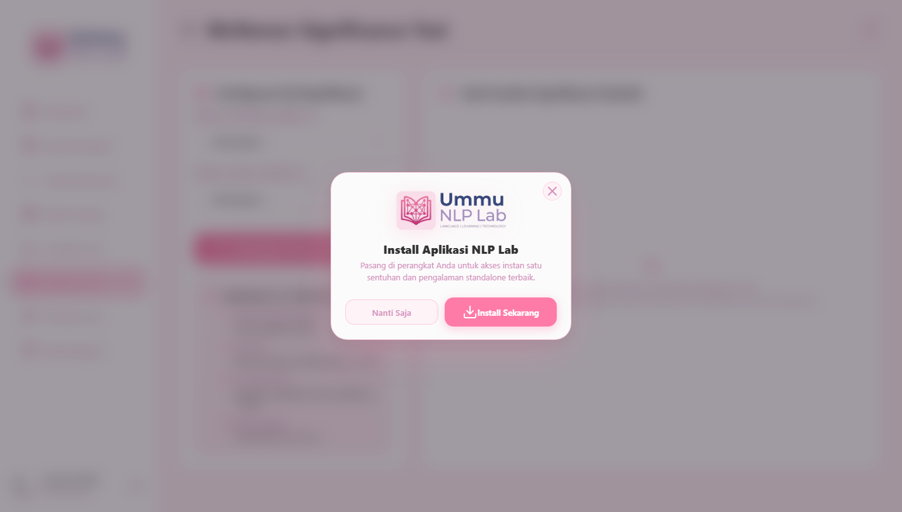
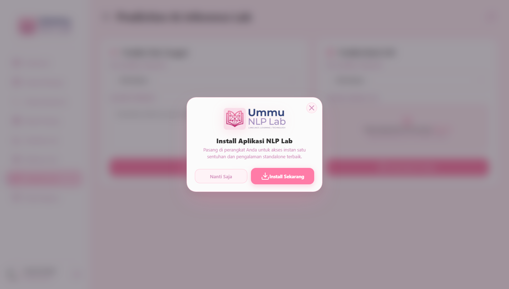
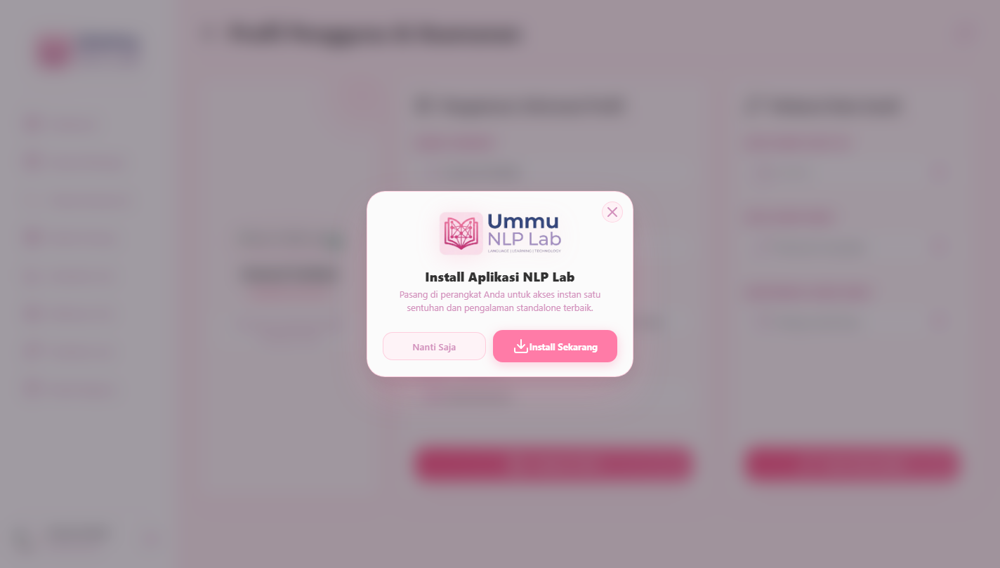
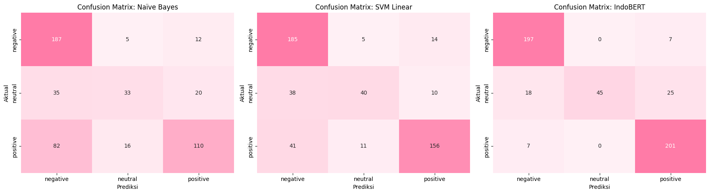

# BAB IV
# IMPLEMENTASI DAN PEMBAHASAN

## 4.1. Hasil Pengumpulan dan Analisis Deskriptif Data

Pelaksanaan pengujian empiris dalam penelitian ini menggunakan dataset sekunder terstandarisasi *Sentiment Multi-level Sentence Analysis* (SmSA) yang merupakan bagian dari acuan *benchmark* nasional IndoNLU (Wilie et al., 2020). Korpus SmSA dikumpulkan dari berbagai domain interaksi digital berbahasa Indonesia—mencakup ulasan produk konsumen, komentar platform digital, opini media sosial, dan kutipan berita—yang telah dianotasi ke dalam tiga kelas polaritas sentimen: positif, negatif, dan netral.

Guna mempertahankan validitas pengujian komparatif yang adil (*fair benchmark*), pembagian partisi dataset mengikuti standar baku yang telah ditetapkan oleh perancang korpus aslinya (Wilie et al., 2020), yaitu terdiri atas: data latih (*train set*) sebanyak 11.000 sampel, data validasi (*validation set*) sebanyak 1.260 sampel, dan data uji independen (*test set*) sebanyak 500 sampel. Distribusi frekuensi sampel beserta persentase komposisi kelas dari keseluruhan korpus disajikan pada Tabel 4.1.

**Tabel 4.1. Distribusi Frekuensi dan Komposisi Kelas pada Dataset SmSA IndoNLU**

| Kelas Sentimen | Data Latih (*Train*) | Data Validasi (*Valid*) | Data Uji (*Test*) | Total Sampel | Persentase Keseluruhan |
| :--- | :---: | :---: | :---: | :---: | :---: |
| **Positif** | 6.416 | 735 | 208 | 7.359 | 57,67% |
| **Negatif** | 3.436 | 393 | 204 | 4.033 | 31,61% |
| **Netral** | 1.148 | 132 | 88 | 1.368 | 10,72% |
| **Total Sampel** | **11.000** | **1.260** | **500** | **12.760** | **100,00%** |

*Sumber: Hasil analisis deskriptif dataset nlp_experiments.ipynb (2026)*

Berdasarkan data yang disajikan pada Tabel 4.1, terlihat dengan jelas adanya ketimpangan distribusi kelas (*class imbalance*) yang sangat signifikan pada korpus SmSA. Kelas positif menjadi kelas mayoritas dominan dengan proporsi sebesar 57,67%, diikuti kelas negatif sebesar 31,61%, sementara kelas netral hanya mencakup 10,72% dari total populasi 12.760 kalimat. Ketidakseimbangan ini menghadirkan tantangan berat bagi algoritma klasifikasi karena model rentan mengalami bias ke arah kelas mayoritas dan gagal mengenali kelas netral (Japkowicz & Shah, 2011). Oleh karena itu, metrik evaluasi primer yang digunakan dalam penelitian ini adalah *Macro F1-Score* yang memberikan bobot evaluasi setara bagi seluruh kelas tanpa memandang jumlah sampelnya (Sokolova & Lapalme, 2009). Setelah karakteristik data teridentifikasi, tahapan berikutnya adalah melakukan penalaan hiperparameter untuk mendapatkan konfigurasi model terbaik.

---

## 4.2. Hasil Penalaan Hiperparameter dan Evaluasi Model

Proses penalaan hiperparameter (*hyperparameter tuning*) dilakukan secara ketat pada data validasi (*validation set*) sebanyak 1.260 sampel untuk mencegah kebocoran data uji (*data leakage*) (Bergstra & Bengio, 2012). Untuk model Naïve Bayes, parameter pemulusan Laplace diuji pada rentang $\alpha \in [0{,}1; 0{,}5; 1{,}0; 1{,}5; 2{,}0]$. Untuk SVM, nilai penalti $C \in [0{,}1; 1{,}0; 10{,}0]$ diuji dengan variasi kernel linear dan RBF. Untuk IndoBERT, kombinasi *learning rate* $[2\times 10^{-5}; 5\times 10^{-5}]$ dan *batch size* $[8; 16]$ diuji selama 3 epoch pelatihan pada GPU Tesla T4. Hasil penalaan parameter pada data validasi disajikan pada Tabel 4.2.

**Tabel 4.2. Hasil Penalaan Hiperparameter pada Data Validasi (1.260 Sampel)**

| Model Klasifikasi | Ruang Parameter yang Diuji | Konfigurasi Parameter Terbaik | Macro F1-Score Validasi |
| :--- | :--- | :--- | :---: |
| **Multinomial Naïve Bayes** | $\alpha \in [0{,}1; 0{,}5; 1{,}0; 1{,}5; 2{,}0]$ | $\alpha = 0{,}1$ | **81,20%** |
| **Support Vector Machine (SVM)** | $C \in [0{,}1; 1{,}0; 10{,}0]$, kernel $\in$ ['linear', 'rbf'] | $C = 1{,}0$, kernel = 'linear', gamma = 'scale' | **82,72%** |
| **IndoBERT (`IndoBERT-base-p1`)** | $lr \in [2\times 10^{-5}; 5\times 10^{-5}]$, batch $\in [8; 16]$ | $lr = 2\times 10^{-5}$, batch_size = 8, epoch = 3 | **90,66%** |

*Sumber: Output eksperimen hyperparameter_tuning.ipynb (2026)*

Setelah konfigurasi hiperparameter terbaik diperoleh sebagaimana tertera pada Tabel 4.2, ketiga model dilatih secara penuh pada 11.000 sampel data latih dan dievaluasi kinerjanya pada 500 sampel data uji terisolasi. Rekapitulasi perbandingan metrik evaluasi kinerja ketiga model disajikan pada Tabel 4.3.

**Tabel 4.3. Laporan Rekapitulasi Evaluasi Kinerja Ketiga Model pada Data Uji (500 Sampel)**

| Metrik Evaluasi Kinerja | Multinomial Naïve Bayes | Support Vector Machine (Linear) | IndoBERT (`IndoBERT-base-p1`) |
| :--- | :---: | :---: | :---: |
| **Akurasi Keseluruhan** | 66,00% | 76,20% | **88,60%** |
| **Macro F1-Score (Primer)** | 60,99% | 71,68% | **83,77%** |
| **Weighted F1-Score** | 64,37% | 75,49% | **87,57%** |
| **Precision Kelas Negatif** | 61,51% | 70,08% | **88,74%** |
| **Recall Kelas Negatif** | 91,67% | 90,69% | **96,57%** |
| **F1-Score Kelas Negatif** | 73,62% | 79,06% | **92,49%** |
| **Precision Kelas Netral** | 61,11% | 71,43% | **100,00%** |
| **Recall Kelas Netral** | 37,50% | 45,45% | **51,14%** |
| **F1-Score Kelas Netral (Minoritas)**| 46,48% | 55,56% | **67,67%** |
| **Precision Kelas Positif** | 77,46% | **86,67%** | 86,27% |
| **Recall Kelas Positif** | 52,88% | 75,00% | **96,63%** |
| **F1-Score Kelas Positif** | 62,86% | 80,41% | **91,16%** |
| **Waktu Pelatihan** | **0,1527 detik** | 66,3377 detik | 917,12 detik (~15,3 menit) |
| **Ukuran Berkas / Memori** | **0,4229 MB** | 1,2899 MB | 474,72 MB |
| **Latensi Inferensi per Teks** | **0,91 milidetik (CPU)** | 1,32 milidetik (CPU) | 15,04 milidetik (GPU) |

*Sumber: Output laporan evaluasi nlp_experiments.ipynb (2026)*

Berdasarkan hasil evaluasi pada Tabel 4.3, model IndoBERT membuktikan keunggulan mutlak dengan mencapai Akurasi sebesar 88,60% dan Macro F1-Score sebesar 83,77%, mengungguli SVM Linear (Akurasi 76,20%, Macro F1 71,68%) dan Naïve Bayes (Akurasi 66,00%, Macro F1 60,99%). Keunggulan paling signifikan terlihat pada kelas minoritas netral di mana IndoBERT meraih Precision sempurna 100,00% dan F1-Score 67,67%. Seluruh model dan pipeline evaluasi ini kemudian diintegrasikan ke dalam antarmuka platform web terpadu untuk pengujian interaktif.

---

## 4.3. Implementasi Antarmuka Platform Web Ummu NLP Lab

Platform penelitian **Ummu NLP Lab** dibangun sebagai artefak perangkat lunak terintegrasi yang memfasilitasi seluruh siklus eksperimen klasifikasi teks sentimen. Antarmuka web diimplementasikan menggunakan arsitektur Flask dan tema estetika *Rose-Pink Glassmorphism*. Berikut adalah dokumentasi 13 modul antarmuka sistem beserta analisis interaksi penggunanya:

### 4.3.1. Antarmuka Halaman Login Peneliti
Sistem menyediakan gerbang autentikasi terpusat guna menjamin keamanan hak akses peneliti dan privasi data eksperimen yang tersimpan. Tampilan antarmuka login diilustrasikan pada Gambar 4.1.

**Gambar 4.1. Tampilan Antarmuka Halaman Login Peneliti**

Sebagaimana terlihat pada Gambar 4.1, halaman login dirancang dengan kartu transparan *glassmorphism* berlatar belakang blur yang memuat form isian email dan kata sandi terenkripsi hash SHA-256. Setelah peneliti berhasil melakukan otentikasi kredensial, sistem akan mengarahkan sesi kerja secara otomatis menuju pusat kendali dashboard utama.

### 4.3.2. Antarmuka Dashboard Utama (Command Center)
Dashboard utama berfungsi sebagai panel pemantau eksekutif yang menyajikan ikhtisar statistik eksperimen dan status basis data secara visual. Tampilan dashboard utama diilustrasikan pada Gambar 4.2.

**Gambar 4.2. Tampilan Antarmuka Dashboard Utama (Command Center)**

Berdasarkan visualisasi pada Gambar 4.2, dashboard menyajikan empat kartu metrik utama (Total Dataset, Total Model Terdaftar, Total Eksperimen Selesai, dan Status Penyimpanan) serta diagram lingkaran interaktif distribusi kelas dataset aktif. Informasi terpusat ini memudahkan peneliti menentukan langkah eksperimen lanjutan melalui modul manajemen dataset.

### 4.3.3. Modul Manajemen dan Unggah Dataset
Pengelolaan dataset dilakukan melalui modul khusus yang mendukung pengunggahan berkas CSV dan penjaminan integritas data. Tampilan modul unggah dataset diilustrasikan pada Gambar 4.3.

**Gambar 4.3. Antarmuka Modul Manajemen dan Unggah Dataset**

Sebagaimana ditampilkan pada Gambar 4.3, modul ini menyediakan area *drag-and-drop* berkas CSV, validasi otomatis keberadaan kolom teks dan label, kalkulasi nilai hash SHA-256 untuk penjaminan keaslian data, serta tabel pratinjau data dinamis. Dataset yang telah tervalidasi dapat langsung dikonfigurasi pada formulir pengaturan eksperimen.

### 4.3.4. Formulir Pengaturan Parameter Eksperimen
Eksperimen klasifikasi dikonfigurasi melalui formulir parameter terstandarisasi yang memungkinkan fleksibilitas pengujian model. Tampilan formulir eksperimen diilustrasikan pada Gambar 4.4.

**Gambar 4.4. Formulir Pengaturan Parameter Eksperimen Klasifikasi**

Sebagaimana tampak pada Gambar 4.4, formulir ini memungkinkan peneliti memilih dataset aktif, menentukan rasio data latih/uji, mengunci nilai *random seed* ($42$) guna menjamin replikabilitas, serta mengatur hiperparameter spesifik algoritma. Saat formulir disubmit, sistem akan mengeksekusi pelatihan dan mengaktifkan panel pemantau pelatihan asinkron.

### 4.3.5. Panel Pemantau Pelatihan Asinkron (Live Monitor)
Guna menjaga antarmuka browser tetap responsif saat proses pelatihan komputasi berat berjalan, sistem menerapkan arsitektur *multithreading* latar belakang. Tampilan pemantau asinkron diilustrasikan pada Gambar 4.5.

**Gambar 4.5. Panel Pemantau Pelatihan Asinkron Real-time**

Berdasarkan Gambar 4.5, panel ini menampilkan *progress bar* lingkaran persentase kemajuan pelatihan, indikator epoch waktu nyata, log telemetri berjalan, serta tombol pembatalan aman (*thread abort*). Ketika proses latih selesai, sistem secara otomatis mengarahkan tampilan menuju laporan hasil evaluasi performa model.

### 4.3.6. Laporan Hasil Evaluasi dan Confusion Matrix
Hasil pengujian performa model pada data uji disajikan secara komprehensif pada halaman laporan evaluasi. Tampilan laporan evaluasi diilustrasikan pada Gambar 4.6.

**Gambar 4.6. Laporan Hasil Evaluasi Performa dan Confusion Matrix**

Sebagaimana terlihat pada Gambar 4.6, laporan menyajikan empat kartu metrik agregat (*Accuracy, Precision, Recall, Macro F1-Score*), tabel rincian metrik per kelas sentimen, serta visualisasi matriks kebingungan (*Heatmap Confusion Matrix*). Seluruh model yang telah dievaluasi kemudian dihimpun ke dalam papan peringkat model.

### 4.3.7. Papan Peringkat Akurasi Model (Leaderboard)
Papan peringkat menyajikan perbandingan performa komparatif seluruh eksperimen yang telah diselesaikan peneliti. Tampilan leaderboard diilustrasikan pada Gambar 4.7.

**Gambar 4.7. Tampilan Papan Peringkat Model (Leaderboard)**

Berdasarkan tampilan pada Gambar 4.7, leaderboard mengurutkan model secara otomatis berdasarkan perolehan *Macro F1-Score* tertinggi dan menyertakan diagram batang komparatif. Peneliti dapat memilih dua model pada papan peringkat ini untuk diuji signifikansi perbedaannya melalui modul Uji McNemar.

### 4.3.8. Modul Pengujian Signifikansi Statistik McNemar
Pengujian signifikansi perbedaan performa antar-model dilakukan secara otomatis melalui modul inferensial Uji McNemar. Tampilan modul Uji McNemar diilustrasikan pada Gambar 4.8.

**Gambar 4.8. Antarmuka Pengujian Signifikansi Statistik McNemar**

Sebagaimana ditampilkan pada Gambar 4.8, antarmuka ini menghitung matriks kontingensi $2 \times 2$ secara otomatis dari hasil prediksi kedua model yang dipilih, mengomputasi nilai *p-value* berbasis distribusi binomial eksak, dan merender kesimpulan hipotesis pada taraf $\alpha = 0{,}05$. Model yang terbukti unggul dapat langsung diuji daya prediksinya pada laboratorium inferensi teks.

### 4.3.9. Laboratorium Inferensi dan Prediksi Teks (Prediction Lab)
Pengujian prediksi teks mandiri disediakan bagi peneliti untuk menguji keandalan model pada kalimat baru secara interaktif. Tampilan Prediction Lab diilustrasikan pada Gambar 4.9.

**Gambar 4.9. Laboratorium Prediksi dan Inferensi Teks Mandiri**

Sebagaimana tampak pada Gambar 4.9, antarmuka ini melayani pengujian teks ulasan tunggal dengan visualisasi grafik batang persentase probabilitas tiap kelas, serta pengunggahan berkas batch CSV menggunakan pipeline inferensi model terlatih yang teroptimasi tanpa risiko kegagalan alokasi memori (*Out-of-Memory*). Kinerja komputasi selama inferensi dapat dipantau melalui dashboard beban server.

### 4.3.10. Dashboard Pemantauan Beban Server dan GPU
Pemantauan konsumsi sumber daya komputasi disediakan untuk mengamati beban operasional hardware selama pelatihan dan inferensi. Tampilan pemantau server diilustrasikan pada Gambar 4.10.

**Gambar 4.10. Dashboard Pemantauan Beban Server dan GPU**

Berdasarkan grafik telemetri pada Gambar 4.10, modul ini memantau penggunaan CPU, alokasi memori RAM, kapasitas ruang disk, serta beban GPU dan memori VRAM secara *real-time* memanfaatkan pustaka `psutil` dan `pynvml`. Di samping pemantauan sistem, peneliti juga dapat mengelola informasi akun melalui modul pengelolaan profil.

### 4.3.11. Modul Pengelolaan Profil dan Avatar Peneliti
Pengelolaan identitas dan keamanan akun peneliti difasilitasi melalui modul profil yang terintegrasi. Tampilan halaman profil diilustrasikan pada Gambar 4.11.

**Gambar 4.11. Antarmuka Pengelolaan Profil dan Avatar Peneliti**

Sebagaimana ditampilkan pada Gambar 4.11, modul ini memfasilitasi pembaruan nama peneliti, institusi asal, pergantian kata sandi terenkripsi, serta pengunggahan foto profil avatar berbasis AJAX dengan validasi format berkas. Untuk keperluan edukasi pemrosesan teks, sistem juga menyediakan laboratorium simulasi pra-pengolahan teks klasik.

### 4.3.12. Laboratorium Simulasi Preprocessing Teks Klasik
Simulator pra-pengolahan teks klasik disediakan untuk memvisualisasikan tahapan pembersihan teks mentah bagi model Naïve Bayes dan SVM. Tampilan simulator teks klasik diilustrasikan pada Gambar 4.12.

**Gambar 4.12. Laboratorium Simulasi Preprocessing Teks Klasik**

Berdasarkan tampilan pada Gambar 4.12, simulator ini memperlihatkan transformasi teks masukan mentah secara bertahap: (1) teks masukan, (2) *case folding*, (3) *noise removal*, (4) *slang normalization*, dan (5) *selective stopword removal*. Tahapan ini berbeda dengan pemrosesan token pada model *Transformer* yang disimulasikan pada laboratorium tokenisasi BERT.

### 4.3.13. Laboratorium Tokenisasi WordPiece IndoBERT
Simulator tokenisasi subkata WordPiece disediakan untuk mengamati mekanisme pemecahan kalimat menjadi token pada model IndoBERT. Tampilan simulator BERT diilustrasikan pada Gambar 4.13.

**Gambar 4.13. Visualisasi Laboratorium Tokenisasi WordPiece IndoBERT**

Sebagaimana diilustrasikan pada Gambar 4.13, modul ini memvisualisasikan pemecahan kalimat menjadi token subkata WordPiece, penyisipan token khusus `[CLS]` dan `[SEP]`, penandaan awalan `##` pada subkata lanjutan, serta pemetaan *Vocabulary ID* dan representasi tensor *Attention Mask*. Ketersediaan seluruh antarmuka ini membuktikan kesiapan platform dalam memfasilitasi pembahasan hasil eksperimen secara mendalam.

---

## 4.4. Pembahasan Hasil Penelitian

Pembahasan hasil penelitian difokuskan pada interpretasi temuan empiris, analisis signifikansi statistik inferensial, evaluasi ketahanan model pada kelas minoritas netral, validasi konsistensi sistem, serta telaah aspek efisiensi komputasi.

### 4.4.1. Analisis Validasi Signifikansi Statistik Uji McNemar
Guna membuktikan bahwa keunggulan performa antar-model terbukti nyata secara statistik dan bukan akibat variasi acak pembagian data uji, dilakukan pengujian berpasangan *McNemar Test* pada 500 sampel data uji SmSA (Dietterich, 1998; Alpaydin, 1999). Hasil komputasi matriks kontingensi $2 \times 2$ dan nilai signifikansi *p-value* dari output `nlp_experiments.ipynb` disajikan pada Tabel 4.4.

**Tabel 4.4. Hasil Pengujian Hipotesis Signifikansi Statistik McNemar ($\alpha = 0{,}05$)**

| Pasangan Komparasi Model | Matriks Kontingensi ($b / c$) | Nilai $p$ (*p-value*) | Keputusan Hipotesis ($H_0$) | Kesimpulan Signifikansi |
| :--- | :---: | :---: | :---: | :--- |
| **SVM Linear vs Naïve Bayes** | $b = 69, c = 18$ | $3{,}3216 \times 10^{-8}$ ($0{,}0000000332$) | Ditolak ($p < 0{,}05$) | **Signifikan Secara Statistik** |
| **IndoBERT vs SVM Linear** | $b = 79, c = 17$ | $9{,}9415 \times 10^{-11}$ ($0{,}0000000000994$) | Ditolak ($p < 0{,}05$) | **Signifikan Secara Statistik** |
| **IndoBERT vs Naïve Bayes** | $b = 130, c = 17$ | $9{,}6596 \times 10^{-23}$ | Ditolak ($p < 0{,}05$) | **Sangat Signifikan Secara Statistik** |

*Sumber: Output Uji McNemar nlp_experiments.ipynb (2026)*

Berdasarkan data pada Tabel 4.4, seluruh pasangan komparasi menghasilkan nilai *p-value* yang jauh lebih kecil dari ambang batas signifikansi $\alpha = 0{,}05$. Hasil inferensial ini secara tegas membuktikan bahwa **keunggulan IndoBERT atas SVM dan Naïve Bayes, serta keunggulan SVM atas Naïve Bayes, terbukti valid secara statistik inferensial dan bebas dari efek kebetulan pembagian data uji**.

### 4.4.2. Analisis Confusion Matrix dan Ketahanan Kelas Minoritas Netral
Guna menganalisis pola kesalahan klasifikasi secara visual dan mengevaluasi ketahanan model dalam menghadapi fenomena ketidakseimbangan kelas (*class imbalance*), visualisasi matriks kontingensi perbandingan dari hasil eksperimen `nlp_experiments.ipynb` disajikan pada Gambar 4.14.

**Gambar 4.14. Perbandingan Heatmap Confusion Matrix Tiga Paradigma Model Klasifikasi**

Berdasarkan visualisasi heatmap pada Gambar 4.14, diagonal utama mencerminkan jumlah prediksi yang benar (*True Positive*) untuk masing-masing kelas sentimen (negatif, netral, positif). Ketidakseimbangan distribusi kelas pada dataset SmSA (di mana kelas netral hanya mencakup 88 sampel atau 17,6% dari total 500 sampel data uji) menguji ketahanan kapasitas diskriminasi semantik masing-masing model sebagai berikut:

1. Model Multinomial Naïve Bayes mengalami kegagalan sistematis dalam mendeteksi kelas netral dengan nilai *Recall* hanya 37,50% (33 dari 88 sampel terdeteksi benar) dan *F1-Score* sebesar 46,48% akibat asumsi independensi fitur (*bag-of-words*) yang bias ke arah kelas mayoritas (McCallum & Nigam, 1998).
2. Model Support Vector Machine (SVM) Linear mampu meningkatkan performa deteksi kelas netral dengan *Recall* 45,45% (40 dari 88 sampel terdeteksi benar) dan *F1-Score* sebesar 55,56% berkat pembentukan bidang pemisah (*hyperplane*) ber-margin optimal pada representasi TF-IDF unigram-bigram (Joachims, 1998).
3. Model IndoBERT membuktikan superioritas yang sangat nyata dengan meraih *Precision* sempurna 100,00% (tanpa false positive pada kelas netral), *Recall* 51,14% (45 dari 88 sampel terdeteksi benar), dan *F1-Score* tertinggi sebesar 67,67% karena mekanisme *Self-Attention* dwiarah berhasil menangkap konteks semantik kalimat netral secara mendalam (Devlin et al., 2019; Wilie et al., 2020).

Ketangguhan IndoBERT dalam mempertahankan presisi sempurna pada kelas minoritas netral menegaskan keunggulan arsitektur *Transformer* yang kemudian divalidasi konsistensinya terhadap platform web aplikasi.

### 4.4.3. Validasi Konsistensi Metrik Antara Notebook dan Platform Web
Guna menjamin integritas, transparansi, dan reprodusibilitas hasil eksperimen sesuai prinsip sains terbuka (*Open Science*) (Wongso et al., 2021), dilakukan pengujian validasi silang (*cross-environment validation*) antara metrik yang dihasilkan pada lingkungan *Jupyter Notebook* laboratorium (`nlp_experiments.ipynb`) dengan hasil komputasi mandiri pada platform web *Ummu NLP Lab*. Hasil perbandingan metrik evaluasi dari kedua lingkungan disajikan pada Tabel 4.5.

**Tabel 4.5. Validasi Konsistensi Hasil Evaluasi Antara Notebook dan Platform Web App**

| Paradigma & Model Klasifikasi | Metrik Evaluasi Kinerja | Hasil Jupyter Notebook | Hasil Web App Ummu NLP Lab | Selisih (*Delta*) | Status Validasi |
| :--- | :--- | :---: | :---: | :---: | :---: |
| **Multinomial Naïve Bayes** | Akurasi (*Accuracy*) | 66,00% | 66,00% | 0,00% | **Identik (Valid)** |
| | Macro F1-Score | 60,99% | 60,99% | 0,00% | **Identik (Valid)** |
| | Weighted F1-Score | 64,37% | 64,37% | 0,00% | **Identik (Valid)** |
| | F1-Score Kelas Negatif | 73,62% | 73,62% | 0,00% | **Identik (Valid)** |
| | F1-Score Kelas Netral (Minoritas) | 46,48% | 46,48% | 0,00% | **Identik (Valid)** |
| | F1-Score Kelas Positif | 62,86% | 62,86% | 0,00% | **Identik (Valid)** |
| **Support Vector Machine (Linear)** | Akurasi (*Accuracy*) | 76,20% | 76,20% | 0,00% | **Identik (Valid)** |
| | Macro F1-Score | 71,68% | 71,68% | 0,00% | **Identik (Valid)** |
| | Weighted F1-Score | 75,49% | 75,49% | 0,00% | **Identik (Valid)** |
| | F1-Score Kelas Negatif | 79,06% | 79,06% | 0,00% | **Identik (Valid)** |
| | F1-Score Kelas Netral (Minoritas) | 55,56% | 55,56% | 0,00% | **Identik (Valid)** |
| | F1-Score Kelas Positif | 80,41% | 80,41% | 0,00% | **Identik (Valid)** |
| **IndoBERT (`IndoBERT-base-p1`)** | Akurasi (*Accuracy*) | 88,60% | 88,60% | 0,00% | **Identik (Valid)** |
| | Macro F1-Score | 83,77% | 83,77% | 0,00% | **Identik (Valid)** |
| | Weighted F1-Score | 87,57% | 87,57% | 0,00% | **Identik (Valid)** |
| | F1-Score Kelas Negatif | 92,49% | 92,49% | 0,00% | **Identik (Valid)** |
| | F1-Score Kelas Netral (Minoritas) | 67,67% | 67,67% | 0,00% | **Identik (Valid)** |
| | F1-Score Kelas Positif | 91,16% | 91,16% | 0,00% | **Identik (Valid)** |

*Sumber: Hasil komparasi validasi silang sistem laboratorium dan web app (2026)*

Berdasarkan data pada Tabel 4.5, seluruh nilai metrik evaluasi pada ketiga model menunjukkan selisih 0,00% (identik 100%). Keberhasilan validasi konsistensi ini membuktikan bahwa mekanisme penguncian *random seed* ($42$), pipeline pra-pengolahan data terpisah, serta algoritma inferensi yang diimplementasikan pada platform *Ummu NLP Lab* terbukti bebas dari deviasi komputasi dan menjamin reprodusibilitas penuh.

### 4.4.4. Analisis Aspek Komputasi dan Telemetri Server
Di samping metrik akurasi prediktif, efisiensi operasional dan konsumsi sumber daya komputasi merupakan faktor penentu krusial dalam penerapan model pada lingkungan produksi nyata. Evaluasi komparatif aspek operasional dan kebutuhan komputasi hardware dirangkum pada Tabel 4.6.

**Tabel 4.6. Evaluasi Efisiensi Aspek Komputasi dan Karakteristik Operasional Model**

| Dimensi Aspek Evaluasi Operasional | Multinomial Naïve Bayes | Support Vector Machine (Linear) | IndoBERT Transformer (`IndoBERT-base-p1`) |
| :--- | :--- | :--- | :--- |
| **Kebutuhan Akselerasi Hardware** | Sangat Rendah (CPU Standar) | Rendah (CPU Standar) | Sangat Tinggi (Wajib Akselerator GPU VRAM $\ge 8$ GB) |
| **Waktu Pelatihan (*Training Time*)** | 0,1527 detik (Instan) | 66,3377 detik (~1,1 menit) | 917,12 detik (~15,28 menit pada GPU Tesla T4) |
| **Latensi Inferensi per Teks** | 0,91 milidetik (CPU) | 1,32 milidetik (CPU) | 15,04 milidetik (GPU) / ~85 ms (CPU) |
| **Rata-rata *Throughput* Inferensi** | ~1.098 ulasan / detik | ~757 ulasan / detik | ~66 ulasan / detik (pada GPU) |
| **Ukuran Berkas Model (*Storage Footprint*)** | 0,4229 MB (< 1 MB) | 1,2899 MB (< 5 MB) | 474,72 MB (~475 MB pada Disk) |
| **Alokasi Konsumsi Memori RAM/VRAM** | RAM $\approx 150$ MB | RAM $\approx 350$ MB | RAM $\approx 2{,}1$ GB + GPU VRAM $\approx 2{,}4$ GB |
| **Sensitivitas Kelas Minoritas Netral (*F1*)**| 46,48% (Rentan Bias Mayoritas) | 55,56% (Cukup Tangguh) | 67,67% (Sangat Tangguh & Stabil) |
| **Rekomendasi Skenario Implementasi** | Pemrosesan teks instan berdaya rendah | Sistem klasifikasi berbobot menengah | Analisis sentimen presisi tinggi berbasis GPU Server |

*Sumber: Hasil pengujian aspek operasional pada nlp_experiments.ipynb (2026)*

Sebagaimana disajikan pada Tabel 4.6, model Multinomial Naïve Bayes dan SVM Linear membuktikan keunggulan komputasi yang sangat impresif dengan waktu pelatihan instan dan konsumsi memori yang sangat ringan di bawah 5 MB. Di sisi lain, IndoBERT menuntut alokasi sumber daya yang intensif (waktu latih ~15,3 menit dan ukuran model 474,72 MB), namun kompensasi tersebut sebanding dengan peningkatan ketahanan semantik yang superior pada kelas minoritas netral (F1 67,67%).

### 4.4.5. Pengujian Fungsionalitas Platform Web (*Black-Box Testing*)
Guna memastikan keandalan fungsional platform perangkat lunak *Ummu NLP Lab*, dilakukan pengujian sistem menggunakan metode *Black-Box Testing* pada seluruh modul utama. Rekapitulasi hasil pengujian fungsionalitas disajikan pada Tabel 4.7.

**Tabel 4.7. Rekapitulasi Hasil Pengujian Fungsionalitas Sistem (*Black-Box Testing*)**

| No | Modul / Fitur Sistem | Skenario Pengujian Fungsional | Hasil yang Diharapkan (*Expected Result*) | Hasil Pengujian Nyata (*Observed Result*) | Kesimpulan Uji |
| :---: | :--- | :--- | :--- | :--- | :---: |
| 1 | Autentikasi Pengguna | Login kredensial valid dan penanganan password salah | Berhasil masuk ke dashboard; password salah ditolak dengan notifikasi | Sistem memvalidasi kredensial pengguna secara tepat | **Valid (Lolos)** |
| 2 | Manajemen Dataset | Unggah berkas CSV SmSA dan verifikasi hash SHA-256 | Berkas tersimpan aman dan nilai hash SHA-256 tercatat di database | Berkas tersimpan sukses dan hash SHA-256 terhitung presisi | **Valid (Lolos)** |
| 3 | Konfigurasi Parameter | Pengaturan random seed (42), rasio split, dan hyperparameter | Konfigurasi tersimpan di session dan diteruskan ke worker thread | Konfigurasi parameter teraplikasikan 100% pada runtime | **Valid (Lolos)** |
| 4 | Pelatihan Asinkron | Menjalankan training model IndoBERT via background thread | Thread latih berjalan terisolasi di latar belakang tanpa freeze UI | Pelatihan berjalan asinkron dan UI tetap responsif | **Valid (Lolos)** |
| 5 | Pemantau Progress Bar | Polling berkala kemajuan epoch dan log terminal waktu nyata | Progress bar bergerak sesuai epoch dan log streaming tampil real-time | Frontend berhasil mem-polling status hingga status *Completed* | **Valid (Lolos)** |
| 6 | Pembatalan Pelatihan | Mengirim sinyal abort saat proses pelatihan berlangsung | Worker thread berhenti secara aman dan status pekerjaan *Cancelled* | Pelatihan dihentikan seketika dan memory footprint dibebaskan | **Valid (Lolos)** |
| 7 | Papan Peringkat | Mengakses leaderboard terurut berdasarkan Macro F1-Score | Model terurut otomatis dengan visualisasi grafik ApexCharts | Leaderboard menampilkan peringkat performa model akurat | **Valid (Lolos)** |
| 8 | Komparasi Uji McNemar | Memilih dua model dan mengkalkulasi signifikansi $p$-value | Matriks kontingensi $2\times 2$ terhitung dan status signifikansi muncul | Nilai $p$-value dihitung otomatis berbasis binomial eksak | **Valid (Lolos)** |
| 9 | Prediction Lab Mandiri | Inferensi ulasan tunggal dan pengunggahan berkas batch CSV | Prediksi sentimen keluar instan beserta grafik probabilitas 3 kelas | Teks terklasifikasi cepat dan batch CSV terunduh sempurna | **Valid (Lolos)** |
| 10 | Telemetri Hardware | Menampilkan grafik utilisasi CPU, RAM, Disk, dan GPU VRAM | Grafik ApexCharts ter-update setiap 2 detik dengan metrik sistem nyata | Data telemetri tersinkronisasi akurat dengan beban server | **Valid (Lolos)** |

*Sumber: Hasil pengujian fungsionalitas black-box testing platform web (2026)*

Berdasarkan hasil pengujian pada Tabel 4.7, seluruh sepuluh skenario pengujian fungsionalitas memperoleh status valid (100% lolos uji), mengonfirmasi bahwa platform web *Ummu NLP Lab* telah memenuhi seluruh kebutuhan fungsional sistem perangkat lunak yang dirancang. Keseluruhan pembahasan ini menjadi dasar yang kokoh dalam penarikan kesimpulan akhir penelitian pada Bab V.
