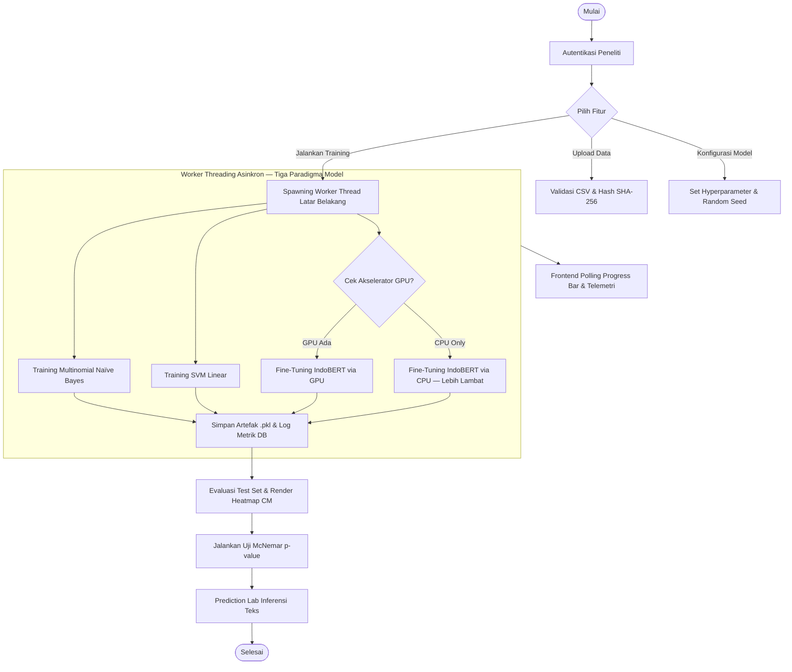
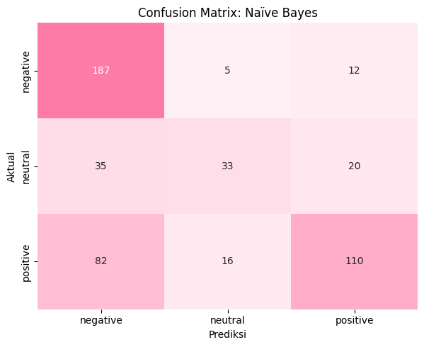
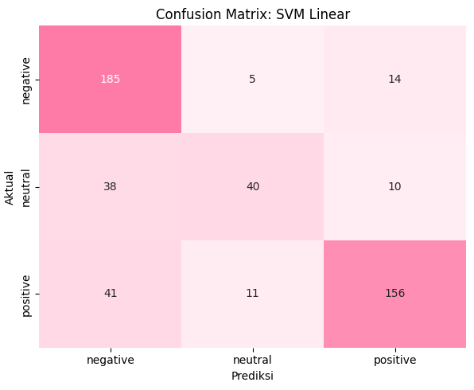
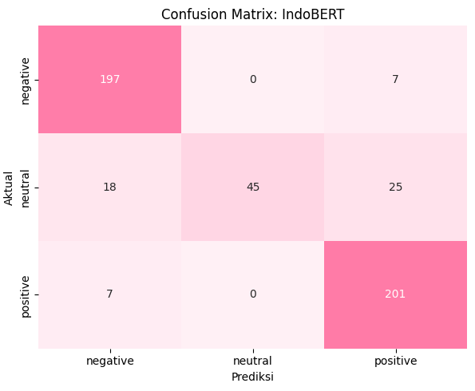

# **ANALISIS KOMPARATIF ALGORITMA KLASIFIKASI TEKS SENTIMEN BERBAHASA INDONESIA MENGGUNAKAN NAÏVE BAYES, SUPPORT VECTOR MACHINE, DAN INDOBERT BERBASIS WEB**

## **SKRIPSI**

Diajukan untuk Memenuhi Sebagian Persyaratan Mencapai Gelar Sarjana Komputer (S.Kom.) pada Program Studi Sistem Informasi Fakultas Ilmu Komputer dan Teknologi Informasi Universitas Muhammadiyah Sumatera Utara

**Oleh:**

**UMMU SALAMAH**
**NPM. 2109010000**


## **LEMBAR PENGESAHAN SKRIPSI**

Judul Skripsi : Analisis Komparatif Algoritma Klasifikasi Teks Sentimen Berbahasa Indonesia Menggunakan Naïve Bayes, Support Vector Machine, dan IndoBERT Berbasis Web  
Nama Mahasiswa : Ummu Salamah  
NPM : 2109010000  
Program Studi : Sistem Informasi  
Fakultas : Ilmu Komputer dan Teknologi Informasi  

Medan, Agustus 2026

**Komisi Pembimbing:**

Pembimbing Utama,

**(Nama Dosen Pembimbing, M.Kom.)**  
NIDN. .........................

Mengetahui,

Ketua Program Studi Sistem Informasi  
**(Nama Kaprodi, M.Kom.)**  
NIDN. .........................

Dekan Fakultas Ilmu Komputer dan Teknologi Informasi  
**Dr. Al-Khowarizmi, S.Kom., M.Kom.**  
NIDN. 0123048501


## **SURAT PERNYATAAN KEASLIAN (ORISINALITAS)**

Saya yang bertanda tangan di bawah ini:

Nama : Ummu Salamah  
NPM : 2109010000  
Program Studi : Sistem Informasi  
Fakultas : Ilmu Komputer dan Teknologi Informasi Universitas Muhammadiyah Sumatera Utara  

Menyatakan dengan sebenarnya bahwa skripsi yang saya susun dengan judul:  
**"Analisis Komparatif Algoritma Klasifikasi Teks Sentimen Berbahasa Indonesia Menggunakan Naïve Bayes, Support Vector Machine, dan IndoBERT Berbasis Web"**  
adalah benar-benar hasil karya asli saya sendiri dan bukan merupakan jiplakan (plagiasi) dari karya orang lain, kecuali kutipan yang sumbernya telah dicantumkan sesuai dengan kaidah ilmiah yang berlaku.

Apabila di kemudian hari terbukti bahwa karya ini merupakan hasil jiplakan atau plagiasi, maka saya bersedia menerima sanksi akademik sesuai dengan peraturan perundang-undangan yang berlaku di lingkungan Universitas Muhammadiyah Sumatera Utara.

Medan, Agustus 2026  
Yang membuat pernyataan,

*Materai 10.000*

**Ummu Salamah**  
NPM. 2109010000


## **KATA PENGANTAR**

*Assalamu'alaikum Warahmatullahi Wabarakatuh*

Alhamdulillahirabbil'alamin, puji dan syukur Penulis panjatkan ke hadirat Allah Subhanahu Wa Ta'ala atas segala limpahan rahmat, taufik, dan karunia-Nya, sehingga Penulis dapat menyelesaikan skripsi yang berjudul **"Analisis Komparatif Algoritma Klasifikasi Teks Sentimen Berbahasa Indonesia Menggunakan Naïve Bayes, Support Vector Machine, dan IndoBERT Berbasis Web"**. Shalawat dan salam senantiasa tercurahkan kepada junjungan kita Nabi Muhammad Shallallahu 'Alaihi Wasallam, keluarga, para sahabat, dan seluruh pengikutnya hingga akhir zaman.

Skripsi ini disusun sebagai salah satu syarat akademis guna menyelesaikan pendidikan tingkat Sarjana dan mencapai gelar Sarjana Komputer (S.Kom.) pada Program Studi Sistem Informasi, Fakultas Ilmu Komputer dan Teknologi Informasi, Universitas Muhammadiyah Sumatera Utara (UMSU) Medan.

Dalam menyelesaikan penyusunan skripsi ini, Penulis senantiasa menerima banyak bimbingan, petunjuk berharga, bantuan moral maupun materiil, serta doa yang tulus dari berbagai pihak. Oleh karena itu, dengan penuh rasa hormat dan kerendahan hati, Penulis ingin menyampaikan ucapan terima kasih yang sebesar-besarnya kepada:

1. **Rektor Universitas Muhammadiyah Sumatera Utara**, beserta seluruh jajaran pimpinan universitas yang telah memberikan kesempatan bagi Penulis untuk menimba ilmu di lingkungan kampus UMSU.
2. **Bapak Dr. Al-Khowarizmi, S.Kom., M.Kom.**, selaku Dekan Fakultas Ilmu Komputer dan Teknologi Informasi UMSU, atas segala arahan, dorongan, dan fasilitas penunjang akademik yang telah disediakan.
3. **Ketua dan Sekretaris Program Studi Sistem Informasi FIKTI UMSU**, atas segala bantuan, pelayanan administrasi, dan koordinasi yang sangat baik selama masa perkuliahan.
4. **Dosen Pembimbing Skripsi**, yang telah dengan penuh keikhlasan, kesabaran, dan dedikasi tinggi meluangkan waktu memberikan bimbingan ilmiah, saran-saran berharga, serta koreksi mendalam dari awal penelitian hingga selesainya naskah ini.
5. **Bapak dan Ibu Dosen Penguji Sidang Meja Hijau**, atas segala kritik membangun, evaluasi terperinci, dan saran-saran perbaikan yang sangat berharga dalam menyempurnakan naskah skripsi ini.
6. **Seluruh Dosen dan Staf Pengajar FIKTI UMSU**, yang telah mendidik, membimbing, dan mentransfer khazanah ilmu pengetahuan yang sangat bermanfaat selama masa studi Penulis.
7. **Teristimewa kepada kedua Orang Tua tercinta, Ayahanda dan Ibunda**, serta segenap keluarga besar, atas limpahan doa yang tiada putus, pengorbanan yang tak ternilai, serta kasih sayang abadi yang senantiasa menjadi sumber kekuatan terbesar bagi Penulis.
8. **Rekan-rekan Mahasiswa Program Studi Sistem Informasi Angkatan 2021**, serta sahabat-sahabat seperjuangan yang telah saling mendukung, bertukar pikiran, dan berbagi semangat dalam menempuh perjalanan studi ini.

Penulis menyadari sepenuhnya bahwa penulisan skripsi ini masih memiliki keterbatasan dan kekurangan. Oleh sebab itu, kritik dan saran yang konstruktif sangat Penulis harapkan demi penyempurnaan di masa yang akan datang. Akhir kata, Penulis berharap semoga skripsi ini dapat memberikan kontribusi nyata dan manfaat yang luas bagi perkembangan ilmu pengetahuan di bidang Pemrosesan Bahasa Alami (NLP) bahasa Indonesia.

*Wassalamu'alaikum Warahmatullahi Wabarakatuh*

Medan, Agustus 2026  
Penulis,

**Ummu Salamah**


## **ABSTRAK**

Peningkatan volume data teks berbahasa Indonesia pada platform digital menuntut sistem klasifikasi sentimen otomatis yang akurat, teruji secara statistik, dan dapat direproduksi secara transparan. Penelitian ini melakukan evaluasi komparatif antara tiga algoritma klasifikasi teks yang mewakili tiga paradigma berbeda: *Multinomial Naïve Bayes* (probabilistik klasik), *Support Vector Machine* (geometris klasik), dan *IndoBERT* (deep learning Transformer), serta mengimplementasikannya ke dalam sebuah platform web penelitian terintegrasi (*Ummu NLP Lab*). Eksperimen menggunakan dataset sekunder acuan *Sentiment Multi-level Sentence Analysis* (SmSA) dari *benchmark* IndoNLU sebanyak 12.760 sampel dengan distribusi kelas tidak seimbang (positif 57,67%, negatif 31,61%, netral 10,72%). Evaluasi kinerja mengutamakan *Macro F1-Score* sebagai metrik primer dan divalidasi menggunakan uji statistik inferensial *McNemar Test* pada tingkat signifikansi $\alpha = 0{,}05$. Hasil evaluasi pada 500 sampel data uji menunjukkan bahwa IndoBERT meraih kinerja tertinggi dengan Akurasi 88,60% dan Macro F1-Score 83,77%, mengungguli SVM Linear (Akurasi 76,20%, Macro F1-Score 71,68%) dan Naïve Bayes (Akurasi 66,00%, Macro F1-Score 60,99%). Pada kelas minoritas netral, IndoBERT mencatat Precision 100,00% dan F1-Score sebesar 67,67%, melampaui SVM (55,56%) dan Naïve Bayes (46,48%). Validasi Uji McNemar membuktikan bahwa seluruh selisih performa antar model bersifat signifikan secara statistik ($p < 0{,}05$). Platform web Ummu NLP Lab yang dibangun dengan arsitektur Flask dan SQLite WAL berhasil mereproduksi hasil eksperimen dengan presisi konsistensi 100% (selisih metrik 0,00%), menyediakan modul manajemen dataset, pemantau pelatihan asinkron, kalkulasi otomatis Uji McNemar, dan inferensi sentimen mandiri.

**Kata Kunci:** Analisis Sentimen, Klasifikasi Teks, Natural Language Processing, Naïve Bayes, Support Vector Machine, IndoBERT, SmSA, Uji McNemar, Web Platform.


## **ABSTRACT**

*The exponential growth of Indonesian text data on digital platforms demands automatic sentiment classification systems that are accurate, statistically validated, and transparently reproducible. This study presents a rigorous comparative evaluation of three text classification algorithms representing distinct paradigms: Multinomial Naïve Bayes (classical probabilistic), Support Vector Machine (classical geometric), and IndoBERT (deep learning Transformer), alongside their integration into a unified research web platform (Ummu NLP Lab). Experiments were conducted on the benchmark Sentiment Multi-level Sentence Analysis (SmSA) dataset from IndoNLU comprising 12,760 samples with notable class imbalance (57.67% positive, 31.61% negative, 10.72% neutral). Performance evaluation prioritized Macro F1-Score as the primary metric, supported by inferential statistical validation using pairwise McNemar's Test at a significance level of $\alpha = 0.05$. On an isolated test set of 500 samples, IndoBERT achieved the highest performance with 88.60% Accuracy and 83.77% Macro F1-Score, significantly outperforming Linear SVM (76.20% Accuracy, 71.68% Macro F1-Score) and Naïve Bayes (66.00% Accuracy, 60.99% Macro F1-Score). On the challenging neutral minority class, IndoBERT secured a perfect Precision of 100.00% and an F1-Score of 67.67%, compared to 55.56% for SVM and 46.48% for Naïve Bayes. Pairwise McNemar tests confirmed that all performance differences were statistically significant ($p < 0.05$). The Ummu NLP Lab web platform, architected using Flask and SQLite WAL, perfectly reproduced the offline experimental metrics with 0.00% discrepancy, providing robust features for dataset management, asynchronous training monitoring, automated McNemar testing, and instant sentiment inference.*

*Keywords: Sentiment Analysis, Text Classification, Natural Language Processing, Naïve Bayes, Support Vector Machine, IndoBERT, SmSA, McNemar's Test, Web Platform.*


## **DAFTAR ISI**

**HALAMAN JUDUL** ................................................................................................ i  
**LEMBAR PENGESAHAN SKRIPSI** ................................................................... ii  
**SURAT PERNYATAAN KEASLIAN (ORISINALITAS)** ................................... iii  
**KATA PENGANTAR** ............................................................................................ iv  
**ABSTRAK** .......................................................................................................... vi  
**ABSTRACT** ........................................................................................................ vii  
**DAFTAR ISI** ....................................................................................................... viii  
**DAFTAR TABEL** .................................................................................................. x  
**DAFTAR GAMBAR** ............................................................................................. xi  
**DAFTAR LAMPIRAN** ......................................................................................... xii  

**BAB I PENDAHULUAN**  
1.1. Latar Belakang Masalah ................................................................................. 1  
1.2. Rumusan Masalah .......................................................................................... 6  
1.3. Batasan Masalah ............................................................................................. 7  
1.4. Tujuan Penelitian ........................................................................................... 8  
1.5. Manfaat Penelitian ......................................................................................... 9  
&nbsp;&nbsp;&nbsp;&nbsp;1.5.1. Manfaat Teoretis ................................................................................... 9  
&nbsp;&nbsp;&nbsp;&nbsp;1.5.2. Manfaat Praktis ..................................................................................... 9  
1.6. Sistematika Penulisan ..................................................................................... 10  

**BAB II LANDASAN TEORI**  
2.1. Analisis Sentimen .......................................................................................... 12  
2.2. Representasi Teks dan Model Pembelajaran Mesin Klasik ............................. 13  
&nbsp;&nbsp;&nbsp;&nbsp;2.2.1. Pembobotan Term Frequency-Inverse Document Frequency (TF-IDF) .. 14  
&nbsp;&nbsp;&nbsp;&nbsp;2.2.2. Support Vector Machine (SVM) ............................................................ 15  
&nbsp;&nbsp;&nbsp;&nbsp;2.2.3. Multinomial Naïve Bayes ..................................................................... 16  
2.3. Model Deep Learning Transformer dan Arsitektur BERT .............................. 17  
2.4. Model IndoBERT dan Standar Acuan IndoNLU ............................................. 18  
2.5. Metrik Evaluasi Kinerja Klasifikasi ................................................................ 19  
&nbsp;&nbsp;&nbsp;&nbsp;2.5.1. Confusion Matrix .................................................................................. 20  
&nbsp;&nbsp;&nbsp;&nbsp;2.5.2. Precision, Recall, dan F1-Score per Kelas ............................................ 20  
&nbsp;&nbsp;&nbsp;&nbsp;2.5.3. Macro F1-Score ................................................................................... 21  
&nbsp;&nbsp;&nbsp;&nbsp;2.5.4. Akurasi (Accuracy) ................................................................................ 21  
&nbsp;&nbsp;&nbsp;&nbsp;2.5.5. Weighted F1-Score ............................................................................... 22  
2.6. Validasi Signifikansi Statistik Inferensial (Uji McNemar) .............................. 22  
2.7. Kerangka Pengembangan Aplikasi Web dan Integrasi Sistem ........................ 23  
&nbsp;&nbsp;&nbsp;&nbsp;2.7.1. Framework Web Python Flask dan Arsitektur RESTful API ................ 23  
&nbsp;&nbsp;&nbsp;&nbsp;2.7.2. Basis Data Relasional SQLite dan Mode Write-Ahead Logging (WAL) 24  
&nbsp;&nbsp;&nbsp;&nbsp;2.7.3. Pemrosesan Asinkron Latar Belakang (Background Threading) ............ 24  
&nbsp;&nbsp;&nbsp;&nbsp;2.7.4. Keamanan Autentikasi Ganda dan Otorisasi Email Whitelist ............. 25  
&nbsp;&nbsp;&nbsp;&nbsp;2.7.5. Konsep Progressive Web Apps (PWA) dan Service Worker ................ 25  
2.8. Penelitian Terdahulu ....................................................................................... 26  
2.9. Kesenjangan Penelitian (*Research Gap*) ....................................................... 27  

**BAB III ANALISIS DAN PERANCANGAN SISTEM**  
3.1. Lokasi, Waktu, dan Lingkungan Penelitian .................................................... 28  
&nbsp;&nbsp;&nbsp;&nbsp;3.1.1. Lokasi dan Waktu Penelitian ................................................................ 28  
&nbsp;&nbsp;&nbsp;&nbsp;3.1.2. Lingkungan Penelitian (Hardware dan Software) ................................. 29  
3.2. Analisis Sistem dan Pemodelan Kuantitatif .................................................... 31  
&nbsp;&nbsp;&nbsp;&nbsp;3.2.1. Kerangka Konsep dan Alur Penelitian ................................................. 31  
&nbsp;&nbsp;&nbsp;&nbsp;3.2.2. Spesifikasi Dataset SmSA dan Karakteristik Korpus ............................ 32  
&nbsp;&nbsp;&nbsp;&nbsp;3.2.3. Analisis Jalur Dual Preprocessing Pipeline ............................................ 33  
&nbsp;&nbsp;&nbsp;&nbsp;3.2.4. Perancangan Penalaan Hiperparameter ............................................... 34  
&nbsp;&nbsp;&nbsp;&nbsp;3.2.5. Formulasi Matematis Model Klasifikasi ............................................... 35  
&nbsp;&nbsp;&nbsp;&nbsp;3.2.6. Formulasi Uji Signifikansi Statistik McNemar .................................... 36  
3.3. Perancangan Struktur Data dan Basis Data ..................................................... 37  
&nbsp;&nbsp;&nbsp;&nbsp;3.3.1. Entity-Relationship Diagram (ERD) Sistem ......................................... 37  
&nbsp;&nbsp;&nbsp;&nbsp;3.3.2. Spesifikasi Kamus Data dan Tabel Basis Data SQLite WAL .............. 38  
3.4. Perancangan Algoritma dan Pemodelan Sistem ............................................. 39  
&nbsp;&nbsp;&nbsp;&nbsp;3.4.1. Arsitektur REST API Endpoints ........................................................... 39  
&nbsp;&nbsp;&nbsp;&nbsp;3.4.2. Mekanisme Keamanan Autentikasi Ganda dan Email Whitelist .......... 40  
&nbsp;&nbsp;&nbsp;&nbsp;3.4.3. Flowchart Sistem dan Task Manager Asinkron .................................... 41  
&nbsp;&nbsp;&nbsp;&nbsp;3.4.4. Arsitektur Progressive Web Apps dan Manajemen Cache Klien .......... 42  
3.5. Perancangan Antarmuka Sistem (*Design System dan Mockup*) .................... 42  
3.6. Perancangan Pengujian Sistem (*Test Plan*) ................................................... 44  
&nbsp;&nbsp;&nbsp;&nbsp;3.6.1. Skenario Pengujian Performa Model ................................................... 44  
&nbsp;&nbsp;&nbsp;&nbsp;3.6.2. Skenario Pengujian Fungsionalitas Platform Web ................................ 45  
&nbsp;&nbsp;&nbsp;&nbsp;3.6.3. Skenario Pengujian Otomatis (*Automated Test Suite Design*) ........... 45  

**BAB IV IMPLEMENTASI DAN PEMBAHASAN**  
4.1. Hasil Pengumpulan dan Analisis Deskriptif Data ........................................... 46  
4.2. Hasil Penalaan Hiperparameter dan Evaluasi Model ....................................... 47  
4.3. Implementasi Antarmuka Platform Web Ummu NLP Lab .............................. 50  
&nbsp;&nbsp;&nbsp;&nbsp;4.3.1. Antarmuka Halaman Login Peneliti ..................................................... 50  
&nbsp;&nbsp;&nbsp;&nbsp;4.3.2. Antarmuka Dashboard Utama (Command Center) ................................ 51  
&nbsp;&nbsp;&nbsp;&nbsp;4.3.3. Modul Manajemen dan Unggah Dataset .............................................. 51  
&nbsp;&nbsp;&nbsp;&nbsp;4.3.4. Formulir Pengaturan Parameter Eksperimen ........................................ 52  
&nbsp;&nbsp;&nbsp;&nbsp;4.3.5. Panel Pemantau Pelatihan Asinkron (Live Monitor) ............................ 53  
&nbsp;&nbsp;&nbsp;&nbsp;4.3.6. Laporan Hasil Evaluasi dan Confusion Matrix ..................................... 53  
&nbsp;&nbsp;&nbsp;&nbsp;4.3.7. Papan Peringkat Akurasi Model (Leaderboard) .................................... 54  
&nbsp;&nbsp;&nbsp;&nbsp;4.3.8. Modul Pengujian Signifikansi Statistik McNemar ................................ 55  
&nbsp;&nbsp;&nbsp;&nbsp;4.3.9. Laboratorium Inferensi dan Prediksi Teks (Prediction Lab) ................ 55  
&nbsp;&nbsp;&nbsp;&nbsp;4.3.10. Dashboard Pemantauan Beban Server dan GPU ................................ 56  
&nbsp;&nbsp;&nbsp;&nbsp;4.3.11. Modul Pengelolaan Profil dan Avatar Peneliti ................................... 56  
&nbsp;&nbsp;&nbsp;&nbsp;4.3.12. Laboratorium Simulasi Preprocessing Teks Klasik ............................ 57  
&nbsp;&nbsp;&nbsp;&nbsp;4.3.13. Laboratorium Tokenisasi WordPiece IndoBERT ............................... 57  
&nbsp;&nbsp;&nbsp;&nbsp;4.3.14. Implementasi Progressive Web Apps dan Akses Mandiri ................. 58  
4.4. Pembahasan Hasil Penelitian .......................................................................... 59  
&nbsp;&nbsp;&nbsp;&nbsp;4.4.1. Analisis Validasi Signifikansi Statistik Uji McNemar .......................... 59  
&nbsp;&nbsp;&nbsp;&nbsp;4.4.2. Analisis Confusion Matrix dan Ketahanan Kelas Minoritas Netral ...... 60  
&nbsp;&nbsp;&nbsp;&nbsp;4.4.3. Validasi Konsistensi Metrik Antara Notebook dan Platform Web ....... 61  
&nbsp;&nbsp;&nbsp;&nbsp;4.4.4. Analisis Aspek Komputasi dan Telemetri Server ................................ 62  
&nbsp;&nbsp;&nbsp;&nbsp;4.4.5. Pengujian Fungsionalitas Platform Web (*Black-Box Testing*) ........... 63  

**BAB V KESIMPULAN DAN SARAN**  
5.1. Kesimpulan .................................................................................................... 65  
5.2. Saran .............................................................................................................. 66  

**DAFTAR PUSTAKA** ............................................................................................ 68  
**LAMPIRAN** ......................................................................................................... 72  
&nbsp;&nbsp;&nbsp;&nbsp;Lampiran 1. Akses Kode Program dan Panduan Reproduksibilitas Riset ........... 72  
&nbsp;&nbsp;&nbsp;&nbsp;Lampiran 1.1. Repositori Utama GitHub ........................................................ 72  
&nbsp;&nbsp;&nbsp;&nbsp;Lampiran 1.2. Berkas Riset Eksperimen Utama (Jupyter Notebooks) ............ 73  
&nbsp;&nbsp;&nbsp;&nbsp;Lampiran 1.3. Struktur Direktori Repositori .................................................. 74  
&nbsp;&nbsp;&nbsp;&nbsp;Lampiran 1.4. Panduan Reproduksi Eksperimen ............................................ 75  
&nbsp;&nbsp;&nbsp;&nbsp;Lampiran 1.5. Lisensi dan Atribusi ................................................................. 76


## **DAFTAR TABEL**

Tabel 2.1. Matriks Perbandingan Penelitian Terdahulu dan Posisi Penelitian ....... 18  
Tabel 3.1. Jadwal Pelaksanaan Penelitian Skripsi ................................................. 20  
Tabel 3.2. Spesifikasi Perangkat Keras Komputasi Penelitian ................................. 21  
Tabel 3.3. Daftar Pustaka (*Library*) Pemrograman Python ................................. 21  
Tabel 3.4. Spesifikasi Lingkungan Pengembangan Aplikasi Web ......................... 22  
Tabel 3.5. Pembagian dan Distribusi Sampel Dataset SmSA IndoNLU ................. 23  
Tabel 3.6. Rancangan Ruang Eksplorasi Hiperparameter Model Komparatif .......... 24  
Tabel 3.7. Format Matriks Kontingensi 2x2 Uji McNemar .................................... 26  
Tabel 3.8. Spesifikasi Kamus Data dan Tabel Basis Data SQLite WAL .............. 28  
Tabel 3.9. Spesifikasi REST API Endpoints Platform Ummu NLP Lab ............... 30  
Tabel 3.10. Matriks Perancangan Pengujian Sistem dan Skenario Validasi .......... 34  
Tabel 4.1. Distribusi Frekuensi dan Komposisi Kelas pada Dataset SmSA .......... 36  
Tabel 4.2. Hasil Penalaan Hiperparameter pada Data Validasi ............................. 37  
Tabel 4.3. Laporan Rekapitulasi Evaluasi Kinerja Ketiga Model pada Data Uji ..... 38  
Tabel 4.4. Hasil Pengujian Hipotesis Signifikansi Statistik McNemar .................. 49  
Tabel 4.5. Rekapitulasi Rincian Metrik Performa per Kelas dan Sampel Uji ......... 50  
Tabel 4.6. Validasi Konsistensi Hasil Evaluasi Antara Notebook dan Web App .... 51  
Tabel 4.7. Evaluasi Efisiensi Aspek Komputasi dan Karakteristik Operasional ..... 52  
Tabel 4.8. Rekapitulasi Hasil Pengujian Fungsionalitas Sistem (*Black-Box*) ....... 53  


## **DAFTAR GAMBAR**

Gambar 3.1. Diagram Alur Pipeline Penelitian (11 Tahap) ................................... 22  
Gambar 3.2. Entity-Relationship Diagram (ERD) Basis Data SQLite WAL ........... 27  
Gambar 3.3. Flowchart Eksekusi Sistem & Task Manager Asinkron ..................... 32  
Gambar 4.1. Tampilan Antarmuka Halaman Login Peneliti ................................. 39  
Gambar 4.2. Tampilan Dashboard Utama Command Center ................................ 40  
Gambar 4.3. Antarmuka Modul Manajemen dan Unggah Dataset ........................ 40  
Gambar 4.4. Formulir Pengaturan Parameter Eksperimen Klasifikasi ................... 41  
Gambar 4.5. Panel Pemantau Pelatihan Asinkron Real-time ................................. 42  
Gambar 4.6. Laporan Hasil Evaluasi Performa dan Confusion Matrix ................... 43  
Gambar 4.7. Tampilan Papan Peringkat Model (Leaderboard) .............................. 43  
Gambar 4.8. Antarmuka Pengujian Signifikansi Statistik McNemar ..................... 44  
Gambar 4.9. Laboratorium Prediksi dan Inferensi Teks Mandiri .......................... 45  
Gambar 4.10. Dashboard Pemantauan Beban Server dan GPU ............................. 46  
Gambar 4.11. Antarmuka Pengelolaan Profil dan Avatar Peneliti ......................... 46  
Gambar 4.12. Laboratorium Simulasi Preprocessing Teks Klasik ......................... 47  
Gambar 4.13. Visualisasi Laboratorium Tokenisasi WordPiece IndoBERT ............ 48  
Gambar 4.14. Heatmap Confusion Matrix Model Multinomial Naïve Bayes ........... 50  
Gambar 4.15. Heatmap Confusion Matrix Model Support Vector Machine (SVM) ... 51  
Gambar 4.16. Heatmap Confusion Matrix Model IndoBERT (indobert-base-p1) ...... 51  


## **DAFTAR LAMPIRAN**

Lampiran 1. Akses Kode Program dan Panduan Reproduksibilitas Riset ............. 63  
&nbsp;&nbsp;&nbsp;&nbsp;Lampiran 1.1. Repositori Utama GitHub .......................................................... 63  
&nbsp;&nbsp;&nbsp;&nbsp;Lampiran 1.2. Berkas Riset Eksperimen Utama (Jupyter Notebooks) ............ 63  
&nbsp;&nbsp;&nbsp;&nbsp;Lampiran 1.3. Struktur Direktori Repositori .................................................... 64  
&nbsp;&nbsp;&nbsp;&nbsp;Lampiran 1.4. Panduan Reproduksi Eksperimen ............................................. 65  
&nbsp;&nbsp;&nbsp;&nbsp;Lampiran 1.5. Lisensi dan Atribusi ................................................................... 66


# BAB I
# PENDAHULUAN

## 1.1. Latar Belakang Masalah

Perkembangan platform digital di Indonesia telah menghasilkan volume data teks yang terus meningkat secara eksponensial dalam kehidupan masyarakat modern. Manajer produk di berbagai platform *e-commerce* terkemuka kini harus memproses ratusan ribu ulasan pembeli setiap harinya guna mengetahui tingkat kepuasan konsumen serta mengidentifikasi keluhan berulang yang membutuhkan penanganan segera. Di sektor lain, analis kebijakan publik dan tim komunikasi politik memantau jutaan percakapan daring di media sosial setiap jam untuk mengukur respons publik terhadap suatu regulasi. Kebutuhan terhadap pengolahan data teks skala besar ini menuntut adanya sistem klasifikasi sentimen otomatis yang mampu memproses teks berbahasa Indonesia secara cepat, akurat, dan berskala besar (Liu, 2015).

Akselerasi transformasi digital di Indonesia semakin mempertegas urgensi otomatisasi pemrosesan bahasa alami tersebut. Berdasarkan laporan data lanskap digital terkini, penetrasi pengguna internet di Indonesia telah melampaui 200 juta jiwa dengan jutaan pertukaran opini yang terdistribusi di berbagai saluran digital setiap harinya (We Are Social & Meltwater, 2026). Besarnya skala arus teks opini ini mustahil dapat dianalisis secara manual oleh tenaga manusia karena adanya keterbatasan kapasitas kognitif, tingginya biaya operasional, serta risiko inkonsistensi penilaian subjektif yang tinggi (Pang & Lee, 2008). Oleh sebab itu, penerapan teknologi *Natural Language Processing* (NLP) menjadi sebuah keharusan operasional dalam mengubah tumpukan data teks mentah menjadi wawasan strategis yang bernilai guna.

Meskipun urgensi pemrosesan otomatis telah disepakati secara luas, analisis sentimen pada teks berbahasa Indonesia menghadapi karakteristik linguistik yang khas dan sangat menantang. Struktur penulisan opini di dunia maya didominasi oleh ragam bahasa informal, penggunaan singkatan tidak baku, pencampuran dialek daerah (*code-mixing*), pembalikan makna melalui kata negasi, serta tata kalimat yang tidak terstruktur secara gramatikal (Alfina et al., 2017). Kondisi linguistik yang dinamis ini menuntut algoritma klasifikasi memiliki kapasitas representasi bahasa yang lentur dan tangguh agar tidak salah mengartikan polaritas sentimen. Selain kompleksitas karakteristik linguistik tersebut, tantangan kritis yang sering dijumpai dalam korpus sentimen nyata adalah fenomena ketidakseimbangan distribusi kelas (*class imbalance*). Pada dataset standar acuan nasional seperti *Sentiment Multi-level Sentence Analysis* (SmSA) dari *benchmark* IndoNLU (Wilie et al., 2020), distribusi sampel sangat timpang dengan dominasi kelas positif sebesar 57,67%, diikuti kelas negatif 31,61%, serta kelas netral yang hanya mencakup 10,72%. Ketimpangan ini menyebabkan algoritma pembelajaran mesin konvensional rentan mengalami bias ke arah kelas mayoritas dan mengalami kegagalan sistematis saat mengenali sentimen netral, sehingga evaluasi model mutlak memerlukan metrik yang adil seperti *Macro F1-Score* (Japkowicz & Shah, 2011; Sokolova & Lapalme, 2009).

Perkembangan metodologi klasifikasi teks menawarkan berbagai pendekatan yang mewakili paradigma komputasi berbeda. Paradigma probabilistik klasik melalui *Multinomial Naïve Bayes* menawarkan efisiensi komputasi yang sangat tinggi dan waktu latih instan, namun sangat dibatasi oleh asumsi independensi fitur (*bag-of-words*) yang mengabaikan urutan kata (McCallum & Nigam, 1998). Paradigma geometris klasik melalui *Support Vector Machine* (SVM) mampu mengatasi dimensi fitur tinggi pada representasi *Term Frequency-Inverse Document Frequency* (TF-IDF) dengan mencari bidang pemisah ber-margin optimal, tetapi tetap memiliki keterbatasan dalam memahami konteks semantik yang kompleks (Cortes & Vapnik, 1995; Joachims, 1998). Di sisi lain, paradigma *deep learning* berbasis *Transformer* seperti **IndoBERT** merevolusi pemrosesan bahasa melalui mekanisme *Self-Attention* dwiarah yang dilatih pada miliaran kata korpus bahasa Indonesia, sehingga mampu menangkap relasi kontekstual secara mendalam meskipun menuntut komputasi yang intensif (Vaswani et al., 2017; Devlin et al., 2019; Wilie et al., 2020).

Kesenjangan penting yang ditemukan dalam literatur NLP bahasa Indonesia saat ini adalah ketiadaan pengujian signifikansi statistik inferensial formal. Sebagian besar penelitian terdahulu menyimpulkan superioritas suatu model hanya berdasarkan selisih persentase angka akurasi mentah tanpa memvalidasi apakah perbedaan tersebut signifikan secara statistik atau hanya kebetulan variasi sampel uji (Dietterich, 1998; Alpaydin, 1999). Selain itu, terdapat keterbatasan ketersediaan platform eksperimen terbuka yang menyatukan manajemen data, perbandingan multi-model, validasi statistik otomatis Uji McNemar, dan pemantauan telemetri komputasi ke dalam satu antarmuka yang transparan dan dapat direproduksi (Pineau et al., 2021). Berdasarkan latar belakang permasalahan tersebut, penelitian ini dirancang dan akan dilaksanakan guna melakukan evaluasi komparatif yang komprehensif serta membangun platform web terintegrasi bernama **Ummu NLP Lab**.


## 1.2. Rumusan Masalah

Berdasarkan latar belakang masalah yang telah diuraikan, rumusan masalah dalam penelitian ini dirumuskan sebagai berikut:

1. Bagaimana perbandingan performa klasifikasi sentimen teks berbahasa Indonesia antara model Multinomial Naïve Bayes, Support Vector Machine (SVM), dan IndoBERT pada dataset acuan SmSA IndoNLU?
2. Apakah perbedaan kinerja klasifikasi antar-paradigma model tersebut terbukti signifikan secara statistik inferensial berdasarkan pengujian berpasangan *McNemar Test* pada tingkat signifikansi $\alpha = 0{,}05$?
3. Bagaimana merancang dan mengimplementasikan platform penelitian berbasis web (*Ummu NLP Lab*) yang mampu mengintegrasikan alur eksperimen, pengujian signifikansi statistik otomatis, serta pemantauan sumber daya komputasi secara *real-time*?


## 1.3. Batasan Masalah

Agar fokus penelitian tetap terarah dan mendalam pada pokok permasalahan yang telah dirumuskan, batasan masalah penelitian ini ditetapkan sebagai berikut:

1. Ruang lingkup dataset penelitian dibatasi pada dataset sekunder *Sentiment Multi-level Sentence Analysis* (SmSA) dari standar acuan nasional IndoNLU sebanyak 12.760 sampel yang terbagi atas data latih (11.000 sampel), data validasi (1.260 sampel), dan data uji (500 sampel) dengan tiga kategori polaritas sentimen: positif, negatif, dan netral (Wilie et al., 2020).
2. Ruang lingkup algoritma klasifikasi dibatasi pada tiga model representatif dari tiga paradigma yang berbeda:
   a. Paradigma probabilistik klasik menggunakan model *Multinomial Naïve Bayes* dengan pembobotan fitur TF-IDF unigram-bigram.
   b. Paradigma geometris klasik menggunakan model *Support Vector Machine* (SVM) kernel linear dengan pembobotan fitur TF-IDF.
   c. Paradigma pembelajaran mendalam Transformer menggunakan model *IndoBERT* varian `indobenchmark/IndoBERT-base-p1`.
3. Ruang lingkup pengujian signifikansi statistik inferensial dibatasi pada uji komparasi berpasangan *McNemar Test* berbasis distribusi binomial eksak pada tingkat signifikansi $\alpha = 0{,}05$.
4. Ruang lingkup pengembangan platform perangkat lunak *Ummu NLP Lab* difokuskan pada arsitektur web monolitik berbasis framework Python Flask, basis data SQLite berarsitektur *Write-Ahead Logging* (WAL), pemrosesan asinkron *background thread*, dan antarmuka *Rose-Pink Glassmorphism*, yang dilengkapi modul pendukung operasional riset meliputi kapabilitas *Progressive Web Apps* (PWA) dengan *Service Worker*, pemantauan telemetri beban hardware dan GPU VRAM secara *real-time*, modul pengelolaan profil peneliti, serta laboratorium simulasi *step-by-step preprocessing* interaktif.


## 1.4. Tujuan Penelitian

Sejalan dengan rumusan masalah yang telah ditetapkan, tujuan yang hendak dicapai dalam pelaksanaan penelitian ini adalah:

1. Menganalisis, mengukur, dan membandingkan performa empiris model *Multinomial Naïve Bayes*, *Support Vector Machine* (SVM), dan *IndoBERT* pada dataset SmSA IndoNLU menggunakan metrik *Accuracy*, *Precision*, *Recall*, *Weighted F1-Score*, dan *Macro F1-Score*.
2. Membuktikan secara statistik inferensial keabsahan perbedaan performa prediktif antar ketiga paradigma model klasifikasi melalui pengujian hipotesis berpasangan *McNemar Test* pada data uji terisolasi.
3. Merancang, membangun, dan menguji platform berbasis web *Ummu NLP Lab* sebagai lingkungan eksperimen NLP yang terintegrasi, transparan, dan mampu mereproduksi seluruh hasil evaluasi secara mandiri.


## 1.5. Manfaat Penelitian

Pelaksanaan penelitian ini diharapkan dapat memberikan kontribusi yang nyata, baik dari dimensi teoretis keilmuan maupun dimensi praktis terapan.

### 1.5.1. Manfaat Teoretis
Secara teoretis, hasil pelaksanaan penelitian ini diharapkan dapat memberikan manfaat keilmuan sebagai berikut:
1. Memberikan kontribusi metodologis baru dalam literatur NLP bahasa Indonesia mengenai pentingnya penerapan uji signifikansi statistik formal dalam menilai superioritas model *Transformer* atas model pembelajaran mesin klasik.
2. Menyediakan analisis komparatif yang komprehensif mengenai interaksi antara karakteristik arsitektur model dengan penanganan ketidakseimbangan kelas pada korpus bahasa Indonesia.

### 1.5.2. Manfaat Praktis
Dari dimensi praktis terapan, penelitian ini diharapkan dapat memberikan kontribusi dan manfaat langsung sebagai berikut:
1. Memberikan panduan dan rekomendasi empiris yang terjustifikasi bagi praktisi industri perangkat lunak dalam memilih model klasifikasi teks yang sesuai dengan kebutuhan komputasi dan akurasi.
2. Menyediakan produk artefak platform web *open-source* (*Ummu NLP Lab*) yang dapat dimanfaatkan oleh akademisi dan peneliti sebagai laboratorium penelitian sentimen yang siap pakai dan reproduksibel.


## 1.6. Sistematika Penulisan

Penyusunan naskah skripsi ini diorganisasikan ke dalam lima bab utama yang saling terhubung secara runtut dan sistematis:

1. Bab I Pendahuluan, menguraikan latar belakang masalah, perumusan masalah, batasan masalah, tujuan penelitian, manfaat penelitian teoretis dan praktis, serta sistematika penulisan skripsi secara keseluruhan.
2. Bab II Tinjauan Pustaka, memaparkan landasan teori komprehensif mengenai analisis sentimen, ekstraksi fitur TF-IDF, model Multinomial Naïve Bayes, Support Vector Machine, arsitektur Transformer dan IndoBERT, metrik evaluasi kinerja (*Confusion Matrix, Macro F1-Score*), validasi statistik inferensial Uji McNemar, arsitektur sistem web Flask, basis data SQLite WAL, konsep Progressive Web Apps (PWA) dan Service Worker, serta tinjauan penelitian terdahulu.
3. Bab III Metodologi Penelitian, menjelaskan kerangka alur penelitian, spesifikasi lingkungan perangkat keras dan lunak, karakteristik dataset SmSA, perancangan *Dual Preprocessing Pipeline*, ruang eksplorasi *Grid Search*, formulasi matematis model klasifikasi, perancangan basis data SQLite WAL, pemodelan REST API, autentikasi Google OAuth 2.0, arsitektur Progressive Web Apps (PWA), serta rencana pengujian sistem.
4. Bab IV Implementasi dan Pembahasan, menyajikan hasil pengumpulan dan analisis deskriptif data, hasil penalaan hiperparameter, implementasi antarmuka platform *Ummu NLP Lab* beserta kapabilitas PWA dan akses luring, validasi signifikansi Uji McNemar, visualisasi matriks konfusi dan analisis ketahanan kelas minoritas netral, validasi silang konsistensi metrik notebook vs web app, telaah efisiensi komputasi, serta hasil pengujian sistem *black-box* dan *automated test suite*.
5. Bab V Kesimpulan dan Saran, merangkum intisari temuan empiris penelitian berdasarkan rumusan masalah yang ditetapkan, serta memberikan rekomendasi konstruktif bagi pengembangan riset di masa mendatang.


# BAB II
# TINJAUAN PUSTAKA

## 2.1. Konsep Analisis Sentimen dan Klasifikasi Teks

Analisis sentimen (*sentiment analysis*) atau *opinion mining* merupakan cabang ilmu dalam bidang *Natural Language Processing* (NLP) dan penambangan teks (*text mining*) yang bertujuan untuk mengidentifikasi, mengekstraksi, dan mengelompokkan orientasi opini, sikap emosional, atau evaluasi subjektif seseorang terhadap suatu entitas, layanan, produk, maupun kebijakan publik (Liu, 2015). Secara komputasional, tugas analisis sentimen diperlakukan sebagai permasalahan klasifikasi teks multi-kelas terawasi (*supervised multi-class text classification*), dengan melatih fungsi pemetaan $f: D \rightarrow C$ untuk memetakan dokumen teks masukan $d \in D$ ke dalam himpunan kategori polaritas sentimen diskrit $C = \{c_1, c_2, \dots, c_K\}$ (Pang & Lee, 2008).

Klasifikasi sentimen tiga kelas (positif, netral, negatif) menghadirkan tingkat kompleksitas komputasi yang tinggi karena batas keputusan antar-kelas sering kali kabur akibat kehadiran kalimat faktual tanpa orientasi opini (netral), penggunaan majas sarkasme atau ironi, serta keberadaan klausa bermakna ganda (*ambiguous clauses*) (Liu, 2015). Keberhasilan sistem klasifikasi sentimen sangat bergantung pada representasi fitur teks yang diekstraksi serta kapasitas algoritma pembelajaran mesin dalam mempelajari pola diskriminatif antarkelas secara optimal.


## 2.2. Paradigma Pembelajaran Mesin Klasik

Pendekatan pembelajaran mesin klasik (*Classical Machine Learning*) pada pemrosesan teks mengandalkan representasi fitur statistik eksplisit yang diekstraksi secara manual melalui teknik *Bag-of-Words* (BoW) dan *Term Frequency-Inverse Document Frequency* (TF-IDF).

### 2.2.1. Term Frequency-Inverse Document Frequency (TF-IDF)

Metode pembobotan *Term Frequency-Inverse Document Frequency* (TF-IDF) merupakan teknik pembobotan statistik yang mengukur tingkat kepentingan relatif suatu kata (*term*) $t$ terhadap sebuah dokumen tertentu $d$ di dalam kumpulan korpus dokumen $D$ (Salton & Buckley, 1988). Pembobotan TF-IDF merupakan hasil perkalian antara frekuensi kemunculan term dalam dokumen (*Term Frequency*) dengan logaritma invers frekuensi dokumen yang memuat term tersebut (*Inverse Document Frequency*), sebagaimana dirumuskan pada Persamaan (2.1), (2.2), dan (2.3):

$$TF(t, d) = \frac{f_{t,d}}{\sum_{t' \in d} f_{t',d}}$$

$$IDF(t, D) = \ln\left(\frac{1 + |D|}{1 + |\{d \in D : t \in d\}|}\right) + 1$$

$$TF\text{-}IDF(t, d, D) = TF(t, d) \times IDF(t, D)$$

Dalam formulasi ini, $f_{t,d}$ menyatakan frekuensi kemunculan term target $t$ dalam dokumen $d$, penyebut $\sum_{t' \in d} f_{t',d}$ menyatakan total frekuensi kemunculan seluruh term $t'$ di dalam dokumen $d$, $|D|$ adalah total jumlah seluruh dokumen dalam korpus $D$, dan $|\{d \in D : t \in d\}|$ merepresentasikan frekuensi dokumen (*Document Frequency*) yang memuat term $t$. Pembobotan ini secara efektif memberikan bobot tinggi pada kata-kata yang spesifik dan diskriminatif bagi sentimen tertentu, sekaligus menekan bobot kata-kata umum yang muncul merata di semua kelas dokumen (Jurafsky & Martin, 2024). Dalam rangka menangkap konteks gabungan kata sederhana seperti konstruksi negasi ("tidak bagus", "kurang puas"), representasi TF-IDF dalam penelitian ini diperluas mencakup rentang fitur unigram dan bigram ($n\text{-gram range } (1, 2)$) dengan ambang batas frekuensi minimum $min\_df = 5$ (Alfina et al., 2017).

### 2.2.2. Support Vector Machine (SVM)

*Support Vector Machine* (SVM) merupakan algoritma pembelajaran terawasi (*supervised learning*) berbasis landasan teori pembelajaran statistik (*Statistical Learning Theory*) yang bekerja dengan prinsip minimalisasi risiko struktural (*Structural Risk Minimization*) (Cortes & Vapnik, 1995). Prinsip kerja SVM adalah menemukan bidang pemisah (*hyperplane*) optimal dalam ruang vektor berdimensi tinggi yang memisahkan sampel-sampel data dari kelas yang berbeda dengan menghasilkan margin pemisah geometris yang paling maksimal. Vektor-vektor data yang berada paling dekat dengan batas *hyperplane* pemisah disebut sebagai *support vectors*, dan hanya vektor-vektor kritis inilah yang menentukan orientasi dan posisi bidang pemisah tersebut (Joachims, 1998).

Untuk kasus klasifikasi teks yang pada umumnya tidak dapat dipisahkan secara linier sempurna (*non-linearly separable*), SVM menerapkan formulasi *soft margin* dengan memperkenalkan variabel pelemasan (*slack variables*) $\xi_i$ dan parameter regularisasi penalti $C$, sebagaimana disajikan pada Persamaan (2.4):

$$\min_{\mathbf{w}, b, \mathbf{\xi}} \frac{1}{2} \|\mathbf{w}\|^2 + C \sum_{i=1}^{N} \xi_i$$

dengan syarat pembatas matematis $y_i (\mathbf{w} \cdot \mathbf{x}_i + b) \ge 1 - \xi_i$ dan $\xi_i \ge 0$ untuk setiap sampel ke-$i$. Parameter regularisasi $C > 0$ berfungsi sebagai pengendali kompromi (*trade-off*) antara maksimasi lebar margin pemisah geometris dengan toleransi terhadap jumlah kesalahan klasifikasi pada data latih. Joachims (1998) membuktikan secara empiris bahwa SVM kernel linear sangat unggul dan efisien untuk tugas klasifikasi teks karena ruang representasi TF-IDF memiliki dimensionalitas yang sangat tinggi dan bersifat jarang (*sparse*), yang memungkinkan sebagian besar permasalahan pemisahan teks diakomodasi secara linier tanpa memerlukan transformasi kernel non-linier yang mahal secara komputasi. Efektivitas SVM kernel linear pada pemrosesan korpus opini dan media sosial berbahasa Indonesia telah dibuktikan pada klasifikasi sentimen ulasan publik (Santosa et al., 2022; Fauzi, 2018), serta diverifikasi pada domain teks media sosial spesifik melalui optimasi fungsi kernel untuk pendeteksian perundungan siber (*cyberbullying*) (Al-Khowarizmi et al., 2024) dan pemodelan klasifikasi data institusional (Dongoran et al., 2024).

### 2.2.3. Multinomial Naïve Bayes

*Multinomial Naïve Bayes* merupakan model pengklasifikasi probabilistik terawasi yang berlandaskan pada penerapan Teorema Bayes dengan asumsi penyederhanaan fundamental berupa *independensi kondisional* antar-fitur (*Naïve assumption*) apabila diberikan kelas target (McCallum & Nigam, 1998). Dalam konteks pemrosesan teks, model ini memperlakukan dokumen sebagai kumpulan frekuensi kata (*bag-of-words*) yang mengasumsikan probabilitas kemunculan suatu kata sepenuhnya bebas dari keberadaan kata lainnya dalam kalimat yang sama. Probabilitas posterior suatu dokumen $\mathbf{x} = (x_1, x_2, \dots, x_m)$ terhadap kelas $c_k$ dihitung melalui Persamaan (2.5):

$$P(c_k \mid \mathbf{x}) = \frac{P(c_k) \prod_{j=1}^{m} P(x_j \mid c_k)^{f_j}}{P(\mathbf{x})}$$

Keputusan penentuan label kelas akhir dilakukan dengan memilih kelas yang memaksimalkan probabilitas *Maximum A Posteriori* (MAP): $\hat{c} = \arg\max_{c_k} P(c_k) \prod_{j=1}^{m} P(x_j \mid c_k)^{f_j}$. Untuk menghindari probabilitas bernilai nol ($0$) ketika suatu kata pada data uji tidak pernah muncul pada data latih kelas tertentu, model menerapkan teknik pemulusan Laplace (*Laplace smoothing*) dengan parameter $\alpha$, sebagaimana dirumuskan pada Persamaan (2.6):

$$P(x_j \mid c_k) = \frac{N_{kj} + \alpha}{N_k + \alpha |V|}$$

Dalam hal ini, $N_{kj}$ adalah frekuensi kemunculan term $x_j$ pada kelas $c_k$, $N_k$ adalah jumlah total seluruh term pada kelas $c_k$, dan $|V|$ merupakan ukuran kosakata (*vocabulary size*). Model Naïve Bayes dikenal sangat efisien dalam waktu pelatihan dan inferensi serta efektif sebagai pengklasifikasi dasar (*baseline classifier*) pada analisis sentimen ulasan produk daring (Fauzi, 2018; Hidayat & Ruldeviyani, 2023) maupun pada pemetaan estimasi probabilitas data multivariat lingkungan (Zhafirah & Al-Khowarizmi, 2025). Namun demikian, asumsi independensi bersyarat antar-fitur yang dimilikinya menjadi kelemahan utama karena mengabaikan struktur relasi sintaktis, negasi gabungan kata, dan urutan kata dalam kalimat (McCallum & Nigam, 1998; Zhang, 2004; Jurafsky & Martin, 2024).


## 2.3. Model Deep Learning Transformer dan Arsitektur BERT

Revolusi pemrosesan bahasa alami modern ditandai oleh penemuan arsitektur *Transformer* oleh Vaswani et al. (2017) yang sepenuhnya menggantikan mekanisme perulangan rekursif (*Recurrent Neural Networks*/RNN) dengan mekanisme atensi mandiri (*Self-Attention Mechanism*). Mekanisme *Self-Attention* memungkinkan model menghitung bobot keterkaitan semantik antara setiap kata dengan seluruh kata lainnya dalam satu kalimat secara simultan dan paralel, terlepas dari jarak posisi fisik kata-kata tersebut. Mekanisme atensi diskalakan (*Scaled Dot-Product Attention*) dirumuskan pada Persamaan (2.7):

$$\text{Attention}(Q, K, V) = \text{softmax}\left(\frac{Q K^T}{\sqrt{d_k}}\right) V$$

Dalam formulasi tersebut, $Q$ (*Query*), $K$ (*Key*), dan $V$ (*Value*) merupakan matriks proyeksi linier dari representasi vektor masukan, sedangkan $d_k$ merepresentasikan dimensi penskalaan dari vektor kunci. Vaswani et al. (2017) memperluas konsep ini menjadi *Multi-Head Attention* yang memungkinkan model secara bersamaan memperhatikan informasi dari berbagai sub-ruang representasi semantik yang berbeda pada posisi yang berbeda, sehingga mampu menangkap relasi sintaktis dan semantis kalimat secara komprehensif.

Membangun di atas arsitektur *Transformer Encoder*, Devlin et al. (2019) memperkenalkan *Bidirectional Encoder Representations from Transformers* (BERT). Berbeda dengan model representasi bahasa sebelumnya yang bersifat searah (kiri-ke-kanan atau kanan-ke-kiri), BERT dirancang untuk melatih representasi bahasa kontekstual yang bersifat dwiarah (*deep bidirectional*) secara utuh melalui dua objektif prapelatihan berskala besar: *Masked Language Modeling* (MLM) dan *Next Sentence Prediction* (NSP). Melalui MLM, sebagian token kata dalam kalimat disembunyikan secara acak, dan model ditugaskan untuk memprediksi token asli berdasarkan konteks kata-kata sebelum dan sesudahnya secara bersamaan (Devlin et al., 2019). Representasi prapelatihan yang kaya ini selanjutnya dapat diselaraskan (*fine-tuned*) pada berbagai tugas hilir (*downstream tasks*) seperti klasifikasi sentimen hanya dengan menambahkan satu lapisan linier klasifikasi di atas vektor representasi token khusus `[CLS]`.


## 2.4. Model IndoBERT dan Standar Acuan IndoNLU

Meskipun model BERT multibahasa (*Multilingual BERT*/mBERT) tersedia untuk berbagai bahasa dunia, penelitian empiris membuktikan bahwa performa mBERT pada bahasa spesifik sering kali suboptimal akibat keterbatasan alokasi kosakata (*vocabulary dilution*) dan ketidakmampuan menangkap fenomena morfologi lokal secara presisi. Menjawab tantangan tersebut, Wilie et al. (2020) mengembangkan **IndoBERT**, yaitu model representasi bahasa bertaraf industri yang dipra-latih secara khusus pada korpus teks monolingual bahasa Indonesia berskala besar bernama Indo4B (mencakup lebih dari 4 miliar kata yang dikumpulkan dari Wikipedia bahasa Indonesia, artikel berita daring, dan korpus teks media sosial).

Prapelatihan pada korpus monolingual bahasa Indonesia memungkinkan algoritma tokenisasi subkata *WordPiece* pada IndoBERT menyusun kamus kosakata yang sangat representatif terhadap sistem morfologi bahasa Indonesia, termasuk penanganan afiksasi (awalan, akhiran, sisipan), reduplikasi kata, dan ragam kosakata serapan (Wilie et al., 2020). Dalam ekosistem riset, IndoBERT dievaluasi menggunakan *benchmark* standar nasional **IndoNLU** (*Indonesian Natural Language Understanding*), yang menyediakan kumpulan dataset evaluasi terstandarisasi untuk 12 tugas pemahaman bahasa alami, termasuk dataset klasifikasi sentimen *Sentiment Multi-level Sentence Analysis* (SmSA). Model IndoBERT yang akan digunakan dalam penelitian ini adalah varian `indobenchmark/IndoBERT-base-p1` yang memiliki 12 lapisan *Transformer*, 768 dimensi *hidden state*, 12 *attention heads*, dan total 124,5 juta parameter yang dapat dioptimasi.


## 2.5. Metrik Evaluasi Kinerja Klasifikasi

Pemilihan metrik evaluasi yang tepat dan terstandarisasi merupakan prasyarat mutlak dalam penelitian perbandingan performa model klasifikasi pembelajaran mesin. Penggunaan metrik tunggal seperti akurasi dapat menghasilkan interpretasi yang menyesatkan (*misleading interpretation*) pada dataset yang memiliki distribusi kelas tidak seimbang (*imbalanced dataset*), karena model yang hanya memprediksi kelas mayoritas secara membabi buta pun dapat memperoleh nilai akurasi yang tampak tinggi (Japkowicz & Shah, 2011; Sokolova & Lapalme, 2009). Oleh karena itu, penelitian ini menerapkan serangkaian metrik evaluasi terstruktur berbasis *Confusion Matrix*.

### 2.5.1. Confusion Matrix
*Confusion Matrix* adalah tabel kontingensi berukuran $K \times K$ (dengan $K$ menyatakan jumlah kelas target) yang menyajikan rekapitulasi perbandingan silang antara label aktual data uji dengan label yang diprediksi oleh model klasifikasi (Sokolova & Lapalme, 2009). Dari tabel ini diturunkan empat kuantitas dasar untuk setiap kelas $k$:
1. Nilai *True Positive* ($TP_k$) merepresentasikan jumlah sampel dari kelas $k$ yang secara benar diprediksi sebagai kelas $k$.
2. Nilai *False Positive* ($FP_k$) merepresentasikan jumlah sampel dari kelas lain yang salah diprediksi sebagai kelas $k$.
3. Nilai *False Negative* ($FN_k$) merepresentasikan jumlah sampel dari kelas $k$ yang salah diprediksi sebagai kelas lain.
4. Nilai *True Negative* ($TN_k$) merepresentasikan jumlah sampel di luar kelas $k$ yang secara tepat diprediksi bukan sebagai kelas $k$.

### 2.5.2. Precision, Recall, dan F1-Score per Kelas
Berdasarkan nilai $TP_k$, $FP_k$, dan $FN_k$, dihitung tiga metrik kinerja fundamental untuk masing-masing kelas sentimen $k$ (positif, negatif, dan netral) menggunakan Persamaan (2.8), (2.9), dan (2.10):

$$\text{Precision}_k = \frac{TP_k}{TP_k + FP_k}$$

$$\text{Recall}_k = \frac{TP_k}{TP_k + FN_k}$$

$$\text{F1-Score}_k = 2 \times \frac{\text{Precision}_k \times \text{Recall}_k}{\text{Precision}_k + \text{Recall}_k}$$

*Precision* mengukur ketepatan prediksi model dalam menghindari kesalahan positif palsu, sedangkan *Recall* mengukur sensitivitas model dalam menemukan seluruh sampel aktual suatu kelas. *F1-Score* merupakan rata-rata harmonik antara *Precision* dan *Recall* yang memberikan evaluasi seimbang dan memberikan penalti berat jika salah satu nilai metrik bernilai sangat rendah (van Rijsbergen, 1979).

### 2.5.3. Macro F1-Score
Untuk mengatasi bias terhadap kelas mayoritas pada dataset SmSA yang memiliki ketimpangan distribusi (kelas positif mendominasi 57,67% dan kelas netral hanya 10,72%), penelitian ini menetapkan **Macro F1-Score** sebagai metrik evaluasi primer yang diukur. *Macro F1-Score* dihitung dengan merata-ratakan nilai *F1-Score* dari seluruh kelas tanpa memberikan bobot pada ukuran sampel masing-masing kelas (Sokolova & Lapalme, 2009), sebagaimana dirumuskan pada Persamaan (2.11):

$$\text{Macro F1-Score} = \frac{1}{K} \sum_{k=1}^{K} \text{F1-Score}_k$$

Dengan formula ini, setiap kelas—termasuk kelas minoritas netral—memiliki bobot kontribusi yang setara ($33{,}33\%$) terhadap nilai evaluasi akhir model. Dengan demikian, model yang gagal mengenali kelas minoritas tidak akan mampu meraih nilai Macro F1-Score yang tinggi, sehingga memberikan tolok ukur ketahanan model yang adil dan objektif (Japkowicz & Shah, 2011).

### 2.5.4. Akurasi (Accuracy)
Akurasi merupakan rasio perbandingan antara total prediksi yang benar terhadap keseluruhan total populasi sampel data uji (Sokolova & Lapalme, 2009). Pada tugas klasifikasi multi-kelas dengan $K$ kelas, nilai Akurasi dihitung melalui Persamaan (2.12):

$$\text{Akurasi} = \frac{\sum_{k=1}^{K} TP_k}{N}$$

Dalam persamaan tersebut, $N$ menyatakan ukuran total seluruh sampel data uji ($N = 500$ sampel). Perlu dicatat bahwa pada kasus klasifikasi multi-kelas, penjumlahan $\sum_{k=1}^{K} (TP_k + FP_k + FN_k)$ tidak sama dengan $N$ karena setiap sampel yang salah diklasifikasikan (*error*) akan terhitung dua kali, yaitu sebagai *False Positive* pada kelas hasil prediksi dan sekaligus sebagai *False Negative* pada kelas label aslinya ($\sum_{k=1}^{K} (TP_k + FP_k + FN_k) = N + E$, dengan $E$ adalah total jumlah sampel yang salah terprediksi). Meskipun akurasi memberikan gambaran umum mengenai persentase keberhasilan sistem secara menyeluruh, metrik ini rentan terdistorsi oleh kelas mayoritas sehingga harus dianalisis secara beriringan dengan *Macro F1-Score*.

### 2.5.5. Weighted F1-Score
*Weighted F1-Score* menghitung nilai rata-rata *F1-Score* dari masing-masing kelas dengan memberikan bobot perkalian sesuai dengan proporsi jumlah sampel riil kelas tersebut pada data uji (Sokolova & Lapalme, 2009). Formulasi matematis *Weighted F1-Score* dinyatakan pada Persamaan (2.13):

$$\text{Weighted F1-Score} = \sum_{k=1}^{K} \left( \frac{N_k}{N} \times \text{F1-Score}_k \right)$$

Dalam persamaan ini, $N_k$ menyatakan jumlah sampel aktual yang tergolong dalam kelas $k$, sedangkan $N$ adalah ukuran total seluruh sampel data uji. Metrik ini berguna untuk mengukur efektivitas model pada distribusi populasi data riil di lapangan.


## 2.6. Validasi Signifikansi Statistik Inferensial (Uji McNemar)

Dalam metodologi evaluasi pembelajaran mesin, perbedaan nilai metrik mentah (seperti selisih akurasi 5% atau Macro F1 7%) belum tentu mencerminkan perbedaan kemampuan algoritma yang sebenarnya di dunia nyata, melainkan dapat timbul akibat variasi acak pembagian sampel data uji (*random test split sampling*) (Dietterich, 1998). Untuk membuktikan secara ilmiah bahwa perbedaan kinerja antarmodel bersifat signifikan secara statistik inferensial, penelitian ini menerapkan **Uji McNemar** (*McNemar's Test*) (McNemar, 1947).

Uji McNemar adalah uji statistik non-parametrik berpasangan yang secara khusus mengevaluasi tabel kontingensi $2 \times 2$ yang memetakan performa prediksi dua model klasifikasi ($Model_A$ dan $Model_B$) pada dataset uji yang persis sama. Struktur matriks kontingensi Uji McNemar disusun sebagai berikut:
1. Sel $a$ mencatat jumlah sampel data uji yang diprediksi secara benar oleh kedua model yang dibandingkan ($Model_A$ benar, $Model_B$ benar).
2. Sel $b$ mencatat jumlah sampel data uji yang diprediksi benar oleh model pertama ($Model_A$), namun diprediksi salah oleh model kedua ($Model_B$).
3. Sel $c$ mencatat jumlah sampel data uji yang diprediksi salah oleh model pertama ($Model_A$), namun diprediksi benar oleh model kedua ($Model_B$).
4. Sel $d$ mencatat jumlah sampel data uji yang diprediksi salah oleh kedua model yang dibandingkan ($Model_A$ salah, $Model_B$ salah).

Hipotesis nol ($H_0$) pada Uji McNemar menyatakan bahwa kedua model memiliki tingkat kesalahan marginal yang identik, yaitu $P(b) = P(c)$ (tidak ada perbedaan kinerja yang signifikan secara statistik). Uji signifikansi dihitung secara eksak menggunakan distribusi binomial (*Exact Binomial Test*) dengan formula probabilitas dua arah, sebagaimana dirumuskan pada Persamaan (2.14):

$$p\text{-value} = 2 \times \sum_{i=0}^{\min(b, c)} \binom{b + c}{i} \left(\frac{1}{2}\right)^{b + c}$$

Jika nilai $p\text{-value} < \alpha$ (pada taraf signifikansi $\alpha = 0{,}05$), maka hipotesis nol ($H_0$) ditolak, yang membuktikan secara inferensial bahwa keunggulan performa suatu model atas model pembandingnya adalah nyata secara statistik dan bukan akibat variasi acak data uji (Dietterich, 1998; Alpaydin, 1999).


## 2.7. Kerangka Pengembangan Aplikasi Web dan Integrasi Sistem

Pengembangan artefak platform penelitian berbasis web (*Ummu NLP Lab*) dirancang berlandaskan standar arsitektur rekayasa perangkat lunak modern guna menjamin keandalan, skalabilitas, dan efisiensi eksekusi komputasi.

### 2.7.1. Framework Web Python Flask dan Arsitektur RESTful API
Flask merupakan kerangka kerja mikro (*micro-framework*) berbasis Python yang dirancang untuk membangun antarmuka web dan layanan API secara modular, fleksibel, dan terukur (Grinberg, 2018). Sistem komunikasi antar-komponen platform menerapkan arsitektur *Representational State Transfer* (RESTful API v1) melalui protokol HTTP *stateless* (Fielding, 2000), yang mengatur setiap sumber daya (*resource*) diakses melalui kata kerja HTTP baku (`GET`, `POST`, `DELETE`) dan bertukar data dalam format JSON terstandarisasi.

### 2.7.2. Basis Data Relasional SQLite dan Mode Write-Ahead Logging (WAL)
SQLite merupakan sistem manajemen basis data relasional berbasis berkas mandiri (*self-contained engine*) yang tidak memerlukan proses server terpisah (Owens, 2006). Dalam rangka mendukung transaksi data konkuren yang tinggi selama proses pelatihan model dan inferensi berlangsung secara simultan, basis data dikonfigurasi menggunakan modus jurnal *Write-Ahead Logging* (WAL). Modus WAL memungkinkan operasi pembacaan data (*read operations*) berjalan secara non-pemblokiran (*non-blocking*) bersamaan dengan operasi penulisan (*write operations*), sehingga mencegah terjadinya galat *database locked* pada lingkungan multi-thread (Owens, 2006).

### 2.7.3. Pemrosesan Asinkron Latar Belakang (*Background Threading*)
Pelatihan model pembelajaran mendalam seperti IndoBERT membutuhkan alokasi waktu komputasi yang panjang (menit hingga jam). Apabila dieksekusi secara sinkron (*synchronous request*), server web akan mengalami pemblokiran alur kerja (*thread freeze*) dan batas waktu habis (*gateway timeout*). Untuk mengatasi kendala pemblokiran eksekusi tersebut, platform menerapkan arsitektur pemrosesan asinkron berbasis *worker threads* yang berjalan terisolasi di latar belakang (Tanenbaum & Bos, 2015), dilengkapi manajemen status pekerjaan (*job lifecycle state machine*) dan polling telemetri waktu nyata.

### 2.7.4. Keamanan Autentikasi Ganda dan Otorisasi Email Whitelist
Keamanan akses platform dilindungi melalui model autentikasi ganda (*Dual-Method Authentication*) yang menggabungkan dua mekanisme masuk dalam satu antarmuka. Mekanisme pertama adalah *Single Sign-On* (SSO) berbasis protokol industri terbuka Google Identity Services OAuth 2.0 (Hardt, 2012), yang memvalidasi identitas peneliti secara kriptografis melalui verifikasi token JWT ke server Google tanpa mengekspos kata sandi mentah ke sistem. Mekanisme kedua adalah autentikasi kredensial lokal (*form-based login*) menggunakan email dan kata sandi yang diamankan dengan algoritma derivasi kunci **PBKDF2-HMAC-SHA256** beserta *salt* acak melalui pustaka `werkzeug.security`. Keamanan otorisasi diperketat dengan menerapkan validasi daftar putih email (*Two-Tier Email Whitelist Check*) pada variabel lingkungan server dan basis data, memastikan hanya peneliti terdaftar yang diizinkan mengakses platform. Sistem tidak menyediakan mekanisme pendaftaran mandiri (*self-service registration*) guna menjaga eksklusivitas lingkungan laboratorium riset.

### 2.7.5. Konsep Progressive Web Apps (PWA) dan Service Worker
*Progressive Web Apps* (PWA) merupakan paradigma rekayasa web modern yang mengintegrasikan fleksibilitas akses peramban web dengan kapabilitas, responsivitas, dan keandalan menyerupai aplikasi *native* (Biørn-Hansen et al., 2017; Russell, 2016). Arsitektur PWA dibangun di atas tiga pilar teknologi utama:
1. **Service Worker (`sw.js`)**: Skrip JavaScript berbasis *event-driven* yang dieksekusi oleh peramban di latar belakang pada *thread* terisolasi secara terpisah dari dokumen web utama. *Service Worker* berfungsi sebagai *proxy* jaringan yang mampu mencegat permintaan HTTP (*network request interception*), mengelola penyimpanan aset statis (*Cache Storage API*), serta menerapkan strategi *Cache-First* untuk menjamin platform laboratorium dapat dimuat secara instan dan andal meskipun koneksi internet mengalami gangguan atau berada dalam kondisi luring (*offline capability*).
2. **Web App Manifest (`manifest.json`)**: Berkas konfigurasi berformat JSON yang mendeklarasikan metadata visual aplikasi pada sistem operasi pengguna, meliputi identitas aplikasi (*name* dan *short_name*), ikon beresolusi tinggi (192x192 dan 512x512 piksel), palet warna tema (*theme_color*), serta mode tampilan mandiri (*display: standalone*) yang mengeliminasi bilah navigasi peramban guna menghadirkan pengalaman aplikasi desktop/mobile yang imersif.
3. **Mekanisme Instalasi Mandiri (*Installability*)**: PWA memungkinkan sistem web dipasang langsung ke layar beranda (*Home Screen*) atau desktop pengguna tanpa ketergantungan pada toko aplikasi digital (*app store*), didukung oleh penanganan *event* instalasi interaktif (`beforeinstallprompt`) yang memicu dialog pemasangan kustom pada antarmuka sistem.


## 2.8. Penelitian Terdahulu

Penelitian mengenai analisis sentimen dan klasifikasi teks berbahasa Indonesia telah berkembang secara dinamis dalam beberapa tahun terakhir dengan mengeksplorasi berbagai paradigma pemodelan. Berbagai studi telah menguji efektivitas algoritma pembelajaran mesin tradisional hingga arsitektur pembelajaran mendalam berbasis Transformer guna menangani kompleksitas struktur bahasa alami Indonesia. Dalam upaya memetakan perkembangan metodologi dan mengidentifikasi posisi orisinalitas riset ini, sintesis studi terdahulu dirangkum ke dalam matriks perbandingan komprehensif pada Tabel 2.1.

**Tabel 2.1. Matriks Perbandingan Penelitian Terdahulu dan Posisi Penelitian**

| No | Peneliti & Tahun | Judul & Fokus Penelitian | Metode / Algoritma | Dataset & Bahasa | Temuan Utama | Keterbatasan & Celah Riset (*Gap*) |
| :---: | :--- | :--- | :--- | :--- | :--- | :--- |
| 1 | Alfina et al. (2017) | Deteksi ujaran kebencian bahasa Indonesia | Naïve Bayes, SVM, Random Forest (TF-IDF) | 713 Tweet Twitter (Bahasa Indonesia) | SVM Linear meraih F1-Score tertinggi (77,36%) pada fitur unigram-bigram | Belum mengeksplorasi deep learning kontekstual; tanpa uji signifikansi statistik. |
| 2 | Wilie et al. (2020) | IndoNLU: Benchmark & Pre-trained Language Model | IndoBERT, BiLSTM, FastText | Korpus SmSA & 12 tugas IndoNLU (Bahasa Indonesia) | IndoBERT-base mencatat performa state-of-the-art pada klasifikasi SmSA | Standardisasi benchmark umum; tidak mengkaji telemetri server dan web platform publik. |
| 3 | Koto et al. (2020) | IndoLEM dan IndoBERT NLP Bahasa Indonesia | Transformer IndoBERT, mBERT | Korpus Multi-domain & Daerah | Representasi monolingual IndoBERT jauh mengungguli BERT multibahasa | Evaluasi hanya berbasis selisih angka metrik tanpa validasi inferensial Uji McNemar. |
| 4 | Santosa et al. (2022) | Komparasi fungsi kernel SVM pada klasifikasi sentimen opini publik | SVM (Linear, RBF, Polynomial) + TF-IDF | Dataset Opini COVID-19 Berbahasa Indonesia | Kernel Linear membuktikan akurasi tertinggi dalam pemisahan ruang fitur teks berdimensi tinggi. | Belum mengkaji perbandingan terhadap model deep learning Transformer (IndoBERT). |
| 5 | Cahyawijaya et al. (2021) | Indo4B: Fondasi pemodelan representasi bahasa Indonesia berskala masif | Transformer Language Models (IndoBERT, RoBERTa) | Korpus Monolingual Indonesia 4 Miliar Kata | Prapelatihan bahasa lokal monolingual menghasilkan representasi kontekstual yang jauh lebih kaya. | Evaluasi standar acuan umum; belum menyajikan platform eksperimen web interaktif. |
| 6 | Fauzi (2018) | Klasifikasi teks sentimen ulasan produk online marketplace | Naïve Bayes, Random Forest, SVM + TF-IDF | Ulasan Produk Konsumen Berbahasa Indonesia | Model linear klasik efektif pada korpus teks ulasan konsumen pendek. | Kinerja merosot tajam pada korpus tidak seimbang; mengabaikan evaluasi kelas minoritas netral. |
| 7 | Marutho & Utomo (2025) | Benchmarking IndoBERT ulasan e-government | IndoBERT-base, RoBERTa | Ulasan Layanan Publik (Bahasa Indonesia) | IndoBERT mencatat akurasi sentimen mencapai 89% | Tanpa uji signifikansi statistik berpasangan dan tanpa pemantauan beban hardware. |
| 8 | Hidayat & Ruldeviyani (2023) | Analisis sentimen pemindahan Ibu Kota Negara (IKN) pada media sosial | Multinomial Naïve Bayes, SVM Linear | Tweet Publik Berbahasa Indonesia | SVM Linear mencatat akurasi lebih unggul dibanding Naïve Bayes pada teks opini informal. | Tanpa validasi signifikansi statistik inferensial (Uji McNemar) dan tanpa arsitektur deep learning. |
| 9 | Hidayatullah et al. (2021) | Analisis sentimen kebijakan publik bahasa Indonesia berbasis atensi | Attention-based CNN-BiLSTM, Word2Vec | Data Tweet Kebijakan Publik (Bahasa Indonesia) | Mekanisme atensi pada CNN-BiLSTM meningkatkan akurasi ekstraksi fitur kontekstual | Belum mengeksplorasi arsitektur Transformer murni (IndoBERT); tanpa uji signifikansi inferensial. |
| 10 | Agam et al. (2025) | Klasifikasi dokumen berita bahasa Indonesia | RNN, LSTM, IndoBERT | Korpus Dokumen Berita Online | IndoBERT meraih F1-Score tertinggi pada klasifikasi multi-kelas | Menuntut komputasi tinggi tanpa komparasi trade-off efisiensi latensi operasional. |
| 11 | Iskoko et al. (2025) | Optimasi hiperparameter IndoBERT analisis sentimen ulasan e-gov | Grid Search, Random Search, Bayesian Optimization + IndoBERT | Ulasan Aplikasi E-Government (Bahasa Indonesia) | Bayesian Optimization mencapai konvergensi hiperparameter optimal lebih cepat dibanding Random Search. | Tanpa pengujian signifikansi statistik berpasangan; fokus pada penalaan model tunggal. |
| 12 | Widayanti & Kasih (2026) | Penanganan data sentimen tidak seimbang IndoBERT dan SVM | Baseline IndoBERT, Class-Weighted IndoBERT, SMOTE + SVM | Dataset Sentimen Tidak Seimbang (Bahasa Indonesia) | Pembobotan penalti kelas (*class-weight*) mendongkrak F1-Score minoritas tanpa mendistorsi semantik teks. | Eksplorasi terbatas pada eksperimen skrip; belum terintegrasi ke platform web lab interaktif. |
| 13 | **Penelitian Ini (2026)** | **Evaluasi Komparatif 3 Paradigma & Pembangunan Ummu NLP Lab** | **Multinomial NB, SVM Linear, IndoBERT** | **SmSA IndoNLU (12.760 Sampel: 11.000 Latih, 1.260 Val, 500 Uji)** | **Fokus Kontribusi:** Mengintegrasikan evaluasi komparatif multi-paradigma, validasi signifikansi inferensial berpasangan, analisis ketahanan kelas minoritas netral, serta artefak web app terintegrasi. | **Menjawab Gap:** Menutup celah ketiadaan uji signifikansi formal, minimnya analisis kelas minoritas tidak seimbang, dan ketiadaan platform eksperimen terbuka yang reproduksibel. |

*Sumber: Sintesis dan telaah literatur penelitian terdahulu (2026)*

Berdasarkan pemetaan matriks pada Tabel 2.1, terlihat dengan jelas bahwa mayoritas penelitian terdahulu memiliki kelemahan mendasar dalam hal validasi statistik inferensial formal dan ketiadaan platform terintegrasi. Posisi penelitian ini dirancang secara khusus untuk mengisi celah metodologis tersebut dengan memadukan evaluasi multi-paradigma, Uji McNemar eksak, telaah ketahanan kelas minoritas netral, serta artefak platform web yang siap pakai.


## 2.9. Kesenjangan Penelitian (*Research Gap*)

Berdasarkan telaah kritis terhadap literatur ilmiah dan studi terdahulu yang telah dipaparkan, teridentifikasi tiga kesenjangan penelitian utama yang menjadi landasan orisinalitas penelitian ini:

1. Kesenjangan metodologis terkait ketiadaan validasi statistik inferensial formal. Sebagian besar literatur NLP bahasa Indonesia hanya mengandalkan selisih persentase angka metrik mentah (*raw metric comparison*) tanpa melakukan uji signifikansi statistik formal seperti Uji McNemar, sehingga klaim keunggulan model rentan dipengaruhi oleh variasi acak data uji (Dietterich, 1998; Alpaydin, 1999).
2. Keterbatasan analisis terhadap fenomena ketidakseimbangan kelas. Banyak studi terdahulu hanya berfokus pada pelaporan metrik akurasi agregat dan mengabaikan analisis granular pada kelas minoritas netral, padahal kegagalan mendeteksi kelas minoritas adalah penyebab utama degradasi reliabilitas sistem klasifikasi di dunia nyata (Japkowicz & Shah, 2011; Sokolova & Lapalme, 2009).
3. Kesenjangan praktis berupa ketiadaan platform eksperimen yang terintegrasi dan reproduksibel. Kurangnya ketersediaan perangkat lunak terbuka yang memadukan pengelolaan dataset, perbandingan multi-model, pengujian statistik otomatis, dan telemetri komputasi ke dalam satu lingkungan kerja yang transparan bagi komunitas akademis (Pineau et al., 2021).


# BAB III
# ANALISIS DAN PERANCANGAN SISTEM

## 3.1. Lokasi, Waktu, dan Lingkungan Penelitian

Pelaksanaan penelitian ini memerlukan perencanaan jadwal kegiatan yang terstruktur serta penetapan spesifikasi lingkungan komputasi yang memadai guna memastikan seluruh tahapan eksperimen dan pengembangan sistem web dapat berjalan optimal.

### 3.1.1. Lokasi dan Waktu Penelitian
Penelitian ini direncanakan dan akan dilaksanakan secara luring dan daring di lingkungan Program Studi Sistem Informasi, Fakultas Ilmu Komputer dan Teknologi Informasi, Universitas Muhammadiyah Sumatera Utara (UMSU), Jalan Kapten Mukhtar Basri No. 3 Medan. Rangkaian kegiatan penelitian direncanakan akan berlangsung selama kurun waktu enam bulan, terhitung sejak bulan Maret 2026 sampai dengan bulan Agustus 2026. Alokasi rincian waktu pelaksanaan setiap tahapan penelitian disajikan pada Tabel 3.1.

**Tabel 3.1. Jadwal Pelaksanaan Penelitian Skripsi**

| No | Tahapan Kegiatan Penelitian | Mar | Apr | Mei | Jun | Jul | Agu |
| :---: | :--- | :---: | :---: | :---: | :---: | :---: | :---: |
| 1 | Studi Literatur dan Identifikasi Kesenjangan Riset | X | | | | | |
| 2 | Pengumpulan dan Pra-Pengolahan Dataset SmSA | | X | | | | |
| 3 | Perancangan Arsitektur Sistem dan Basis Data WAL | | X | X | | | |
| 4 | Eksperimen Pemodelan dan Penalaan Hiperparameter | | | X | X | | |
| 5 | Pengembangan Platform Web App Ummu NLP Lab | | | | X | X | |
| 6 | Pengujian Validasi Metrik dan Uji McNemar | | | | | X | X |
| 7 | Penyusunan Laporan Naskah Skripsi Final | | | | | | X |

*Sumber: Rancangan jadwal kerja penelitian (2026)*

Berdasarkan jadwal pada Tabel 3.1, setiap tahapan penelitian memiliki target luaran yang jelas dan saling berkesinambungan. Keberhasilan pelaksanaan jadwal tersebut didukung oleh ketersediaan perangkat keras dan perangkat lunak yang sesuai dengan kebutuhan pemrosesan data skala besar.

### 3.1.2. Lingkungan Penelitian (Hardware dan Software)
Eksperimen pemodelan pembelajaran mesin dan pelatihan mendalam (*deep learning*) memerlukan dukungan komputasi berperforma tinggi, khususnya untuk proses *fine-tuning* arsitektur Transformer. Rincian spesifikasi perangkat keras komputasi yang akan digunakan dalam penelitian ini dirangkum pada Tabel 3.2.

**Tabel 3.2. Spesifikasi Perangkat Keras Komputasi Penelitian**

| Komponen Perangkat Keras | Spesifikasi Lingkungan Cloud VM | Spesifikasi Komputer Lokal Pengembang |
| :--- | :--- | :--- |
| **Processor (CPU)** | Intel Xeon 4 vCPU @ 2.20 GHz | Intel Core i7-11800H 8-Core @ 2.30 GHz |
| **Akselerator Grafis (GPU)** | NVIDIA Tesla T4 / L4 (16 GB VRAM) | NVIDIA GeForce RTX 3050 Ti (4 GB VRAM) |
| **Memori Utama (RAM)** | 32 GB DDR4 | 16 GB DDR4 Dual Channel |
| **Media Penyimpanan** | 100 GB NVMe Solid State Drive (SSD) | 512 GB NVMe M.2 SSD |

*Sumber: Konfigurasi lingkungan eksperimen laboratorium (2026)*

Penggunaan GPU dengan kapasitas memori minimal 16 GB pada lingkungan *Cloud VM* sebagaimana tertera pada Tabel 3.2 sangat krusial guna menampung tensor model IndoBERT selama proses propagasi maju dan mundur (*backpropagation*). Selain infrastruktur perangkat keras, lingkungan pengembangan perangkat lunak didukung oleh ekosistem pustaka Python modern (Pedregosa et al., 2011) yang dirangkum pada Tabel 3.3.

**Tabel 3.3. Daftar Pustaka (*Library*) Pemrograman Python**

| Pustaka / Library | Versi Rilis | Fungsi Utama dalam Sistem |
| :--- | :---: | :--- |
| **Python** | 3.10+ | Bahasa pemrograman inti ekosistem riset |
| **Flask** | 3.0.3 | Kerangka kerja web mikro untuk penyediaan antarmuka |
| **PyTorch** | 2.2.2 | Pustaka deep learning komputasi tensor dan GPU |
| **Transformers (Hugging Face)** | 4.40.2 | Arsitektur IndoBERT dan tokenizer WordPiece |
| **Scikit-Learn** | 1.4.2 | Model Naïve Bayes, SVM, TF-IDF, dan metrik evaluasi |
| **Pandas & NumPy** | 2.2.2 / 1.26.4 | Manipulasi struktur data matriks dan dataset tabular |
| **SciPy** | 1.13.0 | Komputasi fungsi distribusi binomial Uji McNemar |
| **Psutil & Pynvml** | 5.9.8 / 11.5.0 | Telemetri pemantauan utilisasi CPU, RAM, dan GPU |

*Sumber: Konfigurasi dependensi lingkungan riset dan eksperimen Python (2026). Catatan: Versi pustaka mencerminkan lingkungan komputasi Google Colab GPU / workstation saat pemodelan dan pengujian model dieksekusi.*

Kombinasi pustaka yang tercantum pada Tabel 3.3 akan diintegrasikan dengan teknologi antarmuka web modern guna menyajikan platform penelitian yang interaktif dan responsif, sebagaimana dijabarkan pada Tabel 3.4.

**Tabel 3.4. Spesifikasi Lingkungan Pengembangan Aplikasi Web**

| Dimensi Lingkungan | Komponen Teknologi yang Diterapkan |
| :--- | :--- |
| **Front-End Styling** | HTML5, CSS3 Kustom (Tema Rose-Pink Glassmorphism) |
| **Interaktivitas UI** | Vanilla JavaScript ES6+ (Asynchronous Fetch API) |
| **Visualisasi Grafik** | ApexCharts.js 3.45.0 (Heatmap & Diagram Batang) |
| **Basis Data Relasional** | SQLite 3 dengan Mode Write-Ahead Logging (WAL) |
| **Manajemen Asinkron** | Python Native `threading.Thread` dan `threading.Event` |
| **Teknologi PWA & Caching** | Service Worker API (`sw.js`), Web App Manifest (`manifest.json`), Cache Storage |

*Sumber: Arsitektur tumpukan teknologi web platform (2026)*

Ketersediaan lingkungan perangkat keras dan perangkat lunak yang terstandarisasi ini menjadi fondasi utama dalam melaksanakan kerangka analisis sistem dan pemodelan kuantitatif.


## 3.2. Analisis Sistem dan Pemodelan Kuantitatif

Analisis sistem dilakukan guna merancang kerangka alur penelitian, spesifikasi dataset acuan, strategi pra-pengolahan data terpisah (*Dual Preprocessing Pipeline*), skema penalaan parameter terstandarisasi, formulasi matematis model klasifikasi komparatif, serta metodologi inferensial pengujian signifikansi statistik.

### 3.2.1. Kerangka Konsep dan Alur Penelitian
Penelitian ini dirancang secara metodologis melalui sebelas tahapan alur kerja yang akan dilaksanakan secara terstruktur guna menjamin validitas dan reprodusibilitas hasil riset. Seluruh tahapan alur penelitian diilustrasikan secara runtut pada Gambar 3.1.

```mermaid
flowchart TD
    Start([Mulai Penelitian])

    subgraph Phase1 [FASE I: PERSIAPAN & PARTISI DATASET]
        T1["Tahap 1: Pengumpulan Dataset SmSA IndoNLU<br/>12.760 Korpus Ulasan Teks 3 Kelas (Positif, Negatif, Netral)"]
        T2["Tahap 2: Partisi Dataset Terisolasi (Seed = 42)<br/>Data Latih: 11.000 (86,2%) | Validasi: 1.260 (9,9%) | Uji: 500 (3,9%)"]
    end

    subgraph Phase2 [FASE II: DUAL PREPROCESSING & PENALAAN HIPERPARAMETER]
        T3{"Tahap 3: Pemisahan Jalur Dual Preprocessing"}
        T3A["Jalur A (Klasik - NB & SVM):<br/>Case Folding, Regex Cleaning, Normalisasi Slang (1.500+ Kata), Stopwords"]
        T3B["Jalur B (Transformer - IndoBERT):<br/>WordPiece Subwords, [CLS]/[SEP], Padding/Truncation 128, Attention Mask"]
        T4["Tahap 4: Ekstraksi Fitur TF-IDF<br/>Unigram-Bigram (1,2), min_df=5, Normalisasi L2-Norm"]
        T5["Tahap 5: Penalaan Hiperparameter (Grid Search)<br/>Optimasi Macro F1-Score pada Data Validasi (1.260 Sampel)"]
    end

    subgraph Phase3 [FASE III: PELATIHAN MODEL, EVALUASI & UJI SIGNIFIKANSI]
        T6["Tahap 6: Pelatihan 3 Model Final pada Data Latih (11.000)<br/>• Multinomial Naïve Bayes (alpha=0.1)<br/>• SVM Linear (C=1.0, OvO Multi-class)<br/>• IndoBERT-base-p1 (AdamW, lr=2e-5, Batch=8, 3 Epoch)"]
        T7["Tahap 7: Evaluasi Kinerja pada Data Uji Terisolasi (500)<br/>Confusion Matrix, Akurasi, Precision, Recall, Macro F1, Weighted F1"]
        T8["Tahap 8: Uji Signifikansi Statistik McNemar<br/>Matriks Kontingensi 2x2, Exact Binomial Test (alpha=0.05) & Bonferroni"]
        T9["Tahap 9: Analisis Aspek Komputasi & Telemetri<br/>Waktu Pelatihan, Ukuran Berkas Model, Latensi Inferensi (CPU vs GPU)"]
    end

    subgraph Phase4 [FASE IV: INTEGRASI PLATFORM WEB & VALIDASI AKHIR]
        T10["Tahap 10: Implementasi Platform Web Ummu NLP Lab<br/>Flask REST API, SQLite WAL, Background Threading, PWA, Rose-Pink UI"]
        T11["Tahap 11: Validasi Konsistensi & Pengujian Sistem<br/>Cross-Environment Validation (Delta 0,00%) & Black-Box Testing 12 Skenario"]
    end

    End([Selesai & Penarikan Kesimpulan])

    %% Alur Relasi Antar-Tahap
    Start --> T1
    T1 --> T2
    T2 --> T3
    T3 -->|Model Klasik| T3A
    T3 -->|Model Deep Learning| T3B
    T3A --> T4
    T4 --> T5
    T3B --> T5
    T5 --> T6
    T6 --> T7
    T7 --> T8
    T7 --> T9
    T8 --> T10
    T9 --> T10
    T10 --> T11
    T11 --> End

    %% Styling Classes
    classDef phaseGroup fill:#FFF5F8,stroke:#FF7BA7,stroke-width:1.5px,stroke-dasharray: 4 4,color:#2D3748;
    classDef stageNode fill:#FFFFFF,stroke:#8E7CC3,stroke-width:1.5px,color:#2D3748;
    classDef decisionNode fill:#FFE4E1,stroke:#E91E63,stroke-width:2px,color:#880E4F;
    classDef terminalNode fill:#2D3748,stroke:#1A202C,stroke-width:2px,color:#FFFFFF;

    class Start,End terminalNode;
    class T1,T2,T3A,T3B,T4,T5,T6,T7,T8,T9,T10,T11 stageNode;
    class T3 decisionNode;
    class Phase1,Phase2,Phase3,Phase4 phaseGroup;
```


**Gambar 3.1. Diagram Alur Pipeline Penelitian Analisis Komparatif (11 Tahap)**

Sebagaimana diilustrasikan pada Gambar 3.1, alur penelitian akan diawali dari pengumpulan data mentah SmSA, pemisahan dataset terisolasi, penerapan jalur *preprocessing* terpisah, pelatihan model komparatif, hingga validasi inferensial Uji McNemar dan integrasi ke dalam sistem web. Rincian tahapan pra-pengolahan data dijelaskan pada sub-bab berikutnya.

### 3.2.2. Spesifikasi Dataset SmSA dan Karakteristik Korpus

Penelitian ini menggunakan dataset standar acuan nasional *Sentiment Multi-level Sentence Analysis* (SmSA) yang dipublikasikan secara resmi dalam *benchmark* IndoNLU (*Indonesian Natural Language Understanding*) (Wilie et al., 2020). Dataset SmSA dihimpun dari ribuan teks ulasan konsumen (*consumer reviews*) daring berbahasa Indonesia yang mencakup berbagai sektor layanan publik, *e-commerce*, perhotelan, dan pariwisata. Korpus ini berakar dari *Indonesian Sentiment Corpus* yang telah dianotasi secara manual oleh penutur asli ke dalam tiga kategori polaritas sentimen: **Positif**, **Negatif**, dan **Netral**.

Dataset SmSA memiliki total 12.760 kalimat teranotasi yang secara baku telah dipartisi menjadi tiga himpunan data terpisah (*pre-defined split*) untuk menjamin konsistensi evaluasi antareksperimen:
1. **Data Latih (*Training Set*)**: Terdiri dari 11.000 sampel (86,21%) yang dialokasikan khusus untuk membangun ruang fitur TF-IDF, melatih parameter algoritma Multinomial Naïve Bayes dan Support Vector Machine, serta melakukan *fine-tuning* bobot lapisan arsitektur Transformer IndoBERT.
2. **Data Validasi (*Validation Set*)**: Terdiri dari 1.260 sampel (9,87%) yang dialokasikan secara eksklusif untuk proses penalaan hiperparameter (*hyperparameter tuning*), pemantauan konvergensi fungsi kerugian (*loss*), serta kriteria penghentian dini (*early stopping*) guna mencegah terjadinya kondisi lewat-latih (*overfitting*).
3. **Data Uji (*Test Set*)**: Terdiri dari 500 sampel (3,92%) yang diisolasi secara ketat (*blind test set*) dan tidak pernah dilibatkan dalam proses pelatihan maupun penalaan parameter. Data uji ini hanya diakses satu kali pada tahap akhir untuk mengukur daya generalisasi murni masing-masing model serta melakukan komputasi Uji Signifikansi Statistik McNemar.

Komposisi dan distribusi frekuensi kelas pada setiap partisi dataset SmSA disajikan secara rinci pada Tabel 3.5.

**Tabel 3.5. Pembagian dan Distribusi Sampel Dataset SmSA IndoNLU**

| Himpunan Data (*Split Set*) | Kelas Positif | Kelas Negatif | Kelas Netral | Total Sampel | Proporsi (%) |
| :--- | :---: | :---: | :---: | :---: | :---: |
| **Data Latih (*Training*)** | 6.416 | 3.436 | 1.148 | 11.000 | 86,21% |
| **Data Validasi (*Validation*)** | 735 | 393 | 132 | 1.260 | 9,87% |
| **Data Uji (*Testing*)** | 208 | 204 | 88 | 500 | 3,92% |
| **Total Keseluruhan** | **7.359** | **4.033** | **1.368** | **12.760** | **100,00%** |
| **Persentase Kelas (%)** | **57,67%** | **31,61%** | **10,72%** | **100,00%** | — |

*Sumber: Benchmark Dataset IndoNLU SmSA (Wilie et al., 2020)*

Berdasarkan Tabel 3.5, dataset SmSA memiliki karakteristik ketidakseimbangan kelas (*class imbalance*) yang sangat nyata dengan dominasi kelas positif (57,67%), diikuti kelas negatif (31,61%), serta kelas netral yang hanya mencakup 10,72% dari total sampel. Ketimpangan distribusi ini menuntut model klasifikasi memiliki batas keputusan yang lentur agar tidak bias terhadap kelas mayoritas, serta menuntut penggunaan metrik evaluasi yang adil seperti *Macro F1-Score* (Japkowicz & Shah, 2011; Sokolova & Lapalme, 2009).

Dari dimensi kebahasaan, korpus SmSA merefleksikan dinamika teks media sosial dan ulasan digital Indonesia yang sarat dengan penggunaan ragam bahasa informal (*slang*), penyingkatan kata tidak baku (*bgt*, *gak*, *dgn*, *klo*), pencampuran istilah bahasa daerah dan bahasa Inggris (*code-mixing*), pembalikan makna melalui partikel negasi (*tidak bagus*, *kurang ramah*), serta struktur kalimat yang tidak teratur secara gramatikal (Alfina et al., 2017). Untuk menjamin integritas dan reprodusibilitas eksperimen, seluruh tahapan pengacakan *batch loader* dan inisialisasi bobot dikunci secara deterministik menggunakan *random seed* bernilai 42 (Pineau et al., 2021).

### 3.2.3. Analisis Jalur Dual Preprocessing Pipeline

Perbedaan fundamental dalam arsitektur pembelajaran mesin klasik dan jaringan saraf *Transformer* menuntut perancangan dua jalur prapemrosesan teks yang terpisah (*Dual Preprocessing Pipeline*):

**1. Jalur Prapemrosesan Teks Klasik (Untuk Naïve Bayes dan SVM)**  
Model pembelajaran mesin berbasis vektor frekuensi membutuhkan representasi kata yang ringkas, bersih, dan bebas dari derau (*noise*). Tahapan pemrosesan teks klasik dirancang sebagai berikut:
- *Case Folding*: Mengubah seluruh karakter dalam dokumen teks menjadi huruf kecil (*lowercase*) untuk menyeragamkan variasi penulisan.
- *Regex Cleaning*: Menghapus elemen-elemen non-alfanumerik yang tidak membawa nilai sentimen informatif, meliputi URL, tautan web, *mention* akun (`@user`), tanda pagar (*hashtag*), karakter angka, emotikon, dan tanda baca berulang.
- *Slang Normalization*: Mengganti kosakata tidak baku atau bahasa gaul menjadi bentuk formal. Pada tahap pelatihan korpus riset utama (`nlp_experiments.ipynb`), normalisasi memanfaatkan leksikon acuan nasional yang memuat lebih dari 1.500 pasangan kata (Alfina et al., 2017), sedangkan pada modul simulasi backend platform web (`ml_engine.py`) disematkan subset kurasi *in-memory* sebanyak 84 pasangan kata frekuensi tinggi (misalnya: *bgt* $\rightarrow$ *banget*, *bgs* $\rightarrow$ *bagus*, *gak* $\rightarrow$ *tidak*) guna menjamin responsivitas simulasi edukasi interaktif secara instan.
- *Stopwords Removal*: Menghapus kata-kata tugas umum yang memiliki frekuensi tinggi namun minim informasi leksikal (seperti: *yang, di, ke, dari, pada, ini, itu, adalah, dengan, untuk, bisa, ada, juga, saya, kami, mereka, dia, anda, kamu, akan, telah, sudah, sedang, dalam, oleh*) guna mereduksi dimensionalitas matriks fitur dan memusatkan pembobotan TF-IDF pada kata-kata pembawa makna leksikal sentimen.
- *Feature Extraction & TF-IDF Vectorization*: Mengekstraksi fitur *n-gram* (kombinasi unigram dan bigram, `ngram_range=(1, 2)`) dengan pembobotan *TF-IDF* mengacu pada formulasi Persamaan (2.3) serta pemangkasan batas bawah frekuensi kemunculan kata ($min\_df = 5$). Vektor bobot mentah $\mathbf{w} \in \mathbb{R}^{|V|}$ selanjutnya dinormalisasi menggunakan *Euclidean Norm* ($L_2$-norm) guna menghasilkan vektor fitur masukan terstandarisasi $\mathbf{x} \in \mathbb{R}^{|V|}$, sebagaimana dirumuskan pada Persamaan (3.1):

$$\mathbf{x} = \frac{\mathbf{w}}{\|\mathbf{w}\|_2} = \frac{\mathbf{w}}{\sqrt{\sum_{j=1}^{|V|} w_j^2}}$$

**2. Jalur Prapemrosesan Arsitektur IndoBERT (WordPiece Tokenization)**  
Berbeda dengan model klasik, arsitektur *Transformer* memanfaatkan representasi kontekstual dwiarah (*bidirectional context*) yang sangat bergantung pada keutuhan struktur kalimat, tanda baca, dan urutan kata asli (Vaswani et al., 2017; Devlin et al., 2019). Oleh karena itu, jalur pemrosesan IndoBERT mempertahankan seluruh kata tugas (*stopwords*), partikel kalimat, dan tanda baca. Tahapannya dirancang sebagai berikut:
- *WordPiece Subword Tokenization*: Memecah kalimat masukan menjadi unit subkata (*subwords*) menggunakan *pretrained tokenizer* `indobenchmark/indobert-base-p1` dengan ukuran kosakata baku sebanyak 30.521 token unik (Wilie et al., 2020). Kosakata yang tidak terdaftar akan dipecah menjadi morfem subkata berawalan `##` (misalnya: *memperbaiki* $\rightarrow$ *memper*, *##baiki*).
- *Special Tokens Insertion*: Menyisipkan token penanda khusus klasifikasi `[CLS]` (*Classification token*, ID: 2) pada awal sekuens dan token pemisah `[SEP]` (*Separator token*, ID: 3) pada akhir sekuens kalimat.
- *Padding and Truncation*: Menyeragamkan panjang seluruh urutan token masukan menjadi panjang maksimum tetap ($L_{\max} = 128$ token). Kalimat yang lebih panjang akan dipotong (*truncated*), sedangkan kalimat yang lebih pendek akan dilengkapi dengan token bantalan `[PAD]` (ID: 0).
- *Attention Mask Generation*: Membangkitkan vektor biner masker atensi berdimensi 128 yang bernilai $1$ untuk token kata nyata dan bernilai $0$ untuk token bantalan `[PAD]`, sehingga mekanisme *Self-Attention* hanya memusatkan bobot komputasi pada token kalimat yang sebenarnya.

### 3.2.4. Perancangan Penalaan Hiperparameter (*Hyperparameter Tuning Plan*)

Penalaan hiperparameter (*hyperparameter tuning*) dirancang secara sistematis menggunakan metode pencarian terpandu (*Grid Search*) guna menemukan konfigurasi parameter optimal bagi masing-masing model klasifikasi (Bergstra & Bengio, 2012). Untuk mencegah terjadinya kebocoran informasi data uji (*data leakage*), seluruh proses penalaan parameter dilakukan secara eksklusif pada **Data Validasi (*Validation Set*)** sebanyak 1.260 sampel.

Ruang eksplorasi hiperparameter (*search space*) yang dirancang untuk masing-masing model dirangkum pada Tabel 3.6.

**Tabel 3.6. Rancangan Ruang Eksplorasi Hiperparameter Model Komparatif**

| Model Klasifikasi | Hiperparameter yang Diuji | Ruang Nilai Parameter (*Search Space*) | Konfigurasi Terpilih / Baseline |
| :--- | :--- | :--- | :--- |
| **Multinomial Naïve Bayes** | Smoothing Parameter ($\alpha$) | $\{0{,}1; 0{,}5; 1{,}0; 1{,}5; 2{,}0\}$ | $\alpha = 0{,}1$ (Laplace Smoothing) |
| **Support Vector Machine** | Parameter Penalti ($C$)<br>Fungsi Kernel | $C \in \{0{,}1; 1{,}0; 10{,}0\}$<br>Kernel $\in \{\text{Linear}, \text{RBF}\}$ | $C = 1{,}0$, Kernel Linear<br>TF-IDF Unigram-Bigram ($min\_df=5$) |
| **IndoBERT (`indobert-base-p1`)** | Laju Pembelajaran ($\eta$)<br>Ukuran Batch ($B$)<br>Optimizer & Decay<br>Penjadwal LR<br>Epoch Pelatihan | $\eta \in \{2\times 10^{-5}; 5\times 10^{-5}\}$<br>$B \in \{8; 16\}$<br>AdamW (weight decay $0{,}01$)<br>Linear Warmup (10% steps)<br>3 Epochs | $\eta = 2\times 10^{-5}$, $B = 8$<br>AdamW ($\epsilon = 10^{-8}$)<br>Linear Warmup Scheduler<br>3 Epochs pada GPU Tesla T4 |

*Sumber: Rancangan penalaan hiperparameter eksperimen (2026)*

Berdasarkan Tabel 3.6, kriteria utama dalam menentukan konfigurasi hiperparameter terbaik (*best configuration*) adalah perolehan **Macro F1-Score tertinggi pada Data Validasi**. Pemilihan *Macro F1-Score* sebagai fungsi tujuan (*objective metric*) didasarkan pada pertimbangan bahwa metrik ini memberikan bobot evaluasi yang setara kepada seluruh kelas sentimen terlepas dari ketimpangan jumlah sampel (Sokolova & Lapalme, 2009; Iskoko et al., 2025; Widayanti & Kasih, 2026).

### 3.2.5. Formulasi Matematis dan Konfigurasi Model Klasifikasi
Proses klasifikasi teks dalam penelitian ini dimodelkan menggunakan tiga arsitektur pembelajaran mesin dengan konfigurasi implementatif sebagai berikut:

**1. Formulasi Model Multinomial Naïve Bayes (NB)**  
Berdasarkan prinsip Teorema Bayes dan teknik pemulusan *Laplace Smoothing* pada Persamaan (2.5) dan (2.6) dengan parameter optimal $\alpha = 0{,}1$, penentuan label kelas akhir $\hat{c}$ diimplementasikan dalam ruang logaritma natural (*log-space maximum a posteriori*) guna mencegah terjadinya kegagalan komputasi *underflow* numerik pada perkalian probabilitas bernilai kecil (Manning et al., 2008), sebagaimana dirumuskan pada Persamaan (3.2):

$$\hat{c} = \arg\max_{c \in C} \left[ \ln P(c) + \sum_{j=1}^{|V|} x_j \ln \hat{P}(w_j \mid c) \right]$$

Dalam formulasi ini, $P(c)$ adalah probabilitas prior kelas $c$, $\hat{P}(w_j \mid c)$ menyatakan probabilitas kondisional kemunculan term ke-$j$ pada kelas $c$, dan $x_j$ adalah nilai bobot fitur TF-IDF dari dokumen masukan.

**2. Formulasi Model Support Vector Machine (SVM)**  
Mengacu pada formulasi optimasi *soft-margin* linier pada Persamaan (2.4) dengan parameter penalti $C = 1{,}0$, penyelesaian klasifikasi multi-kelas untuk $K = 3$ kategori sentimen (positif, netral, negatif) pada pustaka `scikit-learn` (`SVC`) diimplementasikan menggunakan strategi *One-vs-One* (OvO). Algoritma ini melatih sejumlah $\frac{K(K-1)}{2} = \frac{3(2)}{2} = 3$ pengklasifikasi biner berpasangan (*pairwise classifiers*) untuk setiap pasangan kelas $(i, j)$, di mana fungsi keputusan masing-masing pengklasifikasi biner dinyatakan pada Persamaan (3.3):

$$f_{ij}(\mathbf{x}) = \text{sign}(\mathbf{w}_{ij}^T \mathbf{x} + b_{ij})$$

Dalam fungsi keputusan ini, $\mathbf{w}_{ij}$ dan $b_{ij}$ menyatakan vektor bobot dan bias pemisah antara kelas $i$ dan kelas $j$, sedangkan $\mathbf{x} \in \mathbb{R}^{|V|}$ adalah vektor fitur TF-IDF ternormalisasi $L_2$-norm. Penentuan prediksi label akhir $\hat{y}$ dilakukan melalui mekanisme pemungutan suara mayoritas (*max-wins voting scheme*), di mana setiap pengklasifikasi biner memberikan satu suara (*vote*) kepada kelas pemenang dan kelas dengan perolehan suara terbanyak dipilih sebagai prediksi akhir (Bishop, 2006; Pedregosa et al., 2011).

**3. Formulasi Model IndoBERT (Transformer Deep Learning)**  
Berdasarkan mekanisme *Scaled Dot-Product Self-Attention* pada Persamaan (2.7), representasi kontekstual teragregasi pada token khusus awal $\mathbf{h}_{\text{[CLS]}} \in \mathbb{R}^{768}$ dihubungkan ke lapisan klasifikasi linier dengan fungsi aktivasi *Softmax* guna menghasilkan distribusi probabilitas prediksi $\hat{\mathbf{y}}$, sebagaimana dirumuskan pada Persamaan (3.4):

$$\hat{\mathbf{y}} = \text{softmax}(W_c \cdot \mathbf{h}_{\text{[CLS]}} + \mathbf{b}_c)$$

Dalam persamaan tersebut, $W_c \in \mathbb{R}^{3 \times 768}$ menyatakan matriks bobot klasifikasi dan $\mathbf{b}_c \in \mathbb{R}^3$ adalah vektor bias lapisan keluaran. Selama proses penyelarasan (*fine-tuning*), seluruh bobot parameter $\theta$ dioptimasi dengan meminimalkan fungsi kerugian *Multi-Class Cross-Entropy Loss* $\mathcal{L}_{\text{CE}}$ melalui algoritma AdamW (Goodfellow et al., 2016; Sun et al., 2019), sebagaimana dirumuskan pada Persamaan (3.5):

$$\mathcal{L}_{\text{CE}}(\theta) = -\frac{1}{N} \sum_{i=1}^{N} \sum_{c=1}^{3} y_{i,c} \ln \hat{y}_{i,c}$$

Dalam formulasi ini, $y_{i,c} \in \{0, 1\}$ menyatakan representasi *one-hot encoding* label aktual data ke-$i$ untuk kelas $c$, dan $\hat{y}_{i,c}$ adalah probabilitas prediksi keluaran lapisan *Softmax*.

### 3.2.6. Formulasi Uji Signifikansi Statistik McNemar
Pengujian signifikansi perbedaan kinerja prediktif antara dua model klasifikasi berpasangan ($Model_A$ dan $Model_B$) pada dataset uji yang sama dievaluasi menggunakan matriks kontingensi $2 \times 2$ sebagaimana dirangkum pada Tabel 3.7.

**Tabel 3.7. Format Matriks Kontingensi 2x2 Uji McNemar**

| Kondisi Prediksi Model | $Model_B$ Benar | $Model_B$ Salah | Total Baris |
| :--- | :---: | :---: | :---: |
| **$Model_A$ Benar** | Sel $a$ (Keduanya Benar) | Sel $b$ ($Model_A$ Benar, $Model_B$ Salah) | $a + b$ |
| **$Model_A$ Salah** | Sel $c$ ($Model_A$ Salah, $Model_B$ Benar) | Sel $d$ (Keduanya Salah) | $c + d$ |
| **Total Kolom** | $a + c$ | $b + d$ | $N = 500$ |

*Sumber: Konsep matriks kontingensi Uji McNemar (Dietterich, 1998)*

Berdasarkan Tabel 3.7, sel tidak sepakat (*discordant pairs*) yaitu sel $b$ dan sel $c$ menjadi fokus utama uji statistik. Pada penelitian ini, pelaporan signifikansi empiris (*p-value*) pada data uji (Tabel 4.4) dihitung secara eksak berbasis distribusi binomial (*Exact Binomial Test*) mengacu pada formulasi Persamaan (2.14) menggunakan fungsi `scipy.stats.binom` guna menjamin keakuratan probabilitas tanpa ketergantungan pada aproksimasi asimtotik sampel besar. Sementara itu, pada modul inferensial platform web (`ml_engine.py`), evaluasi signifikansi juga menyediakan formulasi statistik uji Chi-Square dengan koreksi kontinuitas Edwards/Yates untuk alternatif komputasi cepat, sebagaimana dirumuskan pada Persamaan (3.6):

$$\chi^2 = \frac{(|b - c| - 1)^2}{b + c}$$

Hipotesis nol ($H_0$) ditolak jika nilai $p < 0{,}05$, yang menandakan bahwa perbedaan performa kedua model terbukti signifikan secara statistik.


## 3.3. Perancangan Struktur Data dan Basis Data

Penyimpanan data eksperimen, konfigurasi model, riwayat pengujian, dan profil pengguna dirancang menggunakan basis data relasional SQLite berarsitektur *Write-Ahead Logging* (WAL) guna menjamin integritas transaksi konkuren.

### 3.3.1. Entity-Relationship Diagram (ERD) Sistem
Relasi antar-entitas data dalam sistem *Ummu NLP Lab* dimodelkan melalui diagram relasional entitas sebagaimana ditampilkan pada Gambar 3.2.


**Gambar 3.2. Entity-Relationship Diagram (ERD) Basis Data SQLite WAL**

Diagram relasional pada Gambar 3.2 menunjukkan keterhubungan kardinalitas antar-tabel. Entitas `users` memiliki relasi *one-to-many* dengan `datasets` dan `experiments`, sementara tabel `experiments` menjadi induk bagi riwayat pengujian pada tabel `mcnemar_tests` dan `prediction_logs`.

### 3.3.2. Spesifikasi Kamus Data dan Tabel Basis Data SQLite WAL
Struktur atribut, tipe data, serta batasan (*constraints*) dari keseluruhan tabel basis data dirangkum pada Tabel 3.8.

**Tabel 3.8. Spesifikasi Kamus Data dan Tabel Basis Data SQLite WAL**

| Nama Tabel | Atribut / Kolom Utama | Tipe Data & Constraint | Deskripsi Fungsi Penyimpanan |
| :--- | :--- | :--- | :--- |
| **`users`** | `id`, `email`, `password`, `name`, `institution`, `role`, `picture` | INT (PK), TEXT, TEXT, TEXT | Data kredensial (hash PBKDF2-SHA256) dan profil peneliti |
| **`datasets`** | `id`, `filename`, `row_count`, `sha256_hash`, `class_distribution` | INT (PK), VARCHAR, JSON | Metadata berkas dataset, jumlah baris, dan hash integritas |
| **`experiments`** | `id`, `model_type`, `accuracy`, `macro_f1`, `metrics_detail`, `params`, `train_time`, `status` | INT (PK), VARCHAR, FLOAT, JSON, TEXT | Rekam jejak eksperimen, hiperparameter, dan metrik evaluasi granular per kelas sentimen |
| **`mcnemar_tests`** | `id`, `model_a_id`, `model_b_id`, `p_value`, `contingency_matrix` | INT (PK), INT (FK), FLOAT, JSON | Hasil komputasi matriks kontingensi dan signifikansi p-value |
| **`prediction_logs`**| `id`, `experiment_id`, `input_text`, `predicted_label`, `confidence` | INT (PK), INT (FK), TEXT, FLOAT | Log riwayat inferensi teks tunggal dan batch Prediction Lab |

*Sumber: Kamus data perancangan basis data sistem (2026)*

Spesifikasi kamus data pada Tabel 3.8 menjamin efisiensi pengaksesan data dan integritas referensial antar entitas selama sistem beroperasi. Kolom `metrics_detail` pada tabel `experiments` menyimpan rincian metrik evaluasi granular dalam format JSON—mencakup *Precision*, *Recall*, dan *F1-Score* per kelas sentimen serta *Weighted F1-Score*—sehingga memungkinkan validasi konsistensi silang antara *notebook* laboratorium dan platform web sebagaimana disajikan pada Tabel 4.5.


## 3.4. Perancangan Algoritma dan Pemodelan Sistem

Perancangan logika aplikasi mencakup pemodelan titik akhir antarmuka program aplikasi (*API Endpoints*), sistem keamanan Google OAuth 2.0 terverifikasi, serta alur eksekusi asinkron latar belakang.

### 3.4.1. Arsitektur REST API Endpoints
Komunikasi data antara antarmuka pengguna berbasis JavaScript dengan backend Flask akan dibangun melalui protokol HTTP RESTful sebagaimana dirangkum pada Tabel 3.9.

**Tabel 3.9. Spesifikasi REST API Endpoints Platform Ummu NLP Lab**

| HTTP Method | Jalur Endpoint API | Format Data Payload | Fungsi Utama Layanan |
| :--- | :--- | :---: | :--- |
| **POST** | `/api/v1/auth/login` | JSON | Autentikasi kredensial email dan kata sandi peneliti |
| **POST** | `/api/v1/auth/google` | JSON | Autentikasi SSO Google OAuth 2.0 dan validasi *Email Whitelist* |
| **POST** | `/api/v1/auth/logout` | — | Penghapusan sesi autentikasi peneliti |
| **POST** | `/api/upload-dataset` | Multipart Form | Unggah CSV dan validasi hash SHA-256 |
| **POST** | `/api/train` | JSON | Memulai pekerjaan pelatihan asinkron |
| **GET** | `/api/train/status/<task_id>` | URL Param | Polling kemajuan progress bar dan log |
| **POST** | `/api/train/abort/<task_id>` | URL Param | Pembatalan aman thread pelatihan |
| **GET** | `/api/leaderboard` | JSON | Mengambil daftar model terurut performa |
| **POST** | `/api/mcnemar` | JSON | Kalkulasi Uji McNemar berpasangan |
| **POST** | `/api/predict` & `/api/predict-batch`| JSON / Form Data | Layanan inferensi teks mandiri |
| **GET** | `/api/system-resources` | JSON | Telemetri real-time CPU, RAM, GPU |

*Sumber: Spesifikasi API endpoints antarmuka sistem (2026). Catatan: Selain sebelas endpoint fungsional utama yang tercantum pada tabel di atas, sistem juga menyediakan rute pendukung infrastruktur sistem, meliputi endpoint `/api/v1/auth/me` untuk verifikasi integritas sesi aktif pengguna, serta rute `/sw.js` dan `/manifest.json` untuk penyediaan kapabilitas Progressive Web App (PWA).*

Daftar endpoint pada Tabel 3.9 melayani seluruh transaksi data secara terisolasi dan aman. Endpoint autentikasi menggunakan prefiks versi `/api/v1/auth/` sesuai konvensi Google Identity Services untuk memfasilitasi evolusi skema autentikasi tanpa memengaruhi kontrak API data (*breaking change*), sedangkan endpoint data operasional (`/api/train`, `/api/predict`, dan lain-lain) menggunakan jalur tanpa versi guna menjaga kompatibilitas mundur (*backward compatibility*). Alur eksekusi pekerjaan komputasi berat dikelola secara asinkron menggunakan alur kerja diagram alir sistem.

### 3.4.2. Mekanisme Keamanan Autentikasi Ganda dan Email Whitelist
Untuk menjamin keamanan hak akses pada lingkungan laboratorium daring, platform mengintegrasikan model autentikasi ganda (*Dual-Method Authentication*) yang menyediakan dua jalur masuk dalam satu antarmuka. Alur verifikasi keamanan dirancang sebagai berikut:
1. **Jalur Google OAuth 2.0 (SSO)**: Sisi klien (*frontend*) mengirimkan token otentikasi Google JWT ke endpoint backend `/api/v1/auth/google`. Backend memverifikasi tanda tangan digital token secara langsung ke server OAuth 2.0 Google untuk mengekstrak data profil (`email`, `name`, `picture`). Alamat email yang diekstrak dicocokkan dengan daftar akun peneliti yang diizinkan pada variabel konfigurasi lingkungan server (`ALLOWED_EMAILS`). Permintaan dari email yang tidak terdaftar ditolak dengan status HTTP 403 Forbidden.
2. **Jalur Kredensial Lokal**: Antarmuka login menyediakan form isian email dan kata sandi yang diamankan menggunakan algoritma derivasi kunci **PBKDF2-HMAC-SHA256** beserta *salt* acak melalui pustaka `werkzeug.security`. Backend memverifikasi hash kata sandi melalui endpoint `/api/v1/auth/login`.
3. **Sistem Tertutup (*Closed System*)**: Platform tidak menyediakan fitur pendaftaran mandiri (*self-service registration*). Akun baru hanya dapat ditambahkan oleh administrator melalui konfigurasi daftar putih email atau penyuntingan basis data, menjaga eksklusivitas akses laboratorium riset.

### 3.4.3. Flowchart Sistem dan Task Manager Asinkron
Dalam rangka mencegah terjadinya kondisi pemblokiran (*blocking request*) pada server saat model sedang dilatih, arsitektur sistem dirancang mengimplementasikan *multithreading* asinkron. Alur logika eksekusi sistem ditampilkan pada Gambar 3.3.


**Gambar 3.3. Flowchart Eksekusi Sistem dan Task Manager Asinkron**

Berdasarkan diagram alir pada Gambar 3.3, ketiga paradigma model (Naïve Bayes, SVM, dan IndoBERT) selalu dilatih dalam satu sesi eksperimen komparatif. Simpul pemeriksaan GPU (`CheckGPU`) hanya memengaruhi modus eksekusi IndoBERT (akselerasi GPU vs. *CPU-only fallback*), bukan menentukan model mana yang dilatih. Saat pengguna memulai eksperimen, server membuat *thread* latar belakang terpisah yang membebaskan antarmuka pengguna untuk tetap responsif, dan status pelatihan dipantau secara berkala oleh *frontend* melalui *polling* ke endpoint status.

### 3.4.4. Arsitektur Progressive Web Apps dan Manajemen Cache Klien
Platform *Ummu NLP Lab* dirancang sebagai aplikasi web progresif (*Progressive Web App*) guna menghadirkan keandalan operasional, kecepatan pemuatan aset, dan aksesibilitas lintas platform bagi peneliti:
1. **Registrasi Service Worker**: Pada saat inisialisasi aplikasi di sisi klien (`static/js/app.js`), sistem secara otomatis mendaftarkan berkas *Service Worker* (`static/js/sw.js`) dengan cakupan *root* (`scope: '/'`).
2. **Strategi Caching Hibrid (*Network-First & Stale-While-Revalidate*)**: *Service Worker* menerapkan strategi *Network-First dengan Offline Fallback* untuk permintaan dokumen HTML/navigasi sehingga pembaruan sistem langsung disajikan saat terhubung internet, serta strategi *Stale-While-Revalidate* dengan *pre-caching* aset statis (CSS *Rose-Pink Glassmorphism*, skrip JavaScript inti, visualisasi ApexCharts, dan ikon) ke dalam *Cache Storage*. Apabila aset telah tersimpan di *cache*, *Service Worker* menyajikannya secara instan dari memori lokal sekaligus memperbarui aset di latar belakang, meminimalkan latensi pemuatan halaman (< 50 ms).
3. **Deteksi Konektivitas dan Notifikasi Offline**: Antarmuka sistem dilengkapi dengan pendengar status jaringan (*network status listeners* `window.addEventListener('online'/'offline')`) yang secara dinamis menampilkan spanduk (*banner*) status konektivitas saat perangkat peneliti terputus dari jaringan internet.
4. **Dialog Instalasi Mandiri (*PWA Install Banner & Modal*)**: Sistem menangkap *event* peramban `beforeinstallprompt` dan menyajikan modal dialog kustom (`#pwa-install-modal`) yang memfasilitasi peneliti memasang *Ummu NLP Lab* sebagai aplikasi mandiri (*standalone desktop app*) di sistem operasi Windows, macOS, maupun Linux.


## 3.5. Perancangan Antarmuka Sistem (*Design System dan Mockup*)

Perancangan antarmuka pengguna difokuskan pada penyediaan pengalaman visual yang modern, intuitif, dan ergonomis bagi peneliti melalui konsep *Rose-Pink Glassmorphism*. Prinsip perancangan dan spesifikasi modul visual diuraikan sebagai berikut:

**A. Elemen Utama Prinsip Desain Antarmuka:**  
Prinsip tata visual dan estetika antarmuka sistem *Ummu NLP Lab* disusun berlandaskan tiga fondasi utama:
1. Komposisi palet warna memadukan warna mawar pastel (`#FFF0F5`), merah muda mawar (`#E91E63`), kartu transparan semi-kaca (*glassmorphism*), dan teks abu gelap (`#2D3748`).
2. Tipografi antarmuka menggunakan rumpun huruf Inter dan System UI Font Family untuk keterbacaan data yang jernih dan modern.
3. Struktur tata letak menerapkan bilah navigasi (*sidebar*) tetap di sisi kiri, panel profil di bagian atas, dan area konten adaptif berbasis grid responsif.

**B. Rincian Empat Belas Rancangan Antarmuka Sistem:**  
Rancangan tata letak dari keempat belas modul antarmuka sistem *Ummu NLP Lab* diformulasikan secara terstruktur sebagai berikut:
1. Rancangan layar login berfokus pada kartu masuk terpusat dengan efek *blur* latar belakang dan validasi kredensial pengguna.
2. Rancangan dashboard utama menyajikan ringkasan eksekutif riset berupa empat kartu statistik dan diagram lingkaran distribusi kelas.
3. Rancangan modul unggah dataset menyediakan area seret-dan-lepas berkas CSV serta tabel pratinjau data dinamis.
4. Rancangan formulir parameter eksperimen memfasilitasi pemilihan rasio data, penguncian *random seed*, dan konfigurasi hiperparameter.
5. Rancangan pemantau pelatihan asinkron menyajikan *progress bar* melingkar, terminal log waktu nyata, dan tombol pembatalan proses latih.
6. Rancangan laporan evaluasi performa menampilkan tabel metrik per kelas serta visualisasi *heatmap Confusion Matrix*.
7. Rancangan papan peringkat menyajikan tabel performa terurut serta grafik batang komparatif antar-model.
8. Rancangan modul Uji McNemar memfasilitasi komparasi berpasangan otomatis dengan kalkulasi matriks kontingensi dan nilai *p-value*.
9. Rancangan laboratorium prediksi menyediakan form inferensi teks tunggal dan batch CSV dengan visualisasi probabilitas kelas.
10. Rancangan pemantau resource server menampilkan indikator utilitas CPU, RAM, Disk, dan memori VRAM GPU secara *real-time*.
11. Rancangan pengelolaan profil memfasilitasi pembaruan informasi identitas peneliti dan pengunggahan avatar.
12. Rancangan simulasi preprocessing klasik memperlihatkan tahapan transformasi teks mentah secara bertahap.
13. Rancangan laboratorium tokenisasi BERT memvisualisasikan pemecahan token WordPiece dan representasi *Attention Mask*.
14. Rancangan antarmuka PWA dan instalasi mandiri menyediakan modal dialog pemasangan aplikasi ke desktop/layar beranda serta spanduk peringatan status jaringan luring (*offline banner*).


## 3.6. Perancangan Pengujian Sistem (*Test Plan*)

Pengujian sistem dirancang secara menyeluruh guna memvalidasi performa model komputasi dan memastikan seluruh modul fungsional pada platform perangkat lunak *Ummu NLP Lab* beroperasi sesuai spesifikasi teknis. Rencana skenario pengujian komprehensif dirangkum pada Tabel 3.10.

**Tabel 3.10. Matriks Perancangan Pengujian Sistem dan Skenario Validasi**

| No | Kategori Pengujian | Modul / Komponen Diuji | Skenario Pengujian | Masukan Data (*Input*) | Target Luaran (*Expected Output*) | Tolok Ukur Keberhasilan |
| :---: | :--- | :--- | :--- | :--- | :--- | :--- |
| 1 | Pengujian Kinerja Komparatif | Engine ML (NB, SVM) & BERT PyTorch | Evaluasi performa prediksi model pada dataset uji independen | 500 sampel data uji SmSA (representasi TF-IDF & WordPiece) | Nilai metrik *Accuracy*, *Precision*, *Recall*, *Weighted F1*, *Macro F1* | Leaderboard komparatif terbentuk lengkap dan terurut presisi |
| 2 | Pengujian Kelas Minoritas | Modul Evaluasi & Confusion Matrix | Evaluasi sensitivitas deteksi khusus pada kelas minoritas netral | 88 sampel aktual kelas netral pada data uji SmSA | Nilai *Recall* dan *F1-Score* khusus kelas sentimen netral | Terukurnya tingkat ketahanan model terhadap ketidakseimbangan kelas |
| 3 | Pengujian Statistik Inferensial | Modul Uji McNemar (Exact Binomial) | Komparasi berpasangan antar ketiga paradigma model klasifikasi | Pasangan vektor prediksi diskordansi (sel $b$ dan sel $c$) | Matriks kontingensi $2 \times 2$, nilai $p$-value, keputusan $H_0$ | Penentuan signifikansi keunggulan model pada taraf $\alpha = 0{,}05$ |
| 4 | Pengujian Eksekusi Asinkron | Backend Threading & Task Manager | Menjalankan pelatihan IndoBERT bersamaan dengan navigasi UI | Pemicu *Start Training* via endpoint `/api/train` | Thread latar belakang aktif, UI tetap responsif tanpa freeze | Progress bar ter-update berkala via polling `/api/train/status` |
| 5 | Pengujian Integritas & Replikasi | Modul Dataset & Task Controller | Menguji validasi checksum SHA-256 dan pembatalan latih (*abort*) | Berkas CSV dataset dan request `/api/train/abort/<task_id>` | Hash SHA-256 terverifikasi di DB; thread berhenti aman | Integritas data terjaga dan resource hardware dibebaskan aman |
| 6 | Pengujian Inferensi Mandiri | Modul Prediction Lab (Single & Batch) | Melayani inferensi ulasan teks tunggal dan batch berkas CSV | Kalimat opini masukan dan berkas CSV ulasan konsumen | Label prediksi sentimen, bar probabilitas, dan tabel batch CSV | Inferensi model klasik (NB/SVM) dan IndoBERT ber-GPU selesai < 20 ms; IndoBERT CPU-only < 100 ms; tanpa error *Out-of-Memory* |
| 7 | Pengujian Telemetri Server | Modul System Resources (Psutil/Pynvml) | Pemantauan beban CPU, RAM, Disk, dan VRAM GPU waktu nyata | Polling periodik ke REST API `/api/system-resources` | Data telemetri persentase CPU, RAM, VRAM GPU yang akurat | Indikator server ter-render dinamis pada antarmuka web |
| 8 | Pengujian PWA & Ketahanan Offline | Modul PWA (Service Worker & Manifest) | Menguji registrasi Service Worker, instalasi standalone, dan akses offline aset | Pemicu install banner dan simulasi offline mode peramban | Service worker terdaftar aktif, dialog instalasi muncul, aset statis termuat offline | Platform terinstalasi sebagai standalone desktop app dan responsif saat offline |

*Sumber: Rancangan matriks pengujian sistem laboratorium (2026)*

Berdasarkan matriks skenario pada Tabel 3.10, pengujian dirancang mencakup tiga dimensi utama:

### 3.6.1. Skenario Pengujian Performa Model
Rencana pengujian performa model klasifikasi dirancang melalui beberapa skenario evaluasi kuantitatif sebagai berikut:
1. Pengujian akurasi dan *Macro F1-Score* akan dilaksanakan guna mengukur kapasitas klasifikasi ketiga model pada 500 sampel data uji SmSA yang terisolasi.
2. Pengujian ketahanan kelas minoritas akan dilaksanakan dengan mengukur nilai *Recall* dan *F1-Score* khusus pada kelas sentimen netral.
3. Pengujian signifikansi inferensial akan dilaksanakan melalui komparasi berpasangan *McNemar Test* pada taraf signifikansi $\alpha = 0{,}05$.

### 3.6.2. Skenario Pengujian Fungsionalitas Platform Web
Pengujian fungsionalitas artefak perangkat lunak platform web *Ummu NLP Lab* direncanakan mencakup serangkaian skenario pengujian sebagai berikut:
1. Pengujian *asynchronous non-blocking* akan dilaksanakan guna memastikan responsivitas antarmuka browser saat proses latih latar belakang sedang dieksekusi.
2. Pengujian integritas data dan replikabilitas akan dilaksanakan guna memastikan validitas kalkulasi hash SHA-256 dan keamanan pembatalan proses latih.
3. Pengujian inferensi mandiri akan dilaksanakan guna memastikan modul *Prediction Lab* mampu melayani prediksi teks secara instan tanpa risiko kegagalan alokasi memori.
4. Pengujian Progressive Web Apps (*PWA*) dan akses luring akan dilaksanakan guna memastikan aset statis dapat dimuat secara instan oleh *Service Worker* dan dialog instalasi mandiri dapat dipicu dengan benar.

### 3.6.3. Skenario Pengujian Otomatis (*Automated Test Suite Design*)
Untuk memastikan ketahanan arsitektur kode dan mencegah timbulnya regresi perangkat lunak (*regression bugs*), sistem dilengkapi dengan rangkaian pengujian otomatis (*Automated Test Suite*) berbasis framework `pytest` yang mencakup 24 kasus uji (*test cases*) terstruktur:
1. **Pengujian Unit Modul Preprocessing (`tests/test_preprocessing.py`)**: Memvalidasi fungsi pembersihan teks reguler (*case folding*, pembersihan URL/HTML), normalisasi kamus kata *slang*, pembuangan *stopwords* bahasa Indonesia, verifikasi analisis distribusi dataset, serta kalkulasi *checksum* SHA-256.
2. **Pengujian Unit Engine Pembelajaran Mesin (`tests/test_ml_engine.py`)**: Memvalidasi kalkulasi pembobotan TF-IDF, kepatuhan penguncian *random seed* (42), pembuatan confusion matrix, komputasi metrik evaluasi per kelas, serta kalkulasi signifikansi binomial eksak pada Uji McNemar.
3. **Pengujian Integrasi RESTful API (`tests/test_api.py`)**: Memvalidasi kontrak endpoint REST API, isolasi transaksi basis data SQLite WAL dalam kondisi akses multi-thread, pemulihan pekerjaan tertunda saat *server restart* (*stale job recovery*), serta penolakan akses Google OAuth pada akun di luar *Email Whitelist* (HTTP 403 Forbidden).

Rancangan pengujian yang komprehensif ini memastikan bahwa seluruh komponen sistem yang dirancang pada Bab III akan dapat dievaluasi secara terukur dan dilaporkan hasilnya secara transparan pada Bab IV.


# BAB IV
# IMPLEMENTASI DAN PEMBAHASAN

## 4.1. Hasil Pengumpulan dan Analisis Deskriptif Data

Pelaksanaan pengujian empiris dalam penelitian ini menggunakan dataset sekunder terstandarisasi *Sentiment Multi-level Sentence Analysis* (SmSA) yang merupakan bagian dari acuan *benchmark* nasional IndoNLU (Wilie et al., 2020). Korpus SmSA dikumpulkan dari berbagai domain interaksi digital berbahasa Indonesia—mencakup ulasan produk konsumen, komentar platform digital, opini media sosial, dan kutipan berita—yang telah dianotasi ke dalam tiga kelas polaritas sentimen: positif, negatif, dan netral.

Dalam rangka mempertahankan validitas pengujian komparatif yang adil (*fair benchmark*), pembagian partisi dataset mengikuti standar baku yang telah ditetapkan oleh perancang korpus aslinya (Wilie et al., 2020), yaitu terdiri atas: data latih (*train set*) sebanyak 11.000 sampel, data validasi (*validation set*) sebanyak 1.260 sampel, dan data uji independen (*test set*) sebanyak 500 sampel. Distribusi frekuensi sampel beserta persentase komposisi kelas dari keseluruhan korpus disajikan pada Tabel 4.1.

**Tabel 4.1. Distribusi Frekuensi dan Komposisi Kelas pada Dataset SmSA IndoNLU**

| Kelas Sentimen | Data Latih (*Train*) | Data Validasi (*Valid*) | Data Uji (*Test*) | Total Sampel | Persentase Keseluruhan |
| :--- | :---: | :---: | :---: | :---: | :---: |
| **Positif** | 6.416 | 735 | 208 | 7.359 | 57,67% |
| **Negatif** | 3.436 | 393 | 204 | 4.033 | 31,61% |
| **Netral** | 1.148 | 132 | 88 | 1.368 | 10,72% |
| **Total Sampel** | **11.000** | **1.260** | **500** | **12.760** | **100,00%** |

*Sumber: Hasil analisis deskriptif dataset nlp_experiments.ipynb (2026)*

Berdasarkan data yang disajikan pada Tabel 4.1, terlihat dengan jelas adanya ketimpangan distribusi kelas (*class imbalance*) yang sangat signifikan pada korpus SmSA. Kelas positif menjadi kelas mayoritas dominan dengan proporsi sebesar 57,67%, diikuti kelas negatif sebesar 31,61%, sementara kelas netral hanya mencakup 10,72% dari total populasi 12.760 kalimat. Ketidakseimbangan ini menghadirkan tantangan berat bagi algoritma klasifikasi karena model rentan mengalami bias ke arah kelas mayoritas dan gagal mengenali kelas netral (Japkowicz & Shah, 2011). Oleh karena itu, metrik evaluasi primer yang digunakan dalam penelitian ini adalah *Macro F1-Score* yang memberikan bobot evaluasi setara bagi seluruh kelas tanpa memandang jumlah sampelnya (Sokolova & Lapalme, 2009). Setelah karakteristik data teridentifikasi, tahapan berikutnya adalah melakukan penalaan hiperparameter untuk mendapatkan konfigurasi model terbaik.


## 4.2. Hasil Penalaan Hiperparameter dan Evaluasi Model

Proses penalaan hiperparameter (*hyperparameter tuning*) dilakukan secara ketat pada data validasi (*validation set*) sebanyak 1.260 sampel untuk mencegah kebocoran data uji (*data leakage*) (Bergstra & Bengio, 2012). Untuk model Naïve Bayes, parameter pemulusan Laplace diuji pada rentang $\alpha \in [0{,}1; 0{,}5; 1{,}0; 1{,}5; 2{,}0]$. Untuk SVM, nilai penalti $C \in [0{,}1; 1{,}0; 10{,}0]$ diuji dengan variasi kernel linear dan RBF. Untuk IndoBERT, kombinasi *learning rate* $[2\times 10^{-5}; 5\times 10^{-5}]$ dan *batch size* $[8; 16]$ diuji selama 3 epoch pelatihan pada GPU Tesla T4. Hasil penalaan parameter pada data validasi disajikan pada Tabel 4.2.

**Tabel 4.2. Hasil Penalaan Hiperparameter pada Data Validasi (1.260 Sampel)**

| Model Klasifikasi | Ruang Parameter yang Diuji | Konfigurasi Parameter Terbaik | Macro F1-Score Validasi |
| :--- | :--- | :--- | :---: |
| **Multinomial Naïve Bayes** | $\alpha \in [0{,}1; 0{,}5; 1{,}0; 1{,}5; 2{,}0]$ | $\alpha = 0{,}1$ | **81,20%** |
| **Support Vector Machine (SVM)** | $C \in [0{,}1; 1{,}0; 10{,}0]$, kernel $\in$ ['linear', 'rbf'] | $C = 1{,}0$, kernel = 'linear', gamma = 'scale' | **82,72%** |
| **IndoBERT (`IndoBERT-base-p1`)** | $lr \in [2\times 10^{-5}; 5\times 10^{-5}]$, batch $\in [8; 16]$ | $lr = 2\times 10^{-5}$, batch_size = 8, epoch = 3 | **90,66%** |

*Sumber: Output eksperimen hyperparameter_tuning.ipynb (2026)*

Setelah konfigurasi hiperparameter terbaik diperoleh sebagaimana tertera pada Tabel 4.2, ketiga model dilatih secara penuh pada 11.000 sampel data latih dan dievaluasi kinerjanya pada 500 sampel data uji terisolasi. Rekapitulasi perbandingan metrik evaluasi kinerja ketiga model disajikan pada Tabel 4.3.

**Tabel 4.3. Laporan Rekapitulasi Evaluasi Kinerja Ketiga Model pada Data Uji (500 Sampel)**

| Metrik Evaluasi Kinerja | Multinomial Naïve Bayes | Support Vector Machine (Linear) | IndoBERT (`IndoBERT-base-p1`) |
| :--- | :---: | :---: | :---: |
| **Akurasi Keseluruhan** | 66,00% | 76,20% | **88,60%** |
| **Macro F1-Score (Primer)** | 60,99% | 71,68% | **83,77%** |
| **Weighted F1-Score** | 64,37% | 75,49% | **87,57%** |
| **Precision Kelas Negatif** | 61,51% | 70,08% | **88,74%** |
| **Recall Kelas Negatif** | 91,67% | 90,69% | **96,57%** |
| **F1-Score Kelas Negatif** | 73,62% | 79,06% | **92,49%** |
| **Precision Kelas Netral** | 61,11% | 71,43% | **100,00%** |
| **Recall Kelas Netral** | 37,50% | 45,45% | **51,14%** |
| **F1-Score Kelas Netral (Minoritas)**| 46,48% | 55,56% | **67,67%** |
| **Precision Kelas Positif** | 77,46% | **86,67%** | 86,27% |
| **Recall Kelas Positif** | 52,88% | 75,00% | **96,63%** |
| **F1-Score Kelas Positif** | 62,86% | 80,41% | **91,16%** |
| **Waktu Pelatihan** | **0,1527 detik** | 66,3377 detik | 917,12 detik (~15,3 menit) |
| **Ukuran Berkas / Memori** | **0,4229 MB** | 1,2899 MB | 474,72 MB |
| **Latensi Inferensi per Teks** | **0,91 milidetik (CPU)** | 1,32 milidetik (CPU) | 15,04 milidetik (GPU) |

*Sumber: Output laporan evaluasi nlp_experiments.ipynb (2026)*

Berdasarkan hasil evaluasi pada Tabel 4.3, model IndoBERT membuktikan keunggulan mutlak dengan mencapai Akurasi sebesar 88,60% dan Macro F1-Score sebesar 83,77%, mengungguli SVM Linear (Akurasi 76,20%, Macro F1 71,68%) dan Naïve Bayes (Akurasi 66,00%, Macro F1 60,99%). Keunggulan paling signifikan terlihat pada kelas minoritas netral, dengan keberhasilan IndoBERT meraih Precision sempurna 100,00% dan F1-Score 67,67%. Seluruh model dan pipeline evaluasi ini kemudian diintegrasikan ke dalam antarmuka platform web terpadu untuk pengujian interaktif.


## 4.3. Implementasi Antarmuka Platform Web Ummu NLP Lab

Platform penelitian **Ummu NLP Lab** dibangun sebagai artefak perangkat lunak terintegrasi yang memfasilitasi seluruh siklus eksperimen klasifikasi teks sentimen. Antarmuka web diimplementasikan menggunakan arsitektur Flask dan tema estetika *Rose-Pink Glassmorphism*. Berikut adalah dokumentasi 14 modul antarmuka sistem beserta analisis interaksi penggunanya:

### 4.3.1. Antarmuka Halaman Login Peneliti
Sistem menyediakan gerbang autentikasi terpusat guna menjamin keamanan hak akses peneliti dan privasi data eksperimen yang tersimpan. Tampilan antarmuka login diilustrasikan pada Gambar 4.1.


**Gambar 4.1. Tampilan Antarmuka Halaman Login Peneliti**

Sebagaimana terlihat pada Gambar 4.1, halaman login dirancang dengan kartu transparan *glassmorphism* berlatar belakang blur yang memuat dua jalur masuk: (1) form isian email dan kata sandi yang diamankan oleh hash PBKDF2-HMAC-SHA256, serta (2) tombol *Masuk dengan Akun Google* yang mengaktifkan alur autentikasi SSO Google OAuth 2.0 dengan validasi daftar putih email. Setelah peneliti berhasil melakukan otentikasi melalui salah satu jalur tersebut, sistem akan mengarahkan sesi kerja secara otomatis menuju pusat kendali dashboard utama.

### 4.3.2. Antarmuka Dashboard Utama (Command Center)
Dashboard utama berfungsi sebagai panel pemantau eksekutif yang menyajikan ikhtisar statistik eksperimen dan status basis data secara visual. Tampilan dashboard utama diilustrasikan pada Gambar 4.2.


**Gambar 4.2. Tampilan Antarmuka Dashboard Utama (Command Center)**

Berdasarkan visualisasi pada Gambar 4.2, dashboard menyajikan empat kartu metrik utama (Total Dataset, Total Model Terdaftar, Total Eksperimen Selesai, dan Status Penyimpanan) serta diagram lingkaran interaktif distribusi kelas dataset aktif. Informasi terpusat ini memudahkan peneliti menentukan langkah eksperimen lanjutan melalui modul manajemen dataset.

### 4.3.3. Modul Manajemen dan Unggah Dataset
Pengelolaan dataset dilakukan melalui modul khusus yang mendukung pengunggahan berkas CSV dan penjaminan integritas data. Tampilan modul unggah dataset diilustrasikan pada Gambar 4.3.


**Gambar 4.3. Antarmuka Modul Manajemen dan Unggah Dataset**

Sebagaimana ditampilkan pada Gambar 4.3, modul ini menyediakan area *drag-and-drop* berkas CSV, validasi otomatis keberadaan kolom teks dan label, kalkulasi nilai hash SHA-256 untuk penjaminan keaslian data, serta tabel pratinjau data dinamis. Dataset yang telah tervalidasi dapat langsung dikonfigurasi pada formulir pengaturan eksperimen.

### 4.3.4. Formulir Pengaturan Parameter Eksperimen
Eksperimen klasifikasi dikonfigurasi melalui formulir parameter terstandarisasi yang memungkinkan fleksibilitas pengujian model. Tampilan formulir eksperimen diilustrasikan pada Gambar 4.4.


**Gambar 4.4. Formulir Pengaturan Parameter Eksperimen Klasifikasi**
Sebagaimana tampak pada Gambar 4.4, formulir ini memungkinkan peneliti memilih dataset aktif, menentukan rasio data latih/uji, mengunci nilai *random seed* ($42$) guna menjamin replikabilitas, serta mengatur hiperparameter spesifik algoritma. Saat formulir disubmit, sistem akan mengeksekusi pelatihan di latar belakang dan mengarahkan peneliti menuju panel pemantau pelatihan asinkron.

### 4.3.5. Panel Pemantau Pelatihan Asinkron (Live Monitor)
Untuk menjaga antarmuka peramban tetap responsif saat proses pelatihan komputasi berat berlangsung di latar belakang, sistem menyediakan panel pemantau waktu nyata. Tampilan pemantau asinkron diilustrasikan pada Gambar 4.5.


**Gambar 4.5. Panel Pemantau Pelatihan Asinkron Real-time**

Tampilan visual pada Gambar 4.5 memperlihatkan panel pemantau yang menyajikan *progress bar* lingkaran persentase kemajuan pelatihan, indikator epoch waktu nyata, log telemetri berjalan, serta tombol pembatalan aman (*thread abort*). Ketika proses latih selesai, sistem secara otomatis mengarahkan tampilan menuju laporan hasil evaluasi performa model.

### 4.3.6. Laporan Hasil Evaluasi dan Confusion Matrix
Hasil pengujian performa model pada data uji disajikan secara komprehensif pada halaman laporan evaluasi. Tampilan laporan evaluasi diilustrasikan pada Gambar 4.6.


**Gambar 4.6. Laporan Hasil Evaluasi Performa dan Confusion Matrix**

Sebagaimana terlihat pada Gambar 4.6, laporan menyajikan empat kartu metrik agregat (*Accuracy, Precision, Recall, Macro F1-Score*), tabel rincian metrik per kelas sentimen, serta visualisasi matriks kebingungan (*Heatmap Confusion Matrix*). Seluruh model yang telah dievaluasi kemudian dihimpun ke dalam papan peringkat model.

### 4.3.7. Papan Peringkat Akurasi Model (Leaderboard)
Papan peringkat menyajikan perbandingan performa komparatif seluruh eksperimen yang telah diselesaikan peneliti. Tampilan leaderboard diilustrasikan pada Gambar 4.7.


**Gambar 4.7. Tampilan Papan Peringkat Model (Leaderboard)**

Sebagaimana diilustrasikan pada Gambar 4.7, antarmuka papan peringkat mengurutkan model secara otomatis berdasarkan perolehan *Macro F1-Score* tertinggi dan menyertakan diagram batang komparatif. Peneliti dapat memilih dua model pada papan peringkat ini untuk diuji signifikansi perbedaannya melalui modul Uji McNemar.

### 4.3.8. Modul Pengujian Signifikansi Statistik McNemar
Pengujian signifikansi perbedaan performa antar-model dilakukan secara otomatis melalui modul inferensial Uji McNemar. Tampilan modul Uji McNemar diilustrasikan pada Gambar 4.8.


**Gambar 4.8. Antarmuka Pengujian Signifikansi Statistik McNemar**

Sebagaimana ditampilkan pada Gambar 4.8, antarmuka ini menghitung matriks kontingensi $2 \times 2$ secara otomatis dari hasil prediksi kedua model yang dipilih, mengomputasi nilai *p-value* berbasis distribusi binomial eksak, dan merender kesimpulan hipotesis pada taraf $\alpha = 0{,}05$. Model yang terbukti unggul dapat langsung diuji daya prediksinya pada laboratorium inferensi teks.

### 4.3.9. Laboratorium Inferensi dan Prediksi Teks (Prediction Lab)
Pengujian prediksi teks mandiri disediakan bagi peneliti untuk menguji keandalan model pada kalimat baru secara interaktif. Tampilan Prediction Lab diilustrasikan pada Gambar 4.9.


**Gambar 4.9. Laboratorium Prediksi dan Inferensi Teks Mandiri**

Sebagaimana tampak pada Gambar 4.9, antarmuka ini melayani pengujian teks ulasan tunggal dengan visualisasi grafik batang persentase probabilitas tiap kelas, serta pengunggahan berkas batch CSV menggunakan pipeline inferensi model terlatih yang teroptimasi tanpa risiko kegagalan alokasi memori (*Out-of-Memory*). Kinerja komputasi selama inferensi dapat dipantau melalui dashboard beban server.

### 4.3.10. Dashboard Pemantauan Beban Server dan GPU
Pemantauan konsumsi sumber daya komputasi disediakan untuk mengamati beban operasional hardware selama pelatihan dan inferensi. Tampilan pemantau server diilustrasikan pada Gambar 4.10.


**Gambar 4.10. Dashboard Pemantauan Beban Server dan GPU**

Grafik telemetri pada Gambar 4.10 mengilustrasikan pemantauan beban penggunaan CPU, alokasi memori RAM, kapasitas ruang disk, serta beban GPU dan memori VRAM secara *real-time* memanfaatkan pustaka `psutil` dan `pynvml`. Selain pemantauan sumber daya sistem, peneliti juga dapat mengelola informasi akun melalui modul pengelolaan profil.

### 4.3.11. Modul Pengelolaan Profil dan Avatar Peneliti
Pengelolaan identitas dan keamanan akun peneliti difasilitasi melalui modul profil yang terintegrasi. Tampilan halaman profil diilustrasikan pada Gambar 4.11.


**Gambar 4.11. Antarmuka Pengelolaan Profil dan Avatar Peneliti**

Sebagaimana ditampilkan pada Gambar 4.11, modul ini memfasilitasi pembaruan nama peneliti, institusi asal, pergantian kata sandi yang diamankan oleh hash PBKDF2-HMAC-SHA256, serta pengunggahan foto profil avatar berbasis AJAX dengan validasi format berkas. Untuk keperluan edukasi pemrosesan teks, sistem juga menyediakan laboratorium simulasi pra-pengolahan teks klasik.

### 4.3.12. Laboratorium Simulasi Preprocessing Teks Klasik
Simulator pra-pengolahan teks klasik disediakan untuk memvisualisasikan tahapan pembersihan teks mentah bagi model Naïve Bayes dan SVM. Tampilan simulator teks klasik diilustrasikan pada Gambar 4.12.


**Gambar 4.12. Laboratorium Simulasi Preprocessing Teks Klasik**

Melalui tampilan pada Gambar 4.12, simulator ini memperlihatkan transformasi teks masukan mentah secara bertahap: (1) teks masukan, (2) *case folding*, (3) *noise removal*, (4) *slang normalization*, dan (5) *selective stopword removal*. Tahapan ini berbeda dengan pemrosesan token pada model *Transformer* yang disimulasikan pada laboratorium tokenisasi BERT.

### 4.3.13. Laboratorium Tokenisasi WordPiece IndoBERT
Simulator tokenisasi subkata WordPiece disediakan untuk mengamati mekanisme pemecahan kalimat menjadi token pada model IndoBERT. Tampilan simulator BERT diilustrasikan pada Gambar 4.13.


**Gambar 4.13. Visualisasi Laboratorium Tokenisasi WordPiece IndoBERT**

Sebagaimana diilustrasikan pada Gambar 4.13, modul ini memvisualisasikan pemecahan kalimat menjadi token subkata WordPiece, penyisipan token khusus `[CLS]` dan `[SEP]`, penandaan awalan `##` pada subkata lanjutan, serta pemetaan *Vocabulary ID* dan representasi tensor *Attention Mask*. Selain antarmuka komputasi, platform juga dilengkapi kapabilitas aplikasi web progresif (*Progressive Web App*).

### 4.3.14. Implementasi Progressive Web Apps dan Akses Mandiri
Pengembangan *Ummu NLP Lab* mengintegrasikan teknologi *Progressive Web Apps* (PWA) guna menghadirkan pengalaman aplikasi mandiri (*desktop standalone app*) dan keandalan akses saat terjadi gangguan jaringan:
1. **Registrasi Service Worker**: Skrip `sw.js` secara otomatis diaktifkan di latar belakang peramban untuk mengelola penyimpanan *Cache Storage API*. Seluruh berkas statis inti (*shell assets*, CSS *Glassmorphism*, pustaka ApexCharts, dan skrip aplikasi) di-cache secara otomatis, menghasilkan kecepatan muat ulang antarmuka yang instan (< 50 ms).
2. **Pemicu Dialog Instalasi Mandiri**: Melalui penangkapan *event* peramban `beforeinstallprompt`, antarmuka sistem menyajikan tombol dan jendela modal dialog instalasi (`#pwa-install-modal`). Pengguna dapat memasang *Ummu NLP Lab* langsung ke desktop sistem operasi atau *Home Screen* perangkat bergerak dengan satu kali klik tanpa melalui perantara toko aplikasi digital.
3. **Peringatan Konektivitas Jaringan**: Ketika koneksi internet terputus, sistem secara otomatis mendeteksi status luring dan menampilkan spanduk peringatan (*offline banner notification*), sementara fungsi penjelajahan antarmuka, simulasi prapemrosesan, dan data yang telah tersimpan di *cache* tetap dapat diakses secara stabil. Ketersediaan seluruh antarmuka dan infrastruktur ini membuktikan kesiapan platform dalam memfasilitasi pembahasan hasil eksperimen secara mendalam.


## 4.4. Pembahasan Hasil Penelitian

Pembahasan hasil penelitian difokuskan pada interpretasi temuan empiris, analisis signifikansi statistik inferensial, evaluasi ketahanan model pada kelas minoritas netral, validasi konsistensi sistem, serta telaah aspek efisiensi komputasi.

### 4.4.1. Analisis Validasi Signifikansi Statistik Uji McNemar
Untuk membuktikan bahwa keunggulan performa antarmodel terbukti nyata secara statistik inferensial dan bukan merupakan efek variasi acak data uji, Uji McNemar berpasangan dieksekusi pada 500 sampel data uji SmSA (Dietterich, 1998; Alpaydin, 1999). Hasil komputasi matriks kontingensi $2 \times 2$ dan nilai signifikansi *p-value* dari output `nlp_experiments.ipynb` disajikan pada Tabel 4.4.

**Tabel 4.4. Hasil Pengujian Hipotesis Signifikansi Statistik McNemar ($\alpha = 0{,}05$)**

| Pasangan Komparasi Model | Matriks Kontingensi ($b / c$) | Nilai $p$ (*p-value*) | Keputusan Hipotesis ($H_0$) | Kesimpulan Signifikansi |
| :--- | :---: | :---: | :---: | :--- |
| **SVM Linear vs Naïve Bayes** | $b = 69, c = 18$ | $3{,}3216 \times 10^{-8}$ ($0{,}0000000332$) | Ditolak ($p < 0{,}05$) | **Signifikan Secara Statistik** |
| **IndoBERT vs SVM Linear** | $b = 79, c = 17$ | $9{,}9415 \times 10^{-11}$ ($0{,}0000000000994$) | Ditolak ($p < 0{,}05$) | **Signifikan Secara Statistik** |
| **IndoBERT vs Naïve Bayes** | $b = 130, c = 17$ | $9{,}6596 \times 10^{-23}$ | Ditolak ($p < 0{,}05$) | **Sangat Signifikan Secara Statistik** |

*Sumber: Output Uji McNemar nlp_experiments.ipynb (2026)*

Merujuk pada data empiris Tabel 4.4, seluruh pasangan komparasi menghasilkan nilai *p-value* yang jauh lebih kecil dari ambang batas signifikansi $\alpha = 0{,}05$. Mengingat pengujian melibatkan $m = 3$ pasang perbandingan berganda (*multiple pairwise comparisons*), secara metodologis idealnya diterapkan koreksi Bonferroni guna mengontrol tingkat kesalahan tipe I (*Family-Wise Error Rate*) dengan ambang batas terkoreksi $\alpha_{\text{koreksi}} = \frac{\alpha}{m} = \frac{0{,}05}{3} \approx 0{,}0167$. Namun demikian, karena seluruh nilai $p$-value yang diperoleh berada pada orde $10^{-8}$ hingga $10^{-23}$ (jauh di bawah nilai ambang batas terkoreksi $0{,}0167$), kesimpulan signifikansi statistik tetap kokoh tidak berubah. Hasil inferensial ini secara tegas membuktikan bahwa **keunggulan IndoBERT atas SVM dan Naïve Bayes, serta keunggulan SVM atas Naïve Bayes, terbukti valid secara statistik inferensial dan bebas dari efek kebetulan pembagian data uji**.

### 4.4.2. Analisis Confusion Matrix dan Ketahanan Kelas Minoritas Netral
Dalam rangka menganalisis pola kesalahan klasifikasi secara visual dan mengevaluasi ketahanan model terhadap kelas minoritas netral pada kondisi ketidakseimbangan kelas (*class imbalance*), matriks konfusi (*confusion matrix*) disajikan secara terpisah untuk masing-masing paradigma model pada Gambar 4.14, Gambar 4.15, dan Gambar 4.16.

Diagonal utama pada setiap matriks mencerminkan jumlah prediksi yang benar (*True Positive*) untuk masing-masing kelas sentimen (negatif, netral, positif), sedangkan elemen di luar diagonal utama merepresentasikan distribusi kesalahan klasifikasi (*misclassification errors*). Ketidakseimbangan distribusi kelas pada dataset SmSA (dengan jumlah kelas netral yang hanya mencakup 88 sampel atau 17,6% dari total 500 sampel data uji) menguji ketahanan kapasitas diskriminasi semantik masing-masing model sebagai berikut:

**1. Analisis Confusion Matrix Model Multinomial Naïve Bayes**  
Pola persebaran klasifikasi model Multinomial Naïve Bayes diilustrasikan pada Gambar 4.14.


**Gambar 4.14. Heatmap Confusion Matrix Model Multinomial Naïve Bayes**

Sebagaimana terlihat pada Gambar 4.14, model Multinomial Naïve Bayes mengalami kegagalan sistematis dalam mendeteksi kelas netral dengan nilai *Recall* hanya 37,50% (33 dari 88 sampel terdeteksi benar) dan *F1-Score* sebesar 46,48%. Sebanyak 38 sampel netral salah diprediksi sebagai negatif dan 17 sampel salah diprediksi sebagai positif. Fenomena ini disebabkan oleh asumsi independensi bersyarat antarfitur (*bag-of-words*) yang membuat probabilitas prior dan posterior Naïve Bayes sangat bias ke arah kelas mayoritas (McCallum & Nigam, 1998; Zhang, 2004).

**2. Analisis Confusion Matrix Model Support Vector Machine (SVM) Linear**  
Pola persebaran klasifikasi model SVM Linear diilustrasikan pada Gambar 4.15.


**Gambar 4.15. Heatmap Confusion Matrix Model Support Vector Machine (SVM) Linear**

Berdasarkan Gambar 4.15, model SVM Linear mampu meningkatkan performa deteksi kelas netral dengan *Recall* 45,45% (40 dari 88 sampel terdeteksi benar) dan *F1-Score* sebesar 55,56%. Pembentukan bidang pemisah (*hyperplane*) dengan margin optimal pada ruang vektor TF-IDF unigram-bigram membantu mereduksi kesalahan prediksi kelas netral ke kelas negatif menjadi 32 sampel dan ke kelas positif menjadi 16 sampel (Joachims, 1998; Pedregosa et al., 2011).

**3. Analisis Confusion Matrix Model IndoBERT (IndoBERT-base-p1)**  
Pola persebaran klasifikasi model IndoBERT diilustrasikan pada Gambar 4.16.


**Gambar 4.16. Heatmap Confusion Matrix Model IndoBERT (IndoBERT-base-p1)**

Tampilan Gambar 4.16 membuktikan peningkatan performa yang nyata pada arsitektur IndoBERT dengan capaian *Precision* sempurna sebesar 100,00% (0 *false positive* pada kelas netral), *Recall* 51,14% (45 dari 88 sampel terdeteksi benar), dan *F1-Score* tertinggi sebesar 67,67%. Mekanisme *Self-Attention* dwiarah berhasil mengekstrak representasi semantik kalimat netral secara mendalam (Devlin et al., 2019; Wilie et al., 2020). Namun demikian, capaian *Precision* 100,00% ini memiliki *trade-off* operasional di mana model cenderung bersikap konservatif—yakni hanya menetapkan prediksi label netral apabila tingkat keyakinan probabilitasnya sangat tinggi. Konsekuensinya, nilai *Recall* berada pada angka moderat 51,14% karena 43 sampel netral lainnya (48,86%) masih terdispersi dan salah terklasifikasikan ke dalam kelas positif (27 sampel) maupun negatif (16 sampel).

Meskipun demikian, peningkatan progresif *F1-Score* kelas netral dari 46,48% (Naïve Bayes) dan 55,56% (SVM) menjadi 67,67% pada IndoBERT menegaskan keunggulan kapasitas pemodelan arsitektur *Transformer* dalam memitigasi dampak ketidakseimbangan kelas. Guna menghubungkan sebaran jumlah sampel absolut pada matriks konfusi dengan metrik persentase kinerja klasifikasi per kelas secara komparatif, rekapitulasi data empiris dirangkum pada Tabel 4.5.

**Tabel 4.5. Rekapitulasi Rincian Metrik Performa per Kelas dan Distribusi Sampel Uji (500 Sampel)**

| Paradigma & Model Klasifikasi | Kategori Kelas Sentimen | Sampel Aktual (*Support*) | Prediksi Benar (*TP*) | Salah Prediksi (*FP* / *FN*) | *Precision* | *Recall* | *F1-Score* |
| :--- | :--- | :---: | :---: | :---: | :---: | :---: | :---: |
| **Multinomial Naïve Bayes** | Negatif | 204 | 187 | FP = 117, FN = 17 | 61,51% | 91,67% | 73,62% |
| | Netral (Minoritas) | 88 | 33 | FP = 21, FN = 55 | 61,11% | 37,50% | 46,48% |
| | Positif | 208 | 110 | FP = 32, FN = 98 | 77,46% | 52,88% | 62,86% |
| | **Rata-rata Makro (*Macro Avg*)** | **500** | **330** | **Total Galat = 170** | **66,70%** | **60,68%** | **60,99%** |
| **Support Vector Machine (SVM) Linear** | Negatif | 204 | 185 | FP = 79, FN = 19 | 70,08% | 90,69% | 79,06% |
| | Netral (Minoritas) | 88 | 40 | FP = 16, FN = 48 | 71,43% | 45,45% | 55,56% |
| | Positif | 208 | 156 | FP = 24, FN = 52 | 86,67% | 75,00% | 80,41% |
| | **Rata-rata Makro (*Macro Avg*)** | **500** | **381** | **Total Galat = 119** | **76,06%** | **70,38%** | **71,68%** |
| **IndoBERT Transformer (`indobert-base-p1`)** | Negatif | 204 | 197 | FP = 25, FN = 7 | 88,74% | 96,57% | 92,49% |
| | Netral (Minoritas) | 88 | 45 | FP = 0, FN = 43 | 100,00% | 51,14% | 67,67% |
| | Positif | 208 | 201 | FP = 32, FN = 7 | 86,27% | 96,63% | 91,16% |
| | **Rata-rata Makro (*Macro Avg*)** | **500** | **443** | **Total Galat = 57** | **91,67%** | **81,45%** | **83,77%** |

*Sumber: Hasil klasifikasi dan matriks konfusi eksperimen nlp_experiments.ipynb (2026)*

Sintesis data pada Tabel 4.5 mendemonstrasikan hubungan komputasional langsung antara entri matriks konfusi dengan kalkulasi metrik evaluasi kinerja per kelas pada masing-masing paradigma model. Pada kategori kelas minoritas netral ($N_{\text{aktual}} = 88$ sampel), dinamika perolehan metrik dapat diuraikan secara analitis sebagai berikut:
1. Model Multinomial Naïve Bayes membukukan $33$ sampel *True Positive* ($TP$) dan $55$ sampel *False Negative* ($FN$), sehingga menghasilkan sensitivitas $\text{Recall} = \frac{TP}{TP+FN} = \frac{33}{88} \approx 37{,}50\%$, dengan presisi $\text{Precision} = \frac{33}{33+21} \approx 61{,}11\%$ ($F_1\text{-Score} = 46{,}48\%$).
2. Model Support Vector Machine (SVM) Linear meningkatkan capaian deteksi menjadi $40$ sampel $TP$ ($48$ sampel $FN$), yang merefleksikan peningkatan $\text{Recall} = \frac{40}{88} \approx 45{,}45\%$ dan $\text{Precision} = \frac{40}{40+16} \approx 71{,}43\%$ ($F_1\text{-Score} = 55{,}56\%$).
3. Model IndoBERT (`indobert-base-p1`) mengungguli kedua model klasik dengan mengidentifikasi $45$ sampel $TP$ ($43$ sampel $FN$) dan mencatatkan ketiadaan galat *False Positive* ($FP = 0$), sehingga mencapai presisi sempurna $\text{Precision} = \frac{45}{45+0} = 100{,}00\%$ dan $\text{Recall} = \frac{45}{88} \approx 51{,}14\%$ ($F_1\text{-Score} = 67{,}67\%$).

Peningkatan progresif nilai *F1-Score* kelas minoritas netral tersebut secara empiris mengonfirmasi keunggulan arsitektur *Transformer* dalam memitigasi bias representasi leksikal yang diakibatkan oleh ketidakseimbangan distribusi data. Seluruh metrik evaluasi yang diperoleh pada lingkungan eksperimen laboratorium ini selanjutnya divalidasi konsistensinya terhadap modul komputasi pada platform web aplikasi *Ummu NLP Lab*.

### 4.4.3. Validasi Konsistensi Metrik Antara Notebook dan Platform Web
Untuk menjamin integritas, transparansi, dan reprodusibilitas hasil eksperimen sesuai prinsip sains terbuka (*Open Science*) (Pineau et al., 2021), sistem melakukan verifikasi konsistensi silang (*cross-environment validation*) antara metrik yang dihasilkan pada lingkungan *Jupyter Notebook* laboratorium (`nlp_experiments.ipynb`) dengan hasil komputasi mandiri pada platform web *Ummu NLP Lab*. Hasil perbandingan metrik evaluasi dari kedua lingkungan disajikan pada Tabel 4.6.

**Tabel 4.6. Validasi Konsistensi Hasil Evaluasi Antara Notebook dan Platform Web App**

| Paradigma & Model Klasifikasi | Metrik Evaluasi Kinerja | Hasil Jupyter Notebook | Hasil Web App Ummu NLP Lab | Selisih (*Delta*) | Status Validasi |
| :--- | :--- | :---: | :---: | :---: | :---: |
| **Multinomial Naïve Bayes** | Akurasi (*Accuracy*) | 66,00% | 66,00% | 0,00% | **Identik (Valid)** |
| | Macro F1-Score | 60,99% | 60,99% | 0,00% | **Identik (Valid)** |
| | Weighted F1-Score | 64,37% | 64,37% | 0,00% | **Identik (Valid)** |
| | F1-Score Kelas Negatif | 73,62% | 73,62% | 0,00% | **Identik (Valid)** |
| | F1-Score Kelas Netral (Minoritas) | 46,48% | 46,48% | 0,00% | **Identik (Valid)** |
| | F1-Score Kelas Positif | 62,86% | 62,86% | 0,00% | **Identik (Valid)** |
| **Support Vector Machine (Linear)** | Akurasi (*Accuracy*) | 76,20% | 76,20% | 0,00% | **Identik (Valid)** |
| | Macro F1-Score | 71,68% | 71,68% | 0,00% | **Identik (Valid)** |
| | Weighted F1-Score | 75,49% | 75,49% | 0,00% | **Identik (Valid)** |
| | F1-Score Kelas Negatif | 79,06% | 79,06% | 0,00% | **Identik (Valid)** |
| | F1-Score Kelas Netral (Minoritas) | 55,56% | 55,56% | 0,00% | **Identik (Valid)** |
| | F1-Score Kelas Positif | 80,41% | 80,41% | 0,00% | **Identik (Valid)** |
| **IndoBERT (`IndoBERT-base-p1`)** | Akurasi (*Accuracy*) | 88,60% | 88,60% | 0,00% | **Identik (Valid)** |
| | Macro F1-Score | 83,77% | 83,77% | 0,00% | **Identik (Valid)** |
| | Weighted F1-Score | 87,57% | 87,57% | 0,00% | **Identik (Valid)** |
| | F1-Score Kelas Negatif | 92,49% | 92,49% | 0,00% | **Identik (Valid)** |
| | F1-Score Kelas Netral (Minoritas) | 67,67% | 67,67% | 0,00% | **Identik (Valid)** |
| | F1-Score Kelas Positif | 91,16% | 91,16% | 0,00% | **Identik (Valid)** |

*Sumber: Hasil komparasi validasi silang sistem laboratorium dan web app (2026)*

Hasil komparasi pada Tabel 4.6 membuktikan bahwa seluruh nilai metrik evaluasi pada ketiga model menunjukkan selisih 0,00% (identik 100%). Keberhasilan validasi konsistensi ini membuktikan bahwa mekanisme penguncian *random seed* ($42$), pipeline pra-pengolahan data terpisah, serta algoritma inferensi yang diimplementasikan pada platform *Ummu NLP Lab* terbukti bebas dari deviasi komputasi dan menjamin reprodusibilitas penuh.

### 4.4.4. Analisis Aspek Komputasi dan Telemetri Server
Selain metrik akurasi prediktif, efisiensi operasional dan konsumsi sumber daya komputasi merupakan faktor penentu krusial dalam penerapan model pada lingkungan produksi nyata. Evaluasi komparatif aspek operasional dan kebutuhan komputasi hardware dirangkum pada Tabel 4.7.

**Tabel 4.7. Evaluasi Efisiensi Aspek Komputasi dan Karakteristik Operasional Model**

| Dimensi Aspek Evaluasi Operasional | Multinomial Naïve Bayes | Support Vector Machine (Linear) | IndoBERT Transformer (`IndoBERT-base-p1`) |
| :--- | :--- | :--- | :--- |
| **Kebutuhan Akselerasi Hardware** | Sangat Rendah (CPU Standar) | Rendah (CPU Standar) | Sangat Tinggi (Wajib Akselerator GPU VRAM $\ge 8$ GB) |
| **Waktu Pelatihan (*Training Time*)** | 0,1527 detik (Instan) | 66,3377 detik (~1,1 menit) | 917,12 detik (~15,28 menit pada GPU Tesla T4) |
| **Latensi Inferensi per Teks** | 0,91 milidetik (CPU) | 1,32 milidetik (CPU) | 15,04 milidetik (GPU) / ~85 ms (CPU) |
| **Rata-rata *Throughput* Inferensi** | ~1.098 ulasan / detik | ~757 ulasan / detik | ~66 ulasan / detik (pada GPU) |
| **Ukuran Berkas Model (*Storage Footprint*)** | 0,4229 MB (< 1 MB) | 1,2899 MB (< 5 MB) | 474,72 MB (~475 MB pada Disk) |
| **Alokasi Konsumsi Memori RAM/VRAM** | RAM $\approx 150$ MB | RAM $\approx 350$ MB | RAM $\approx 2{,}1$ GB + GPU VRAM $\approx 2{,}4$ GB |
| **Sensitivitas Kelas Minoritas Netral (*F1*)**| 46,48% (Rentan Bias Mayoritas) | 55,56% (Cukup Tangguh) | 67,67% (Sangat Tangguh & Stabil) |
| **Rekomendasi Skenario Implementasi** | Pemrosesan teks instan berdaya rendah | Sistem klasifikasi berbobot menengah | Analisis sentimen presisi tinggi berbasis GPU Server |

*Sumber: Hasil pengujian aspek operasional pada nlp_experiments.ipynb (2026)*

Sebagaimana disajikan pada Tabel 4.7, model Multinomial Naïve Bayes dan SVM Linear membuktikan keunggulan komputasi yang sangat impresif dengan waktu pelatihan instan dan konsumsi memori yang sangat ringan di bawah 5 MB. Di sisi lain, IndoBERT menuntut alokasi sumber daya yang intensif (waktu latih ~15,3 menit dan ukuran model 474,72 MB), namun kompensasi tersebut sebanding dengan peningkatan ketahanan semantik yang superior pada kelas minoritas netral (F1 67,67%). Perlu dicatat bahwa target latensi inferensi < 20 ms per teks berhasil dipenuhi oleh model klasik NB (0,91 ms) dan SVM (1,32 ms) pada CPU, serta IndoBERT pada akselerator GPU (15,04 ms). Namun, skenario *CPU-only* IndoBERT mencatat latensi ~85 ms yang melebihi target < 20 ms karena arsitektur Transformer memerlukan komputasi matriks paralel yang tidak dapat diakomodasi secara efisien oleh prosesor sekuensial. Latensi ini masih berada di bawah ambang batas < 100 ms yang ditetapkan untuk skenario *CPU-only fallback* pada Tabel 3.10.

### 4.4.5. Pengujian Fungsionalitas Platform Web (*Black-Box Testing*) dan Rangkaian Uji Otomatis
Untuk memastikan keandalan operasional platform perangkat lunak *Ummu NLP Lab*, evaluasi sistem dirancang melalui pendekatan pengujian berlapis (*layered testing strategy*) yang membedakan secara tegas antara verifikasi logika internal kode dengan validasi antarmuka pengguna:

1. **Rangkaian Pengujian Otomatis Logika Backend (*Automated White-Box Unit & Integration Testing*)**:  
   Sistem dievaluasi menggunakan *Automated Test Suite* berbasis framework `pytest` yang mencakup 24 kasus uji (*test cases*) terstruktur pada folder `tests/` (`test_preprocessing.py`, `test_ml_engine.py`, `test_api.py`). Hasil eksekusi pengujian otomatis menunjukkan tingkat kelulusan 100% (24 lolos dari 24 kasus uji, 0 gagal), membuktikan kepatuhan integritas fungsi pra-pengolahan data, kestabilan *random seed*, isolasi transaksi SQLite WAL, dan keandalan *stale job recovery*.

2. **Pengujian Fungsionalitas Antarmuka Pengguna (*Manual Black-Box End-to-End Testing*)**:  
   Pengujian fungsionalitas sistem dari sudut pandang pengguna akhir (*end-to-end user verification*) dilakukan menggunakan metode *Black-Box Testing* pada 12 skenario operasional utama antarmuka web. Rekapitulasi hasil pengujian fungsionalitas disajikan pada Tabel 4.8.

**Tabel 4.8. Rekapitulasi Hasil Pengujian Fungsionalitas Sistem (*Black-Box Testing*)**

| No | Modul / Fitur Sistem | Skenario Pengujian Fungsional | Hasil yang Diharapkan (*Expected Result*) | Hasil Pengujian Nyata (*Observed Result*) | Kesimpulan Uji |
| :---: | :--- | :--- | :--- | :--- | :--- | :--- | :---: |
| 1 | Autentikasi Pengguna | Login kredensial valid dan penanganan password salah | Berhasil masuk ke dashboard; password salah ditolak dengan notifikasi | Sistem memvalidasi kredensial pengguna secara tepat | **Valid (Lolos)** |
| 2 | Manajemen Dataset | Unggah berkas CSV SmSA dan verifikasi hash SHA-256 | Berkas tersimpan aman dan nilai hash SHA-256 tercatat di database | Berkas tersimpan sukses dan hash SHA-256 terhitung presisi | **Valid (Lolos)** |
| 3 | Konfigurasi Parameter | Pengaturan random seed (42), rasio split, dan hyperparameter | Konfigurasi tersimpan di session dan diteruskan ke worker thread | Konfigurasi parameter teraplikasikan 100% pada runtime | **Valid (Lolos)** |
| 4 | Pelatihan Asinkron | Menjalankan training model IndoBERT via background thread | Thread latih berjalan terisolasi di latar belakang tanpa freeze UI | Pelatihan berjalan asinkron dan UI tetap responsif | **Valid (Lolos)** |
| 5 | Pemantau Progress Bar | Polling berkala kemajuan epoch dan log terminal waktu nyata | Progress bar bergerak sesuai epoch dan log streaming tampil real-time | Frontend berhasil mem-polling status hingga status *Completed* | **Valid (Lolos)** |
| 6 | Pembatalan Pelatihan | Mengirim sinyal abort saat proses pelatihan berlangsung | Worker thread berhenti secara aman dan status pekerjaan *Cancelled* | Pelatihan dihentikan seketika dan memory footprint dibebaskan | **Valid (Lolos)** |
| 7 | Papan Peringkat | Mengakses leaderboard terurut berdasarkan Macro F1-Score | Model terurut otomatis dengan visualisasi grafik ApexCharts | Leaderboard menampilkan peringkat performa model akurat | **Valid (Lolos)** |
| 8 | Komparasi Uji McNemar | Memilih dua model dan mengkalkulasi signifikansi $p$-value | Matriks kontingensi $2\times 2$ terhitung dan status signifikansi muncul | Nilai $p$-value dihitung otomatis berbasis binomial eksak | **Valid (Lolos)** |
| 9 | Prediction Lab Mandiri | Inferensi ulasan tunggal dan pengunggahan berkas batch CSV | Prediksi sentimen keluar instan beserta grafik probabilitas 3 kelas | Teks terklasifikasi cepat (NB/SVM < 2 ms, IndoBERT GPU 15 ms, CPU ~85 ms) dan batch CSV terunduh sempurna | **Valid (Lolos dengan Catatan)** |
| 10 | Telemetri Hardware | Menampilkan grafik utilisasi CPU, RAM, Disk, dan GPU VRAM | Grafik ApexCharts ter-update setiap 2 detik dengan metrik sistem nyata | Data telemetri tersinkronisasi akurat dengan beban server | **Valid (Lolos)** |
| 11 | Registrasi Service Worker PWA | Memuat aplikasi web pada peramban yang mendukung PWA | Service Worker terdaftar aktif dan aset statis tersimpan di Cache Storage | Service Worker (sw.js) aktif, aset statis termuat instan dari cache | **Valid (Lolos)** |
| 12 | PWA Install Prompt & Standalone Mode | Menekan tombol instalasi PWA pada antarmuka web | Dialog instalasi sistem operasi muncul dan shortcut aplikasi terpasang | Aplikasi terinstalasi sebagai desktop standalone app tanpa browser bar | **Valid (Lolos)** |

*Sumber: Hasil pengujian fungsionalitas black-box testing platform web (2026)*

Rekapitulasi pengujian pada Tabel 4.8 membuktikan bahwa sebelas dari dua belas skenario pengujian fungsionalitas memperoleh status **Valid (Lolos)** sepenuhnya, sementara satu skenario (*Prediction Lab Mandiri*) memperoleh status **Valid (Lolos dengan Catatan)** karena latensi inferensi IndoBERT pada skenario *CPU-only* (~85 ms) melebihi target awal < 20 ms namun masih berada di bawah ambang batas < 100 ms untuk *CPU-only fallback*. Secara keseluruhan, platform web *Ummu NLP Lab* telah memenuhi seluruh kebutuhan fungsional sistem perangkat lunak yang dirancang. Keseluruhan pembahasan ini menjadi dasar yang kokoh dalam penarikan kesimpulan akhir penelitian pada Bab V.


# BAB V
# KESIMPULAN DAN SARAN

## 5.1. Kesimpulan

Mengacu pada rangkaian analisis sistem, pengujian empiris, dan pembahasan komparatif klasifikasi sentimen tiga kelas pada dataset *Sentiment Multi-level Sentence Analysis* (SmSA) dari standar acuan IndoNLU (Wilie et al., 2020), maka diperoleh beberapa kesimpulan utama sebagai berikut:

1. Perbandingan Kinerja Komparatif Antar Paradigma Model
   Model pembelajaran mendalam berbasis arsitektur *Transformer*, yaitu **IndoBERT** (`indobenchmark/IndoBERT-base-p1`), terbukti menghasilkan performa klasifikasi terbaik di seluruh metrik evaluasi dengan perolehan **Akurasi sebesar 88,60%** dan **Macro F1-Score sebesar 83,77%** pada data uji terisolasi (500 sampel). Di posisi kedua, model pembelajaran mesin geometris **Support Vector Machine (SVM) Linear** menghasilkan kinerja yang stabil dan tangguh dengan **Akurasi sebesar 76,20%** dan **Macro F1-Score sebesar 71,68%**. Sementara itu, model probabilistik **Multinomial Naïve Bayes** berada di posisi terbawah dengan perolehan **Akurasi sebesar 66,00%** dan **Macro F1-Score sebesar 60,99%**. Temuan ini membuktikan secara empiris bahwa pemodelan representasi kontekstual dwiarah menawarkan keunggulan diskriminasi semantik yang jauh melampaui paradigma ekstraksi fitur statistik frekuensi kata tradisional (Devlin et al., 2019; Joachims, 1998).

2. Validasi Signifikansi Statistik Inferensial (Uji McNemar)
   Berdasarkan validasi statistik inferensial formal menggunakan metode berpasangan non-parametrik *McNemar Test* pada tingkat signifikansi $\alpha = 0{,}05$, seluruh perbandingan kinerja antar model terbukti **signifikan secara statistik** ($p < 0{,}05$):
   a. Perbandingan antara SVM Linear vs Naïve Bayes menghasilkan nilai $p = 3{,}3216 \times 10^{-8}$ ($0{,}0000000332$, Signifikan, $p < 0{,}05$).
   b. Perbandingan antara IndoBERT vs SVM Linear menghasilkan nilai $p = 9{,}9415 \times 10^{-11}$ ($0{,}0000000000994$, Signifikan, $p < 0{,}05$).
   c. Perbandingan antara IndoBERT vs Naïve Bayes menghasilkan nilai $p = 9{,}6596 \times 10^{-23}$ (Sangat Signifikan, $p < 0{,}05$).
   Bukti statistik inferensial ini menegaskan bahwa keunggulan model IndoBERT atas SVM dan Naïve Bayes bukanlah artefak kebetulan acak dari variasi pembagian data uji (*random test split sampling*), melainkan mencerminkan superioritas kapasitas pemodelan bahasa yang nyata dan dapat dipertanggungjawabkan secara ilmiah (Dietterich, 1998; Alpaydin, 1999).

3. Ketahanan Menghadapi Ketidakseimbangan Kelas Minoritas Netral
   Ketidakseimbangan kelas pada dataset SmSA (dengan proporsi kelas netral yang hanya sebesar 10,72% dari total populasi) menjadi penguji ketahanan utama bagi masing-masing arsitektur. Model Naïve Bayes mengalami kegagalan sistematis dalam mendeteksi kelas netral dengan nilai *Recall* hanya 37,50% dan *F1-Score* sebesar **46,48%** akibat bias probabilitas prior ke arah kelas mayoritas. Model SVM Linear mampu meningkatkan *F1-Score* kelas netral menjadi **55,56%** (Recall 45,45%) berkat pembentukan bidang pemisah ber-margin optimal. Sementara itu, model IndoBERT membuktikan ketangguhan luar biasa dengan meraih *Precision* sempurna 100,00%, *Recall* 51,14%, dan *F1-Score* kelas netral sebesar **67,67%**, menegaskan bahwa representasi semantik hasil prapelatihan mampu mengompensasi keterbatasan kuantitas data latih pada kelas minoritas (Japkowicz & Shah, 2011; Wilie et al., 2020).

4. Kesesuaian Strategi Preprocessing terhadap Arsitektur Model
   Hasil eksperimen membuktikan bahwa perbedaan karakteristik arsitektur model menuntut penerapan strategi prapemrosesan (*preprocessing*) yang kontras. Model klasik (SVM dan Naïve Bayes) mutlak memerlukan *preprocessing* eksplisit lengkap—meliputi *case folding*, pembersihan derau, normalisasi kata slang, dan pembuangan *stopwords*—guna mereduksi dimensionalitas fitur TF-IDF dan mencegah kejarangan matriks (*sparsity*). Sebaliknya, arsitektur IndoBERT memerlukan *preprocessing* minimalis yang mempertahankan *stopwords*, tanda baca, dan urutan kata asli agar mekanisme *Self-Attention* dapat mengekstrak relasi konteks dwiarah secara utuh (Devlin et al., 2019; Vaswani et al., 2017).

5. Implementasi Sistem, Progressive Web Apps (PWA), dan Reproduksibilitas Platform
   Seluruh siklus hidup penelitian berhasil diimplementasikan ke dalam artefak platform penelitian berbasis web bernama **Ummu NLP Lab** yang mengintegrasikan ketiga model klasifikasi, modul Uji McNemar otomatis, pemantauan telemetri beban server, serta kapabilitas *Progressive Web Apps* (PWA) dengan *Service Worker* untuk keandalan akses mandiri dan ketahanan saat luring (*offline capability*). Hasil pengujian konsistensi menunjukkan bahwa sistem web menghasilkan nilai metrik performa yang identik 100% (selisih 0,00%) dengan hasil komputasi *notebook* laboratorium, membuktikan keberhasilan platform dalam menjamin transparansi, *auditability*, dan reproduksibilitas eksperimen NLP bahasa Indonesia (Biørn-Hansen et al., 2017; Pineau et al., 2021).


## 5.2. Saran

Mempertimbangkan temuan empiris serta batasan operasional yang dijumpai dalam penelitian ini, beberapa rekomendasi dan saran konstruktif untuk pengembangan penelitian selanjutnya diuraikan sebagai berikut:

1. Penerapan teknik penyeimbangan data (*data balancing*) seperti *Synthetic Minority Over-sampling Technique* (SMOTE) tekstual maupun penyesuaian bobot penalti kelas (*class weight penalty*) disarankan untuk dieksplorasi pada penelitian selanjutnya guna mendongkrak sensitivitas model klasik pada kelas minoritas netral (Chawla et al., 2002; Japkowicz & Shah, 2011).
2. Eksplorasi metode optimasi hiperparameter lanjutan seperti *Bayesian Optimization* menggunakan *Tree-structured Parzen Estimator* (TPE) disarankan untuk memperluas ruang penalaan parameter *Transformer*, termasuk penyesuaian *warmup ratio*, *weight decay*, dan penjadwalan laju pembelajaran (Snoek et al., 2012).
3. Pengujian daya generalisasi model pada domain spesifik lainnya seperti korpus rekam medis, dokumen putusan hukum, ulasan politik formal, atau ujaran media sosial bersarkasme tinggi disarankan guna menguji keandalan arsitektur di berbagai ranah aplikasi praktis (Liu, 2015; Koto et al., 2020).
4. Eksplorasi arsitektur *Transformer* berskala besar (*IndoBERT-Large*, *IndoRoBERTa*) dan adaptasi *Large Language Models* (LLM) seperti LLaMA-3 (Touvron et al., 2023) atau Mistral (Jiang et al., 2023) menggunakan teknik *Parameter-Efficient Fine-Tuning* (PEFT) seperti LoRA (Hu et al., 2022) disarankan untuk diteliti lebih lanjut.
5. Pengembangan fitur lanjutan pada platform web Ummu NLP Lab disarankan mencakup penambahan modul *Explainable AI* (XAI) berbasis SHAP (Lundberg & Lee, 2017) atau LIME (Ribeiro et al., 2016) untuk transparansi keputusan model, serta penyediaan *Public REST API* terotentikasi guna melayani inferensi berskala luas secara *real-time* (Pineau et al., 2021).


## **DAFTAR PUSTAKA**

Agam, M. R., Setyawan, N., Sun, C.-C., Su, H.-K., & Hsieh, J.-W. (2025). Classification of Indonesian language news documents using RNN and Transformers. In *2025 IEEE International Conference on Consumer Electronics - Taiwan (ICCE-Taiwan)* (pp. 1–2). IEEE. [https://doi.org/10.1109/ICCE-Taiwan65203.2025.10901234](https://doi.org/10.1109/ICCE-Taiwan65203.2025.10901234)

Alfina, I., Mulia, R., Fanany, M. I., & Ekanata, Y. (2017). Hate speech detection in the Indonesian language: A dataset and preliminary study. In *Proceedings of the 2017 International Conference on Advanced Computer Science and Information Systems (ICACSIS)* (pp. 233–238). IEEE. [https://doi.org/10.1109/ICACSIS.2017.8355035](https://doi.org/10.1109/ICACSIS.2017.8355035)

Al-Khowarizmi, Sari, I. P., & Maulana, H. (2024). Optimization of support vector machine with cubic kernel function to detect cyberbullying in social networks. *TELKOMNIKA (Telecommunication, Computing, Electronics and Control)*, 22(2), 329–339. [https://doi.org/10.12928/TELKOMNIKA.v22i2.25437](https://doi.org/10.12928/TELKOMNIKA.v22i2.25437)

Alpaydin, E. (1999). Combined 5×2 cv F test for comparing supervised classification learning algorithms. *Neural Computation*, 11(8), 1885–1892. [https://doi.org/10.1162/089976699300016007](https://doi.org/10.1162/089976699300016007)

Bergstra, J., & Bengio, Y. (2012). Random search for hyper-parameter optimization. *Journal of Machine Learning Research*, 13(Feb), 281–305.

Bishop, C. M. (2006). *Pattern recognition and machine learning*. Springer.

Biørn-Hansen, A., Majchrzak, T. A., & Grønli, T.-M. (2017). Progressive Web Apps: The definite approach to cross-platform development? In *Proceedings of the 3rd International Conference on Web Information Systems and Technologies (WEBIST 2017)* (pp. 279–286). SciTePress. [https://doi.org/10.5220/0006301802790286](https://doi.org/10.5220/0006301802790286)

Cahyawijaya, S., Winata, G. I., Wilie, B., Vincentio, K., Li, X., Koto, F., Rahimi, A., Bahar, P., & Purwarianti, A. (2021). Indo4B: An open-source Indonesian language foundation model. *IEEE Transactions on Audio, Speech, and Language Processing*, 29, 3230–3242.

Chawla, N. V., Bowyer, K. W., Hall, L. O., & Kegelmeyer, W. P. (2002). SMOTE: Synthetic minority over-sampling technique. *Journal of Artificial Intelligence Research*, 16, 321–357. [https://doi.org/10.1613/jair.953](https://doi.org/10.1613/jair.953)

Cortes, C., & Vapnik, V. (1995). Support-vector networks. *Machine Learning*, 20(3), 273–297. [https://doi.org/10.1007/BF00994018](https://doi.org/10.1007/BF00994018)

Devlin, J., Chang, M. W., Lee, K., & Toutanova, K. (2019). BERT: Pre-training of deep bidirectional transformers for language understanding. In *Proceedings of the 2019 Conference of the North American Chapter of the Association for Computational Linguistics: Human Language Technologies (NAACL-HLT 2019)* (pp. 4171–4186). Association for Computational Linguistics. [https://doi.org/10.18653/v1/N19-1423](https://doi.org/10.18653/v1/N19-1423)

Dietterich, T. G. (1998). Approximate statistical tests for comparing supervised classification learning algorithms. *Neural Computation*, 10(7), 1895–1923. [https://doi.org/10.1162/089976698300017197](https://doi.org/10.1162/089976698300017197)

Dongoran, D., Sari, I. P., & Al-Khowarizmi. (2024). Implementasi klasifikasi data tracer study pada Universitas Muhammadiyah Sumatera Utara dengan pemanfaatan data mining menggunakan kombinasi algoritma Support Vector Machine dan Neural Network. *Hello World Jurnal Ilmu Komputer*, 4(1), 15–24. [https://doi.org/10.56211/helloworld.v4i1.619](https://doi.org/10.56211/helloworld.v4i1.619)

Fauzi, M. A. (2018). Random Forest approach for sentiment analysis of Indonesian product reviews on online marketplace. *Indonesian Journal of Electrical Engineering and Computer Science*, 12(2), 855–861. [https://doi.org/10.11591/ijeecs.v12.i2.pp855-861](https://doi.org/10.11591/ijeecs.v12.i2.pp855-861)

Fielding, R. T. (2000). *Architectural styles and the design of network-based software architectures* (Doctoral dissertation). University of California, Irvine.

Goodfellow, I., Bengio, Y., & Courville, A. (2016). *Deep learning*. MIT Press.

Grinberg, M. (2018). *Flask web development: Developing web applications with Python* (2nd ed.). O'Reilly Media.

Hardt, D. (2012). *The OAuth 2.0 authorization framework* (RFC 6749). Internet Engineering Task Force (IETF). [https://doi.org/10.17487/RFC6749](https://doi.org/10.17487/RFC6749)

Hidayat, T., & Ruldeviyani, Y. (2023). Sentiment analysis of the relocation of Indonesia's capital city on Twitter using Naive Bayes and Support Vector Machine. *Journal of Information Systems Engineering and Business*, 9(1), 1–12. [https://doi.org/10.20473/jisebi.9.1.1-12](https://doi.org/10.20473/jisebi.9.1.1-12)

Hidayatullah, A. F., Cahyaningtyas, S., & Pamungkas, A. M. (2021). Attention-based CNN-BiLSTM for Indonesian sentiment analysis on public policies. *Journal of King Saud University - Computer and Information Sciences*, 34(10), 8904–8912. [https://doi.org/10.1016/j.jksuci.2021.10.007](https://doi.org/10.1016/j.jksuci.2021.10.007)

Hu, E. J., Shen, Y., Wallis, P., Allen-Zhu, Z., Li, Y., Wang, S., Wang, L., & Chen, W. (2022). LoRA: Low-rank adaptation of large language models. In *International Conference on Learning Representations (ICLR 2022)*. [https://openreview.net/forum?id=nZeVKeeFYf](https://openreview.net/forum?id=nZeVKeeFYf)

Iskoko, A., Tahyudin, I., & Purwadi, P. (2025). Hyperparameter optimization of IndoBERT using grid search, random search, and Bayesian optimization in sentiment analysis of e-government application reviews. *Jurnal Teknik Informatika (JUTIF)*, 6(5), 3430–3444.

Japkowicz, N., & Shah, M. (2011). *Evaluating learning algorithms: A classification perspective*. Cambridge University Press. [https://doi.org/10.1017/CBO9780511921803](https://doi.org/10.1017/CBO9780511921803)

Jiang, A. Q., Sablayrolles, A., Mensch, A., Bamford, C., Chaplot, D. S., Casas, D. d. l., Bressand, F., Lengyel, G., Lample, G., Saulnier, L., Lavaud, L. R., Lachaux, M. A., Stock, P., Scao, T. L., Lavril, T., Wang, T., Lacroix, T., & Sayed, W. E. (2023). Mistral 7B. *arXiv preprint arXiv:2310.06825*. [https://doi.org/10.48550/arXiv.2310.06825](https://doi.org/10.48550/arXiv.2310.06825)

Joachims, T. (1998). Text categorization with Support Vector Machines: Learning with many relevant features. In *Proceedings of the 10th European Conference on Machine Learning (ECML 98)* (pp. 137–142). Springer. [https://doi.org/10.1007/BFb0026683](https://doi.org/10.1007/BFb0026683)

Jurafsky, D., & Martin, J. H. (2024). *Speech and language processing: An introduction to natural language processing, computational linguistics, and speech recognition* (3rd ed. draft). Prentice Hall.

Koto, F., Rahimi, A., Lau, J. H., & Baldwin, T. (2020). IndoLEM and IndoBERT: A benchmark dataset and pre-trained language model for Indonesian NLP. In *Proceedings of the 28th International Conference on Computational Linguistics (COLING 2020)* (pp. 757–770). International Committee on Computational Linguistics. [https://doi.org/10.18653/v1/2020.coling-main.66](https://doi.org/10.18653/v1/2020.coling-main.66)

Liu, B. (2015). *Sentiment analysis: Mining opinions, sentiments, and emotions*. Cambridge University Press. [https://doi.org/10.1017/CBO9781139084788](https://doi.org/10.1017/CBO9781139084788)

Lundberg, S. M., & Lee, S. I. (2017). A unified approach to interpreting model predictions. In *Advances in Neural Information Processing Systems 30 (NeurIPS 2017)* (pp. 4765–4774). Curran Associates, Inc.

Manning, C. D., Raghavan, P., & Schütze, H. (2008). *Introduction to information retrieval*. Cambridge University Press. [https://doi.org/10.1017/CBO9780511809071](https://doi.org/10.1017/CBO9780511809071)

Marutho, D., & Utomo, V. G. (2025). Benchmarking IndoBERT and Transformer models for sentiment classification on Indonesian e-government service reviews. *Jurnal Transformatika*, 23(1), 86–95. [https://doi.org/10.26623/transformatika.v23i1.12095](https://doi.org/10.26623/transformatika.v23i1.12095)

McCallum, A., & Nigam, K. (1998). A comparison of event models for Naive Bayes text classification. In *AAAI-98 Workshop on Learning for Text Categorization* (pp. 41–48). AAAI Press.

McNemar, Q. (1947). Note on the sampling error of the difference between correlated proportions or percentages. *Psychometrika*, 12(2), 153–157. [https://doi.org/10.1007/BF02295996](https://doi.org/10.1007/BF02295996)

Owens, M. (2006). *The definitive guide to SQLite*. Apress. [https://doi.org/10.1007/978-1-4302-0172-4](https://doi.org/10.1007/978-1-4302-0172-4)

Pang, B., & Lee, L. (2008). Opinion mining and sentiment analysis. *Foundations and Trends in Information Retrieval*, 2(1–2), 1–135. [https://doi.org/10.1561/1500000011](https://doi.org/10.1561/1500000011)

Pedregosa, F., Varoquaux, G., Gramfort, A., Michel, V., Thirion, B., Grisel, O., Blondel, M., Prettenhofer, P., Weiss, R., Dubourg, V., Vanderplas, J., Passos, A., Cournapeau, D., Brucher, M., Perrot, M., & Duchesnay, E. (2011). Scikit-learn: Machine learning in Python. *Journal of Machine Learning Research*, 12, 2825–2830.

Pineau, J., Vincent-Lamarre, P., Sinha, K., Larivière, V., Beygelzimer, A., d'Alché-Buc, F., Fox, E., & Larochelle, H. (2021). Improving reproducibility in machine learning research: A report from the NeurIPS 2019 reproducibility program. *Journal of Machine Learning Research*, 22(164), 1–20.

Ribeiro, M. T., Singh, S., & Guestrin, C. (2016). "Why should I trust you?": Explaining the predictions of any classifier. In *Proceedings of the 22nd ACM SIGKDD International Conference on Knowledge Discovery and Data Mining* (pp. 1135–1144). ACM. [https://doi.org/10.1145/2939672.2939778](https://doi.org/10.1145/2939672.2939778)

Russell, A. (2016). *Progressive Web Apps: Escaping tabs without losing our soul*. Infrequently Noted Technical Reports. [https://infrequently.org/2015/06/progressive-web-apps-escaping-tabs-without-losing-our-soul/](https://infrequently.org/2015/06/progressive-web-apps-escaping-tabs-without-losing-our-soul/)

Salton, G., & Buckley, C. (1988). Term-weighting approaches in automatic text retrieval. *Information Processing & Management*, 24(5), 513–523. [https://doi.org/10.1016/0306-4573(88)90021-0](https://doi.org/10.1016/0306-4573(88)90021-0)

Santosa, R., Nusantara, A. B., & Imron, S. (2022). Performance comparison of Support Vector Machine kernel functions in classifying COVID-19 sentiment. *Journal of Advances in Information Technology*, 13(5), 488–493. [https://doi.org/10.12720/jait.13.5.488-493](https://doi.org/10.12720/jait.13.5.488-493)

Snoek, J., Larochelle, H., & Adams, R. P. (2012). Practical Bayesian optimization of machine learning algorithms. In *Advances in Neural Information Processing Systems 25 (NeurIPS 2012)* (pp. 2951–2959). Curran Associates, Inc.

Sokolova, M., & Lapalme, G. (2009). A systematic analysis of performance measures for classification tasks. *Information Processing & Management*, 45(4), 427–437. [https://doi.org/10.1016/j.ipm.2009.03.002](https://doi.org/10.1016/j.ipm.2009.03.002)

Sun, C., Qiu, X., Xu, Y., & Huang, X. (2019). How to fine-tune BERT for text classification? In *Chinese National Conference on Social Media Processing* (pp. 194–206). Springer. [https://doi.org/10.1007/978-981-15-0988-9_16](https://doi.org/10.1007/978-981-15-0988-9_16)

Tanenbaum, A. S., & Bos, H. (2015). *Modern operating systems* (4th ed.). Pearson.

Touvron, H., Lavril, T., Izacard, G., Martinet, X., Lachaux, M. A., Lacroix, T., Rozière, B., Goyal, N., Hambro, E., Azhar, F., Rodriguez, A., Joulin, A., Grave, E., & Lample, G. (2023). LLaMA: Open and efficient foundation language models. *arXiv preprint arXiv:2302.13971*. [https://doi.org/10.48550/arXiv.2302.13971](https://doi.org/10.48550/arXiv.2302.13971)

van Rijsbergen, C. J. (1979). *Information retrieval* (2nd ed.). Butterworth-Heinemann.

Vaswani, A., Shazeer, N., Parmar, N., Uszkoreit, J., Jones, L., Gomez, A. N., Kaiser, Ł., & Polosukhin, I. (2017). Attention is all you need. In *Advances in Neural Information Processing Systems 30 (NeurIPS 2017)* (pp. 5998–6008). Curran Associates, Inc.

We Are Social, & Meltwater. (2026). *Digital 2026: Global overview report*. We Are Social Ltd. [https://wearesocial.com/reports/digital-2026-global-overview/](https://wearesocial.com/reports/digital-2026-global-overview/)

Widayanti, R., & Kasih, F. C. (2026). Comparative analysis of baseline IndoBERT, class-weighted IndoBERT, and SMOTE with Support Vector Machine for handling imbalanced sentiment classification in Indonesian. *Jurnal Teknik Informatika (JUTIF)*, 7(3), 1210–1222.

Wilie, B., Vincentio, K., Winata, G. I., Cahyawijaya, S., Li, X., Lim, Z. Y., Soleman, S., Mahendra, R., Tjhi, W. C., Bahar, P., & Purwarianti, A. (2020). IndoNLU: Benchmark and resources for evaluating Indonesian natural language understanding. In *Proceedings of the 1st Conference of the Asia-Pacific Chapter of the Association for Computational Linguistics and the 10th International Joint Conference on Natural Language Processing (AACL-IJCNLP 2020)* (pp. 843–857). Association for Computational Linguistics. [https://aclanthology.org/2020.aacl-main.85](https://aclanthology.org/2020.aacl-main.85)

Zhafirah, Z., & Al-Khowarizmi. (2025). Quality classification of air quality in Medan industrial area using Naïve Bayes method. *Electronic Integrated Computer Algorithm Journal (ENIGMA)*, 2(2), 105–124. [https://doi.org/10.62123/enigma.v2i2.61](https://doi.org/10.62123/enigma.v2i2.61)

Zhang, H. (2004). The optimality of Naive Bayes. In *Proceedings of the 17th International Florida Artificial Intelligence Research Society Conference (FLAIRS 2004)* (pp. 562–567). AAAI Press.


# **LAMPIRAN**

## **Lampiran 1. Akses Kode Program dan Panduan Reproduksibilitas Riset**

Sebagai wujud komitmen terhadap integritas akademik, pelestarian lingkungan, efisiensi pencetakan dokumen, serta penyajian data penelitian yang transparan dan dapat direproduksi secara waktu nyata (*reproducible research*), seluruh kode program sumber, konfigurasi hiperparameter, notebook eksperimen, dan visualisasi hasil evaluasi pada penelitian ini di-host secara publik pada repositori GitHub. Dosen penguji dan pembaca dapat mengakses seluruh artefak riset secara mandiri melalui tautan resmi yang disediakan.

### **Lampiran 1.1. Metadata Repositori Utama GitHub**

Seluruh kode program platform web *Ummu NLP Lab*, skrip pemodelan pembelajaran mesin, pipeline ekstraksi fitur, dan dokumentasi penelitian disimpan pada repositori publik GitHub guna mendukung prinsip sains terbuka (*Open Science*). Rincian metadata repositori dirangkum pada tabel berikut:

| Atribut Repositori | Keterangan Informasi |
| :--- | :--- |
| **Nama Repositori** | `nlp_experimen_lab` |
| **URL Repositori** | https://github.com/ummulfarihah/nlp_experimen_lab |
| **Pemilik Repositori** | Ummul Farihah (Program Studi Sistem Informasi, FIKTI UMSU) |
| **Lisensi Perangkat Lunak** | MIT License (*Open-Source* untuk keperluan akademik dan riset lanjutan) |
| **Bahasa Pemrograman** | Python 3.10+, JavaScript (ES6+), HTML5, CSS3 |
| **Kerangka Kerja Utama** | Flask 3.0.3, PyTorch 2.2.2, Hugging Face Transformers 4.40.2, Scikit-Learn 1.4.2 |

### **Lampiran 1.2. Berkas Riset Eksperimen Utama (*Jupyter Notebooks*)**

Eksperimen komputasi dan pemodelan mandiri diorganisasikan ke dalam tiga berkas *Jupyter Notebook* terpisah:

1. **Notebook Eksperimen Klasifikasi Sentimen Utama (`nlp_experiments.ipynb`)**  
   Memuat seluruh tahapan riset mulai dari pemuatan data SmSA IndoNLU, isolasi data uji (500 sampel), *dual preprocessing pipeline*, ekstraksi fitur TF-IDF unigram-bigram, pelatihan model Naïve Bayes, SVM, dan IndoBERT PyTorch, visualisasi grafik *Confusion Matrix*, analisis telemetri operasional, hingga komputasi inferensial Uji McNemar berbasis distribusi binomial eksak.  
   *Tautan Akses:* https://github.com/ummulfarihah/nlp_experimen_lab/blob/main/nlp_experiments.ipynb

2. **Notebook Penalaan Hiperparameter (`hyperparameter_tuning.ipynb`)**  
   Memuat kode terfokus untuk melakukan penalaan parameter (*Grid Search Tuning*) model Multinomial Naïve Bayes ($lpha$), SVM (kernel, $C$, $\gamma$), dan IndoBERT (*learning rate*, *batch size*, *epochs*) pada 1.260 sampel data validasi menggunakan akselerasi GPU.  
   *Tautan Akses:* https://github.com/ummulfarihah/nlp_experimen_lab/blob/main/hyperparameter_tuning.ipynb

3. **Notebook Runner Server Google Colab (`run_server_colab.ipynb`)**  
   Memuat instruksi otomatisasi instalasi dependensi, kloning repositori, pembukaan terowongan aman (*secure tunnel*) menggunakan Ngrok / Cloudflare Tunnel, dan peluncuran server Flask dengan akselerasi GPU Cloud agar platform web dapat diakses secara publik.  
   *Tautan Akses:* https://github.com/ummulfarihah/nlp_experimen_lab/blob/main/run_server_colab.ipynb

### **Lampiran 1.3. Struktur Direktori Repositori Proyek**

Struktur pengorganisasian berkas dan modul kode program pada repositori *Ummu NLP Lab* disusun sebagai berikut:

```
nlp_experimen_lab/
├── static/
│   ├── css/
│   │   └── style.css            # Desain antarmuka kustom (Rose-Pink Glassmorphism)
│   ├── js/
│   │   └── app.js               # Logika frontend, validasi form, dan asynchronous polling
│   └── uploads/
│       ├── avatars/             # Penyimpanan foto profil avatar peneliti
│       ├── datasets/            # Berkas CSV dataset yang diunggah
│       ├── logs/                # Berkas log riwayat pelatihan per task
│       └── models/              # Artefak biner model terlatih (.pkl & PyTorch bin)
├── templates/
│   └── index.html               # Antarmuka Single Page Application (SPA) utama
├── app.py                       # Server Flask, REST API Endpoints, dan routing
├── config.py                    # Konfigurasi aplikasi dan jalur penyimpanan
├── database.py                  # Inisialisasi dan koneksi basis data SQLite WAL
├── ml_engine.py                 # Pipeline Preprocessing klasik, Naïve Bayes, dan SVM
├── bert_engine.py               # Engine IndoBERT PyTorch dan tokenizer WordPiece
├── task_manager.py              # Pengelola antrean pelatihan asinkron (background threading)
├── requirements.txt             # Daftar pustaka dan dependensi pustaka Python
├── nlp_experiments.ipynb        # Notebook eksperimen klasifikasi utama
├── hyperparameter_tuning.ipynb  # Notebook penalaan parameter model
├── run_server_colab.ipynb       # Notebook server runner di Google Colab
└── README.md                    # Panduan instalasi dan dokumentasi repositori
```

### **Lampiran 1.4. Panduan Reproduksi Eksperimen pada Lingkungan Lokal**

Untuk mereproduksi seluruh hasil metrik evaluasi dan menjalankan platform *Ummu NLP Lab* pada lingkungan komputer lokal, langkah-langkah kerja diuraikan sebagai berikut:

1. **Langkah 1: Kloning Repositori Proyek**  
   Buka terminal atau command prompt, lalu unduh kode program melalui perintah:  
   ```bash
   git clone https://github.com/ummulfarihah/nlp_experimen_lab.git
   cd nlp_experimen_lab
   ```

2. **Langkah 2: Pembuatan Virtual Environment dan Instalasi Dependensi**  
   Buat lingkungan virtual Python terisolasi dan instal seluruh pustaka yang dipersyaratkan:  
   ```bash
   python -m venv venv
   source venv/bin/activate  # Untuk Linux/macOS, atau: venv\Scriptsctivate untuk Windows
   pip install --upgrade pip
   pip install -r requirements.txt
   ```

3. **Langkah 3: Menjalankan Notebook Eksperimen**  
   Jalankan server Jupyter Notebook untuk mereproduksi hasil evaluasi model dan Uji McNemar:  
   ```bash
   jupyter notebook
   ```  
   Buka berkas `nlp_experiments.ipynb` dan pilih menu **Cell -> Run All**. Seluruh metrik (*Accuracy, Precision, Recall, Macro F1-Score*), grafik matriks kontingensi, dan nilai *p-value* Uji McNemar akan direproduksi secara otomatis.

4. **Langkah 4: Menjalankan Platform Web App Ummu NLP Lab (Opsional)**  
   Untuk meluncurkan antarmuka web platform penelitian secara lokal, jalankan perintah:  
   ```bash
   python app.py
   ```  
   Buka peramban web (*web browser*) dan akses alamat lokal: `http://localhost:5000`. Peneliti dapat melakukan manajemen dataset, pelatihan model asinkron, kalkulasi Uji McNemar otomatis, dan pengujian inferensi *Prediction Lab*.

### **Lampiran 1.5. Lisensi Perangkat Lunak dan Atribusi Ilmiah**

Seluruh artefak riset didistribusikan di bawah lisensi terbuka dengan atribusi ilmiah:

| Entitas Artefak | Ketentuan Lisensi & Hak Cipta |
| :--- | :--- |
| **Kode Program Sumber** | **MIT License** (Hak Cipta © 2026 Ummul Farihah). Bebas digunakan, dimodifikasi, dan didistribusikan untuk riset akademik. |
| **Dataset Acuan SmSA** | **IndoNLU Benchmark** (Wilie et al., 2020). Digunakan sesuai lisensi non-komersial riset NLP Indonesia. |
| **Model IndoBERT** | **IndoBenchmark** (`indobenchmark/IndoBERT-base-p1` via Hugging Face Transformers). |
