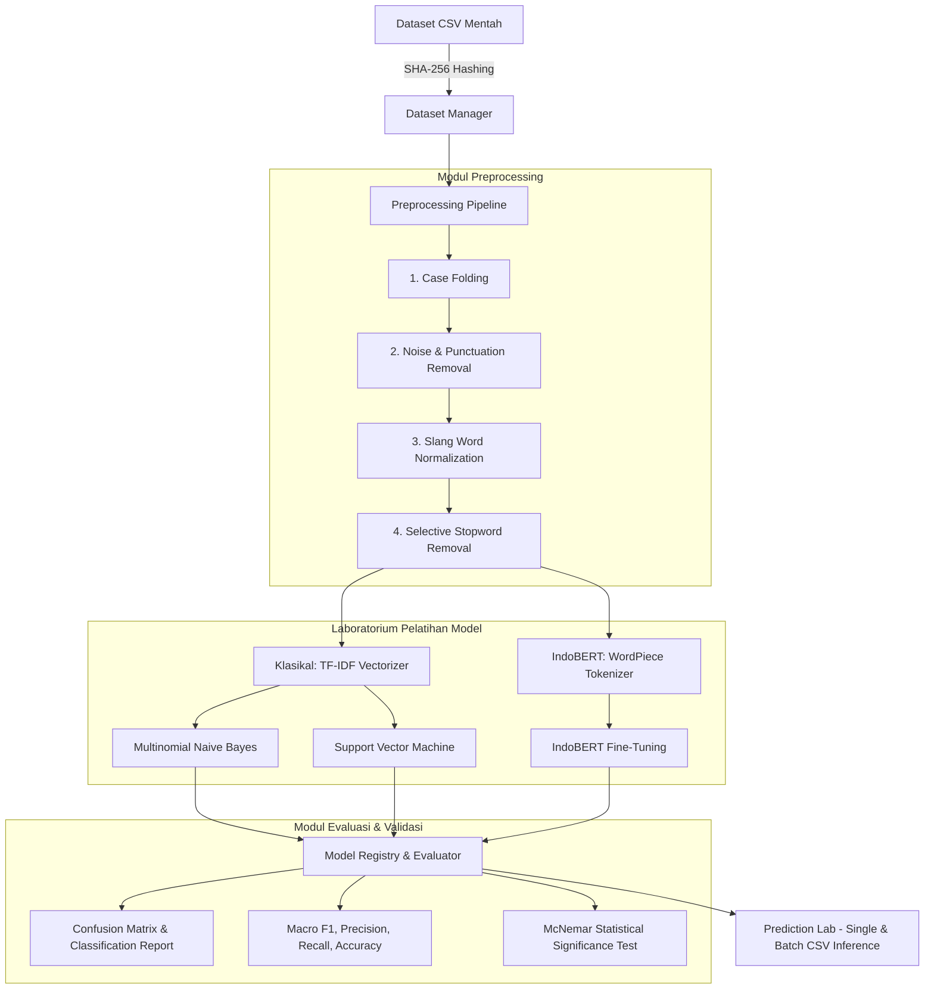

# Ummu NLP Experiment Lab (NLP Research Center)
### *A Scientific and Experimental Research Platform for Indonesian Text Classification Benchmark*

[](https://www.python.org/)
[](https://flask.palletsprojects.com/)
[](https://huggingface.co/indobenchmark/indobert-base-p1)
[](https://scikit-learn.org/)
[-lightgrey.svg)](https://www.sqlite.org/)
[-brightgreen.svg)](https://pytest.org/)
[](https://umsu.ac.id/)

---

## Ringkasan Akademik dan Abstrak Proyek

**Ummu NLP Experiment Lab** adalah platform laboratorium komputasi berbasis web yang dirancang secara terstandar untuk memfasilitasi penelitian empiris dan pengujian komparatif algoritma Pemrosesan Bahasa Alami (*Natural Language Processing*) pada korpus teks bahasa Indonesia.

Platform ini mengintegrasikan seluruh tahapan metodologi penelitian NLP ke dalam satu antarmuka terpadu (*Single Page Application*), yang mencakup:
1. **Manajemen Korpus dan Audit Integritas Data** (*Dataset Manager* dengan verifikasi *hashing* kriptografis SHA-256).
2. **Pipeline Rekayasa Teks Multi-Tahap** (*Preprocessing Lab*: *Case Folding*, *Noise and Punctuation Filtering*, *Dictionary-Based Slang Word Normalization*, dan *Selective Stopword Removal*).
3. **Pemodelan Komparatif Multi-Paradigma**:
   - **Model Klasikal Berbasis Frekuensi N-Gram**: *Multinomial Naive Bayes* (MNB) dan *Support Vector Machine* (SVM) dengan pembobotan *Term Frequency-Inverse Document Frequency* (TF-IDF).
   - **Model Kontekstual *Transformer Deep Pre-trained Language Model***: *IndoBERT Base* (`indobenchmark/indobert-base-p1`) yang dioptimasi melalui *Fine-Tuning* menggunakan *AdamW Optimizer* dan *Linear Warmup Learning Rate Scheduler*.
4. **Evaluasi Empiris Komprehensif** (*Macro Precision*, *Macro Recall*, *Macro F1-Score*, *Accuracy*, *Multi-Class Confusion Matrix*, dan *Per-Class Metric Decomposition*).
5. **Uji Validasi Hipotesis Statistik** (*McNemar’s Statistical Significance Test* dengan tabel kontingensi $2 \times 2$ untuk membuktikan signifikansi perbedaan performa antar model secara objektif).
6. **Inferensi dan Laboratorium Prediksi** (*Single Text Inference* dan *Batch Inference CSV* dengan visualisasi sebaran probabilitas kelas).

---

## Landasan Teori dan Formulasi Matematis

### 1. Ekstraksi Fitur: TF-IDF (Term Frequency-Inverse Document Frequency)
Untuk model klasikal (Naive Bayes dan SVM), teks ditransformasikan ke dalam representasi ruang vektor menggunakan skema pembobotan TF-IDF:

$$\text{TF-IDF}(t, d, D) = \text{TF}(t, d) \times \text{IDF}(t, D)$$

dengan fungsi Inverse Document Frequency teredam:

$$\text{IDF}(t, D) = \ln\left(\frac{1 + |D|}{1 + |\{d \in D : t \in d\}|}\right) + 1$$

Keterangan:
- $|D|$: Total jumlah dokumen dalam korpus data latih.
- $|\{d \in D : t \in d\}|$: Jumlah dokumen dalam korpus yang memuat term $t$.
- $\text{TF}(t, d)$: Frekuensi kemunculan term $t$ dalam dokumen $d$.

---

### 2. Algoritma Multinomial Naive Bayes
Klasifikasi probabilistik berdasarkan Teorema Bayes dengan asumsi independensi fitur bersyarat:

$$P(c \mid d) \propto P(c) \prod_{i=1}^{n} P(t_i \mid c)$$

Probabilitas kemunculan term dengan perataan Laplace (*Laplace Smoothing*):

$$P(t_i \mid c) = \frac{N_{ci} + \alpha}{N_c + \alpha |V|}$$

Keterangan:
- $\alpha$: Parameter penghalusan (*smoothing parameter*, $\alpha = 1.0$).
- $N_{ci}$: Frekuensi kemunculan term $t_i$ pada kelas $c$.
- $N_c$: Total frekuensi seluruh term pada kelas $c$.
- $|V|$: Jumlah total term unik dalam vokabulari korpus.

---

### 3. Support Vector Machine (SVM)
Optimasi bidang pemisah (*hyperplane*) dengan memaksimumkan *margin* geometris:

$$\min_{\mathbf{w}, b, \boldsymbol{\xi}} \frac{1}{2} \|\mathbf{w}\|^2 + C \sum_{i=1}^{N} \xi_i$$

dengan konstrain batas:

$$y_i (\mathbf{w}^T \phi(\mathbf{x}_i) + b) \ge 1 - \xi_i, \quad \xi_i \ge 0, \quad \forall i \in \{1, \dots, N\}$$

Keterangan:
- $\mathbf{w}$: Vektor bobot normal terhadap bidang pemisah (*hyperplane*).
- $b$: Nilai bias (*intercept*) bidang pemisah.
- $C$: Parameter regularisasi penalti kesalahan klasifikasi ($C > 0$).
- $\xi_i$: Variabel *slack* untuk mengakomodasi data yang tidak terpisah sempurna (*non-linearly separable*).
- $\phi(\mathbf{x})$: Fungsi pemetaan kernel (Linear atau *Radial Basis Function* / RBF).

---

### 4. IndoBERT (Bidirectional Encoder Representations from Transformers)
Arsitektur *deep bidirectional Transformer encoder* 12-layer dengan mekanisme *Multi-Head Self-Attention*:

$$\text{Attention}(Q, K, V) = \text{softmax}\left(\frac{QK^T}{\sqrt{d_k}}\right)V$$

Vektor representasi token `[CLS]` pada lapisan akhir diteruskan ke lapisan klasifikasi (*Classification Head*) dan dioptimasi menggunakan fungsi kerugian *Cross-Entropy Loss*:

$$\mathcal{L}_{\text{CE}} = -\sum_{c=1}^{K} y_c \log(\hat{y}_c)$$

Keterangan:
- $Q, K, V$: Matriks *Query*, *Key*, dan *Value*.
- $d_k$: Dimensi vektor representasi kunci ($d_k = 64$).
- $K$: Jumlah kelas target klasifikasi.
- $y_c$: Nilai biner kebenaran (*ground truth*) untuk kelas $c$.
- $\hat{y}_c$: Probabilitas prediksi model untuk kelas $c$.

---

### 5. Uji Signifikansi Statistik McNemar
Pengujian komparasi non-parametrik berpasangan pada sampel data uji yang identik:

$$\chi^2 = \frac{(|n_{01} - n_{10}| - 1)^2}{n_{01} + n_{10}}$$

Keterangan:
- $n_{01}$: Jumlah sampel yang diklasifikasikan benar oleh Model A dan salah oleh Model B.
- $n_{10}$: Jumlah sampel yang diklasifikasikan salah oleh Model A dan benar oleh Model B.
- $df = 1$: Derajat kebebasan (*degree of freedom*) pada distribusi Chi-Square.
- Kriteria keputusan: Jika $p\text{-value} < 0.05$ ($\alpha = 5\%$), hipotesis nol ($H_0$) ditolak, membuktikan adanya perbedaan performa yang signifikan secara statistik antara kedua model.

---

## Arsitektur Sistem dan Alur Kerja Penelitian



---

## Fitur Utama Platform

| Modul | Deskripsi Fungsional Ilmiah |
|---|---|
| **Dataset Management** | Validasi skema CSV (`text`, `label`), kalkulasi distribusi kelas, inspeksi baris data, dan pencatatan *hash* SHA-256 untuk memastikan integritas data (*scientific data integrity*). |
| **Preprocessing Lab** | Eksekusi langkah-demi-langkah pembersihan teks bahasa Indonesia dengan visualisasi tabel perbandingan kata sebelum vs sesudah normalisasi. |
| **Asynchronous Training** | Pelatihan model berjalan pada *background thread worker* non-blocking. Dilengkapi *live console log streamer*, progres kalkulasi *real-time*, dan mekanisme *cancellation*. |
| **Model Registry** | Manajemen siklus hidup berkas biner model terlatih (`.pkl` dan `.pt`), pencatatan *metadata* lingkungan komputasi, dan kontrol versi model. |
| **Evaluation Lab** | Visualisasi grafik batang ApexCharts terintegrasi, visualisasi *heatmap* matriks kontingensi, dan perbandingan performa menyeluruh. |
| **McNemar Statistical Test** | Analisis signifikansi statistik otomatis dengan pembentukan matriks kontingensi $2 \times 2$, nilai derajat kebebasan ($df=1$), dan interpretasi otomatis $p\text{-value}$. |
| **Prediction Lab** | Pengujian inferensi langsung untuk teks interaktif maupun inferensi massal melalui berkas CSV dengan *download report*. |
| **Hardware & Resource Monitor** | Pemantauan berkala penggunaan CPU, RAM, Disk Storage, dan GPU VRAM (NVIDIA L4 / T4 via NVML) secara *real-time*. |
| **Security & Access Control** | Autentikasi Google OAuth 2.0 dengan **Email Whitelist Check** (`ALLOWED_GOOGLE_EMAILS`), hashing sandi PBKDF2/SHA256, dan perlindungan sesi. |
| **PWA & Offline Resilience** | Dukungan *Progressive Web App* (PWA) dengan *Service Worker caching* dan *offline fallback screen*. |

---

## Persyaratan Sistem (System Requirements)

| Komponen | Spesifikasi Minimum | Rekomendasi untuk Pelatihan IndoBERT |
|---|---|---|
| **Sistem Operasi** | Windows 10/11 (64-bit) / Ubuntu 22.04 LTS / macOS | Ubuntu 22.04 LTS / Windows 11 Pro |
| **Python Runtime** | Python 3.10 atau 3.11 / 3.12 / 3.13 | Python 3.10 atau 3.11 |
| **RAM** | 8 GB RAM | 16 GB RAM atau lebih |
| **Penyimpanan** | 5 GB ruang kosong (SSD) | 20 GB ruang kosong (SSD NVMe) |
| **Akselerator Grafis** | CPU (Naive Bayes & SVM) | **NVIDIA GPU dengan VRAM $\ge$ 8 GB (CUDA 11.8 / 12.x)** *(misal: NVIDIA RTX 3060, T4, atau L4 GPU di Google Colab)* |

---

## Panduan Instalasi dan Penggunaan

### 1. Kloning Repositori
```bash
git clone https://github.com/ummulfarihah/nlp_experimen_lab.git
cd nlp_experimen_lab
```

### 2. Konfigurasi Lingkungan Virtual (Virtual Environment)

**Pada Sistem Operasi Windows (PowerShell):**
```powershell
python -m venv venv
.\venv\Scripts\activate
```

**Pada Sistem Operasi Linux / macOS:**
```bash
python3 -m venv venv
source venv/bin/activate
```

### 3. Instalasi Dependensi
```bash
pip install --upgrade pip
pip install -r requirements.txt
```

> **Catatan Instalasi PyTorch dengan Akselerasi CUDA:**
> Jika Anda menggunakan GPU NVIDIA lokal, pastikan menginstal PyTorch dengan dukungan CUDA yang sesuai melalui:
> ```bash
> pip install torch torchvision torchaudio --index-url https://download.pytorch.org/whl/cu121
> ```

### 4. Konfigurasi Environment Variable (`.env`)
Salin berkas konfigurasi template `.env.example` menjadi `.env`:
```bash
cp .env.example .env
```
Sesuaikan parameter pada `.env`:
```env
FLASK_ENV=development
SECRET_KEY=masukkan-kunci-enkripsi-rahasia-anda
ALLOWED_GOOGLE_EMAILS=ummulfarihah20@gmail.com,khamalade@gmail.com
```

### 5. Verifikasi Otomatis Integritas Sistem
Jalankan modul verifikasi mandiri (*Self-Verification Script*) untuk memastikan seluruh *engine* ML, database, dan pipeline NLP berfungsi:
```bash
python verify.py
```
Hasil verifikasi sukses: `ALL TESTS COMPLETED SUCCESSFULLY! CORE ENGINE GREEN.`

### 6. Menjalankan Server Lokal Flask
```bash
python app.py
```
Akses portal melalui peramban pada alamat:
**`http://127.0.0.1:5000`**

---

## Menjalankan di Google Colab (Remote GPU Acceleration)

Bagi peneliti yang tidak memiliki GPU NVIDIA lokal, sistem telah dilengkapi dengan berkas notebook siap pakai **`run_server_colab.ipynb`**:

1. Buka [Google Colab](https://colab.research.google.com/) dan ubah Runtime ke **GPU T4 / L4** (*Runtime $\rightarrow$ Change runtime type $\rightarrow$ T4/L4 GPU*).
2. Unggah dan jalankan **`run_server_colab.ipynb`** secara berurutan:
   - **Langkah 1**: Verifikasi GPU NVIDIA CUDA dan instalasi dependensi.
   - **Langkah 2**: Kloning repositori GitHub NLP Lab.
   - **Langkah 3**: Masukkan Ngrok Authtoken dan konfigurasi Domain Statis Ngrok.
   - **Langkah 4**: Jalankan server Flask (`python app.py`).
3. Akses URL publik statis yang dihasilkan untuk mengakses platform dengan kekuatan akselerasi GPU penuh.

---

## Struktur Direktori Repositori

```text
nlp_experimen_lab/
├── static/
│   ├── css/
│   │   └── style.css              # Sistem desain Glassmorphism & Token Tipografi
│   ├── js/
│   │   ├── app.js                 # Router SPA, Event Handlers, & State Manager
│   │   ├── charts.js              # Modul visualisasi data ApexCharts
│   │   └── sw.js                  # Service Worker untuk PWA & Caching
│   ├── img/                       # Brand logo & aset ikon resolusi tinggi
│   └── uploads/                   # Direktori penyimpanan dinamis
│       ├── datasets/              # Berkas korpus CSV yang diunggah
│       ├── models/                # Berkas biner model terkompilasi (.pkl / .pt)
│       ├── logs/                  # Berkas log fisik per proses eksperimen
│       └── avatars/               # Foto profil pengguna terdaftar
├── templates/
│   └── index.html                 # Single Page Application (SPA) utama
├── tests/
│   ├── test_api.py                # 13 Integration Tests untuk REST API & Auth
│   ├── test_ml_engine.py          # 4 Tests untuk Naive Bayes, SVM, & McNemar
│   └── test_preprocessing.py      # 7 Tests untuk Text Cleaning & Tokenizer
├── app.py                         # REST API Gateway & Server Entrypoint
├── config.py                      # Konfigurasi aplikasi, path, & email whitelist
├── database.py                    # Database Layer SQLite dengan WAL Mode & Migration
├── ml_engine.py                   # Engine NLP Klasikal (MNB, SVM, TF-IDF, McNemar)
├── bert_engine.py                 # Engine Deep Learning Transformer IndoBERT
├── task_manager.py                # Asynchronous Worker & Job Lifecycle Manager
├── verify.py                      # Skrip verifikasi mandiri unit engine
├── nlp_experiments.ipynb          # Notebook Analisis Eksperimen Komprehensif
├── hyperparameter_tuning.ipynb    # Notebook Penalaan Hiperparameter Mandiri
├── run_server_colab.ipynb         # Google Colab GPU Server Runner
├── requirements.txt               # Daftar dependensi & paket Python
└── README.md                      # Dokumentasi akademik repositori
```

---

## Pengujian Perangkat Lunak (Test Suite)

Platform ini menerapkan standar pengujian otomatis (*Automated Unit & Integration Testing*) menggunakan pustaka `pytest` dengan cakupan 24 skenario pengujian:

```bash
pytest tests/ -v
```

### Rangkuman Hasil Pengujian:
```text
tests/test_api.py::test_health_check_endpoint PASSED                     [  4%]
tests/test_api.py::test_login_endpoint_success PASSED                    [  8%]
tests/test_api.py::test_login_endpoint_invalid_password PASSED           [ 12%]
tests/test_api.py::test_unauthenticated_access_blocked PASSED            [ 16%]
tests/test_api.py::test_authenticated_access_allowed PASSED              [ 20%]
tests/test_api.py::test_preprocess_api_empty_text PASSED                 [ 25%]
tests/test_api.py::test_system_resources_endpoint_authenticated PASSED   [ 29%]
tests/test_api.py::test_db_read_connection_closure PASSED                [ 33%]
tests/test_api.py::test_repeated_read_requests_no_leak PASSED            [ 37%]
tests/test_api.py::test_database_driven_cancellation PASSED              [ 41%]
tests/test_api.py::test_stale_job_recovery_on_init PASSED                [ 45%]
tests/test_api.py::test_google_auth_non_whitelisted_denied PASSED        [ 50%]
tests/test_api.py::test_google_auth_whitelisted_allowed PASSED           [ 54%]
tests/test_ml_engine.py::test_calculate_metrics PASSED                   [ 58%]
tests/test_ml_engine.py::test_train_classical_model_naive_bayes PASSED   [ 62%]
tests/test_ml_engine.py::test_train_classical_model_svm PASSED           [ 66%]
tests/test_ml_engine.py::test_run_mcnemar_test PASSED                    [ 70%]
tests/test_preprocessing.py::test_preprocess_text_case_folding PASSED    [ 75%]
tests/test_preprocessing.py::test_preprocess_text_noise_removal PASSED   [ 79%]
tests/test_preprocessing.py::test_preprocess_text_slang_normalization PASSED [ 83%]
tests/test_preprocessing.py::test_preprocess_text_step_by_step PASSED    [ 87%]
tests/test_preprocessing.py::test_analyze_dataset_file_valid PASSED      [ 91%]
tests/test_preprocessing.py::test_analyze_dataset_file_missing_columns PASSED [ 95%]
tests/test_preprocessing.py::test_compute_dataset_hash PASSED            [100%]

======================= 24 passed in 35.80s (100% SUCCESS) =======================
```

---

## Sitasi Akademik dan Referensi

Jika Anda menggunakan platform ini, kode sumber, atau metodologi eksperimen ini dalam penelitian akademik, tesis, atau publikasi ilmiah, silakan mengutip karya ini:

```bibtex
@misc{farihah2026nlplab,
  author       = {Ummul Farihah},
  title        = {Ummu NLP Experiment Lab: Platform Komparasi Eksperimental Klasifikasi Teks Bahasa Indonesia (Naive Bayes, SVM, dan IndoBERT)},
  year         = {2026},
  publisher    = {GitHub},
  journal      = {GitHub Repository},
  howpublished = {\url{https://github.com/ummulfarihah/nlp_experimen_lab}},
  institution  = {Fakultas Ilmu Komputer dan Teknologi Informasi, Universitas Muhammadiyah Sumatera Utara}
}
```

---

## Lisensi dan Hak Cipta

Proyek ini dikembangkan untuk tujuan penelitian akademik pada **Program Studi Informatika, Fakultas Ilmu Komputer dan Teknologi Informasi (FIKTI), Universitas Muhammadiyah Sumatera Utara (UMSU)**.

Hak Cipta &copy; 2026 **Ummul Farihah**. Seluruh hak cipta dilindungi undang-undang.
